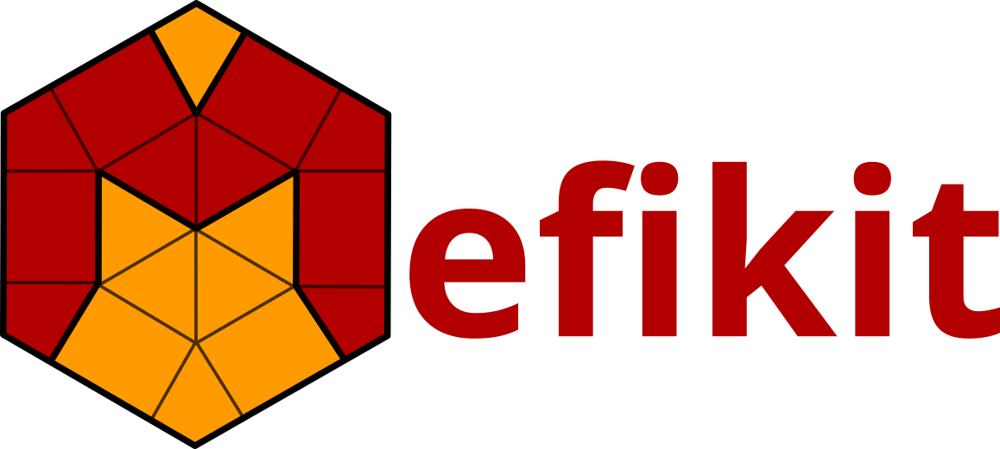

# Mefikit



**Mefikit** (_Meshes and Fields Kit_) is a modern, high-performance library for
manipulating unstructured meshes and associated fields and groups. It is
designed with a minimal, clear, and efficient interface, focusing on
flexibility, correctness, and integration in multi-physics simulations and
mesh-based data processing pipelines.

**Mefikit** is in a very early development phase. You might want to check the [ROADMAP](./ROADMAP.md).

If you are starting with **Mefikit**, especially on the Python side, check for
the [Mefibook!](./docs/src/SUMMARY.md)

---

## 💡 Why `Mefikit`?

The internal mesh representation is designed for **simplicity and
performance**, closely matching the file format layout. Unlike other tools
`Mefikit` provides:

- 🧼 **Simple interface**
- ⚙️ Easy development, integration and debugging
- 📦 Modern tools and clean build system (Rust/Cargo)
- 🧪 Pilot usage of rust in mesh tools and HPC scientific software

And thrive to:

- 🚀 Good **runtime performance**
- 🧪 Robust testing & benchmarking suite

---

## ✨ Key Features

### 🧩 Mesh and Field Core

- Unified, ergonomic `UMesh` structure:
  - Supports **mixed element types** in the same mesh
  - Named **fields of doubles** over elements or nodes
  - **Element groups** for flexible subdomain handling

### 🔄 Input/Output Support

- Built-in (python and rust) support for major file formats:
  - `vtk`
  - `CGNS` (planned)
  - `json` and `yaml` with `serde`
- Python conversions
  - `PyVista`
  - `medcoupling`
  - `meshio`

### 🧮 High-Level mesh operations (Python and rust)

- 🏗️ Mesh Builders
  - `cmesh_builder` - Builds a grid mesh (1d, 2d or 3d).
  - `extrude` - Create an extruded mesh (1d x 1d, 2d x 1d)
  - `duplicate` - Create a mesh by duplication (0d, 1d, 2d, 3d)
  - `aggregate` – Build a mesh from multiple non overlapping cell groups.
- `select` - Powerfull composable selection API (DSL)
  - on nodes position
  - on elements position
  - on fields values
  - etc
- 🧠 Topological operations
  - `descend` – Build the descending connectivity mesh (faces from volumes, etc)
  - `boundaries` – Build the boundaries mesh
  - `crack` – Introduce topological cracks along internal faces.
  - `connected_components` – Split the mesh in connected meshes
- 📐 Geometric operations
  - `snap` - To snap nodes of one mesh on another mesh nodes
  - `merge_nodes` - Merges duplicated nodes
  - `fuse` – Merge two meshes into one.
  - `intersect` – Compute boolean mesh intersection.
  - `split` – Cut a mesh using another.
  - `conformize` – Intersect shared faces, snap and merge near-nodes.

### 🧠 Element kit (rust only)

- Descending elements (edges/faces of volumes, etc.)
- Equivalence classes of elements
- Simplexization
- Bounding box trees
- Element intersections
- Normal and orientation computation
- Barycentre and volume evaluation
- ...

### 🔄 Mesh Ownership, Views, and Shared Coordinates

- `UMesh`: fully owns its data (coordinates, connectivity, fields,
  etc.), suitable for storage, transformation, and I/O. Useful to share
  arrays using copy-on-write. Maximum performance when staying in rust.
- `UMeshView<'a>`: read-only view into external or borrowed mesh
  data; ideal for zero-copy FFI.

### 🛠 Explicit is better than implicit

- Out-of-place functional API for heavy op (`UMeshView` or `&UMesh`): `compute_descending`,
  `intersect_meshes`, ...
- In-place for metadata manipulations and non destructive op (`&mut UMesh`):
  `assign_field`, `merge_close_nodes`, `add_group`, `snap`, ...

### 🐍 Python Bindings

- All high level functionality is exposed via clean Python bindings for rapid prototyping and integration in data pipelines.
- Adding python conversions through `numpy` to `meshio`, `pyvista`, `medcoupling`.

---

## 🧪 Developer Notes

### 📁 Project Structure

```text
mefikit/
├── crates/      # The rust core library and pyo3 bindings. You can use it as a rust dependency
├── src/         # The python package
├── docs/        # The Mefikit Book
```

### Rust core library

```text
src/
├── mesh/          # Mesh & field data model, the Element API
├── tools/         # The home to all high-level functionnalities
├── io/            # Readers/writers
├── element_kit/   # Element toolbox used to build higher level functionnalities
```

To build the library, you need to have Rust installed. You can install Rust
using [rustup](https://rustup.rs/). Once you have Rust installed, you can
build the library using the following command:

```bash
cargo build --release
```

This will create a release build of the library in the `target/release`
directory.

### Python package

The crate with the python bindings is called `mefikit-py`. It contains all the PyO3
stuff. This crate is used as the basis of the python `mefikit` library. The
same name was used for the python library for the sake of simplicity.

To build the bindings and the python package please run:

```bash
uv run maturin develop --uv
```

You can then run:

```bash
uv run pytest
```

`uv` won't build the package, it is only in charge of the dependencies.
`maturin` is the only one parametrized for this. Please run `maturin` each time
rust `mefikit` or `mefikit-py` changed.

### Mefibook

```text
docs/
├── src/                # The mdbook root dir
├── python_examples/    # Python notebooks
```

The `mefibook` is a `mdbook` project. Please refer to the `mdbook` documentation.
In two lines, you should:

```bash
cargo binstall mdbook
mdbook serve
```

`Jupyter-notebooks` are executed and converted to markdown using the following:

```bash
uv run make notebooks
```

`uv` is used here because the notebooks need `jupyterlab`, `mefikit` and all its
dependencies to run. As `uv` won't build `mefipy` you need to build it first.

### Contributing

If you would like to contribute to the library, please fork the repository
and create a pull request with your changes. We welcome contributions of all
kinds, including bug fixes, new features, and documentation improvements.
Please make sure to follow the coding style and conventions used in the
library. You should use `pre-commit` for this purpose.

```bash
uv tool install prek
prek install
git commit -a # pre-commit runs on your committed files
```

This will check the coding style and report any issues. You can also run
the following command to automatically format the code:

### Benchmarks

The `mefkit/benches/` directory contains `Mefikit` benchmarks. They use the
[Criterion](https://bheisler.github.io/criterion.rs/book/getting_started.html)
framework.

To launch the benchmarks, run:

```sh
cargo bench
```

To view results as a static and local website:

```sh
firefox ./target/criterion/report/index.html
```

A convenient CLI tool to visualize a summary of the results is `critcmp`:

```sh
cargo install critcmp
critcmp --list
```

If a new benchmark source file `filename.rs` is added inside `benches/`,
**`Cargo.toml` must be adapted accordingly**:

```toml
[[bench]]
name = "filename"
harness = false
```

Note that `filename`, in `Cargo.toml`, is written without the `.rs` extension.
More information in the [Criterion
documentation](https://bheisler.github.io/criterion.rs/book/getting_started.html#step-1---add-dependency-to-cargotoml)

You can create **flamegraphs** to spot performance bottleneck.

```bash
cargo flamegraph --profile flame --example name_of_the_example
```

## License

This library is licensed under the MIT License. See the `LICENSE` file for
more information.
