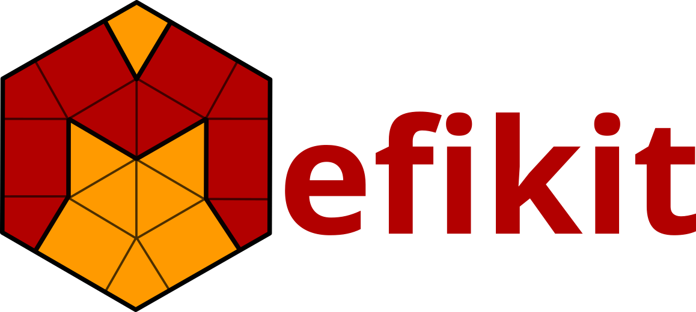

{width=94%}

::::::: {.columns align=center}
::: {.column width="30%"}
:::
::: {.column align=center}
**Kesako ?**
:::
:::::::

## Des idées neuves, inspirées de l'existant

### Existant

- Interface Python
- Bibliothèque d'opérations pour maillages non-structurés et champs.
- Lecture/Écriture MED.
- Transfert conservatif de champs pour le couplage.
- `Intersect2DMeshes` (overlay en `mefikit`)

### Neuf

- Cœur **Rust**.
- Conçue pour être concise, performante et extensible.
- Interopérable avec `pyvista` pour la visu, `vtkhdf`, `CGNS`, ...

## Un outil pour les maillages non-structurés

### Objet central: `mf.UMesh`

- Maillage non structurés
- Éléments mixtes : `VERTEX`, `SEG2`, `TRI3`, `QUAD4`, `TET4`, `HEX8`, `PGON`,
  `PHED`, ...
- Connectivité, groupes
- Champs

### Fonctionnalités modulaires

- Sélections
- Fusion, composantes connexes, overlay...
- Formats : MED, VTKHDF, CGNS, JSON/YAML, ...
- Interopérabilité : PyVista, meshio, MEDCoupling

## Une API plus pythonique

### Interface

```python
mesh.fields["T"] = 1.0 + mf.X**2 + 0.5 * mf.Y  # primitives

T = mf.Field("T")  # custom expressions
K = T + 273.15

mesh.groups["liquid"] = (T > 0.0) & (T < 100.0)
mean = mesh.select("liquid").mean(K)
```

### Une logique basée sur les expressions

- cohérente **maillage → champ → sélection → groupes → réduction**
- composable
- réutilisable sur d'autres maillages

---

{width=94%}

---

{width=94%}

## Remapping conservatif P0/P0

### Interface cohérente avec les expressions

```python
tr = mf.transfer.ConservativeP0(source, target)
T = mf.Field("T")
target.fields["K"] = tr(T + 273.15)
```

### Comme MEDCoupling

- Préparation géométrique réutilisable
- 2D, 3D, types d'éléments mixtes
- Conservation vérifiée
- Résultats cohérents avec MEDCoupling

---

{width=94%}

# Une réécriture, pourquoi ?

## Des gains plus subjectifs et d'autres moins

### Plutôt subjectif: meilleure interface

- Utilisateur : Interface unifiée plus simple (pas de manipulation d'index en python par défaut)
- Développeur : itérateurs, abstractions pratiques et peu nombreuses.

. . .

### Critères objectifs

- Beacoup moins de lignes de code
  - bindings rust + python 3k vs 25k loc SWIG
  - rust 21k avec tests et benchs, vs 250k loc C++ MEDCoupling
- Grande portabilité
- De meilleures performances !

## Quelques opérations représentatives

| Opération                 | Mefikit | MEDCoupling | Ratio |
| ------------------------- | ------: | ----------: | ----: |
| Descente · HEX8 24³       | 56,5 ms |    103,7 ms |   1,8 |
| Overlay · QUAD4 32²       |  2,1 ms |     68,4 ms |  32,6 |

Les résultats sont systématiquement vérifiés sur les cas communs.

## Transfert P0-P0

|                      |  Mefikit | MEDCoupling | Ratio |
| -------------------- | -------: | ----------: | ----: |
| Prepare QUAD4        |    27 ms |       25 ms |  0,93 |
| Prepare HEX8         |   163 ms |      692 ms |   4,2 |
| Prepare PHED         |   357 ms |     8746 ms |  24,5 |
| Apply QUAD4          |  0,18 ms |     3,90 ms |  21,6 |
| Apply HEX8           |  0,09 ms |     1,24 ms |  13,8 |
| Apply PHED           |  0,10 ms |     2,17 ms |  21,7 |

### Gains

- prepare poly x10-100
- apply x10-20

---

{width=90%}

## Pourquoi Rust ?

### Langage natif

- contrôle précis de la mémoire et des allocations
- pas de comportements indéfinis
- parallélisation naturelle et sûre d'une partie des algorithmes
- implémentation haut-niveau

. . .

### Langage moderne

- interface Python avec wheels standard, sans `SWIG`
- binaire portable et disponible sur Windows, MacOS, Linux, Muslinux, x86,
  x86_64, armv7, aarch64, ppc64le, avec 0 ligne de `CMake`
- outils d'audit, de benchmark, de profiling très accessibles

## Stade de maturité

### Aujourd'hui

- cœur de maillage non structuré stable
- champs et post-traitement
- connectivité, géométrie et topologie
- transferts conservatifs
- exports et interopérabilité python
- performances intéressantes sur plusieurs opérations

### Mais

- couverture fonctionnelle inférieure à MEDCoupling
- interface encore instable

## Conclusion

### Base solide

- Maillages, Champs, Groupes
- Opérations géométriques, topologiques
- Expressions, Sélections, Transferts

### Moderne

- Rust - Python
- Parallélisme  (multithread)
- Pas un plateforme, un package

### Performante

- descending x1.8
- overlay    x30
- transfer   x1-100

## Perspectives

### Maillage

- éléments quadratiques 2d avec overlay
- conformize3D
- symétrie / translation / rotation

### Champs

- évolution en temps
- opérateurs post-traitement sans maillage (gradient)

### Misc

- Bindings haut-niveau C/C++
- Kernels GPU (`CubeCL` / `std::offload`) ?
- Distribué (`mpi-rs`)

## Merci pour votre attention

{width=94%}
