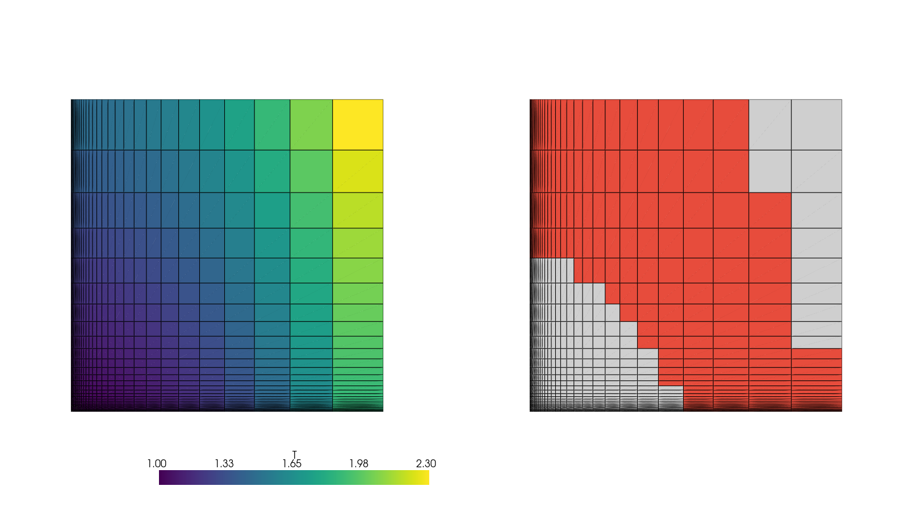
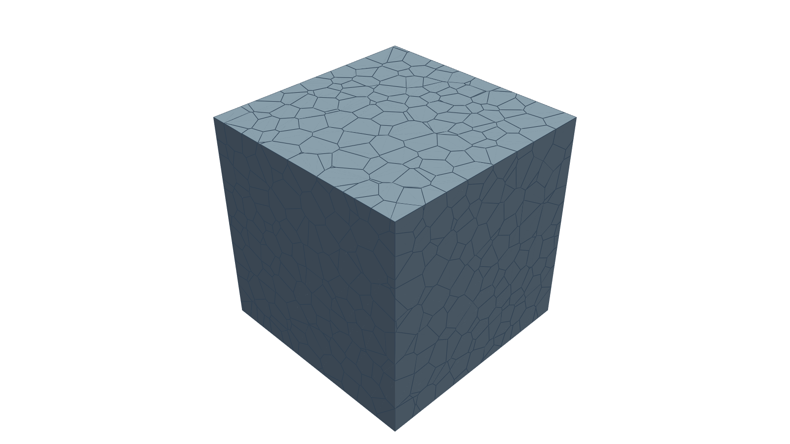
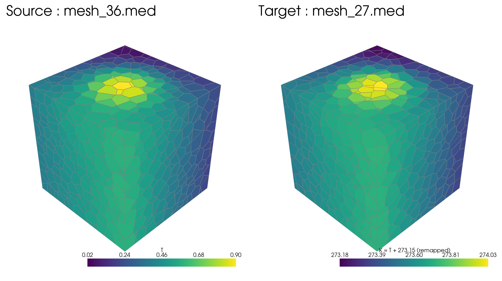

# Mefikit, qu'est-ce ?

## Des idées neuves, inspirées de l'existant

### Existant
* IO MED.
* Remapping de champs pour le couplage conservatif.
* `Intersect2DMeshes` (overlay en `mefikit`)

### Neuf
* Cœur **Rust**, API Python.
* Bibliothèque générique pour maillages et champs.
* Conçue pour être concise, performante et extensible.
* Interopérable avec `pyvista` pour la visu, `vtkhdf`, `CGNS`, ...

## Un cœur de maillage générique

* Maillages non structurés.
* Éléments mixtes : `TRI3`, `QUAD4`, `TET4`, `HEX8`, `PGON`, `PHED`, ...
* Connectivité, groupes.
* Champs et opérations sur les champs.
* Sélections géométriques.
* Fusion, découpage, composantes connexes, overlay...
* Formats : MED, VTKHDF, CGNS, JSON/YAML.
* Interopérabilité : PyVista, meshio, MEDCoupling.

L'objectif est de disposer d'un **socle générique**, et de l'étendre de manière modulaire.

## Une API plus pythonique

```python
# builtins: mf.X, mf.Y, mf.Z, mf.M, ...
mesh.fields["T"] = 1.0 + mf.X**2 + 0.5 * mf.Y

# custom field expressions
T = mf.Field("T")
K = T + 273.15

mesh.groups["liquid"] = (T > 0.0) & (T < 100.0)
mean = mesh.select("liquid").mean(K)
```

### Une logique basée sur les expressions

- cohérente **maillage → champ → sélection → groupes → réduction**
- composable
- réutilisable sur d'autres maillages

---

{width=94%}

---

{width=94%}

## Remapping conservatif P0/P0

Le transfert suit un modèle simple :

```python
tr = mf.transfer.ConservativeP0(source, target)
T = mf.Field("T")
target.fields["K"] = tr(T + 273.15)
```

* Préparation géométrique réutilisable.
* Application à plusieurs champs.
* 2D, 3D et maillages polyédriques.
* Conservation vérifiée.
* Résultats cohérents avec MEDCoupling sur les cas communs.

Le remapper polyédrique est aujourd'hui l'un des cas où les performances sont
particulièrement intéressantes.

---

{width=94%}

# Pourquoi ?

## Des gains plus subjectifs et d'autres moins

- Simplicité, maîtrise et agilité:
  - Interface unifiée plus simple (pas de manipulation d'index en python par défaut)
  - Une plus grande facilité d'implémenter des algorithmes (descend: 150loc, buildDescendingConnectivity: ~3000loc)
  - Une meilleure maîtrise : ce n'est pas parce que le code est dur à lire et à comprendre que l'algorithmie sous-jacente est géniale.
- De meilleures performances !

## Quelques opérations représentatives

| Opération                 | Mefikit | MEDCoupling | Ratio |
| ------------------------- | ------: | ----------: | ----: |
| Descente · HEX8 24³       | 56,5 ms |    103,7 ms |   1,8 |
| Fusion de nœuds · HEX8 3D |  0,5 ms |      4,0 ms |     8 |
| Overlay · QUAD4 32²       |  2,1 ms |     68,4 ms |  32,6 |

Les résultats sont systématiquement vérifiés sur les cas communs.

## Transfert P0-P0

|                           |  Mefikit | MEDCoupling | Ratio |
| ------------------------- | -------: | ----------: | ----: |
| Prepare QUAD4 · 2D        |    27 ms |       25 ms |  0,93 |
| Apply QUAD4 · 2D          |  0,18 ms |     3,90 ms |  21,6 |
| Prepare HEX8 · 3D         |   163 ms |      692 ms |   4,2 |
| Apply HEX8 · 3D           |  0,09 ms |     1,24 ms |  13,8 |
| Prepare Polyédrique · 3D  |   357 ms |     8746 ms |  24,5 |
| Apply Polyédrique · 3D    |  0,10 ms |     2,17 ms |  21,7 |

### Gains

- prepare poly x10-100
- apply x10-20

---

{width=90%}

## Pourquoi Rust ?

### Langage natif
* contrôle précis de la mémoire et des allocations ;
* parallélisation naturelle d'une partie des algorithmes ;

### Langage moderne
- interface Python standard ;
- binaire portable et disponible sur Windows, MacOS, Linux, Muslinux, x86, x86_64, armv7, aarch64, ppc64le à coût nul
- implémentation d'algorithmes haut-niveau.

## Stade de maturité

### Aujourd'hui

* cœur de maillage générique ;
* champs et post-traitement ;
* connectivité, géométrie et topologie ;
* transferts conservatifs ;
* formats et interopérabilité ;
* performances intéressantes sur plusieurs opérations.

### Mais

* couverture fonctionnelle inférieure à MEDCoupling ;
* interface encore instable.

## Conclusion

### Générique

- Maillages, Champs, Groupes
- Opérations géométriques, Sélection
- Expressions, Transferts

### Moderne
- Rust - Python
- Parallélisme  (multithread en python)
- Pas un plateforme, un package

### Performant
- descending
- transfer
- overlay

## Perspectives

### Maillage

- éléments quadratiques 2d et opération overlay
- conformize3D
- symétrie / translation / rotation

### Champs

- évolution en temps
- opérateurs post-traitement sans maillage (gradient)

### Misc

- Bindings haut-niveau C/C++
- Kernels GPU (`CubeCL` / `std::offload`) ?
- Distribué (`mpi-rs`)
