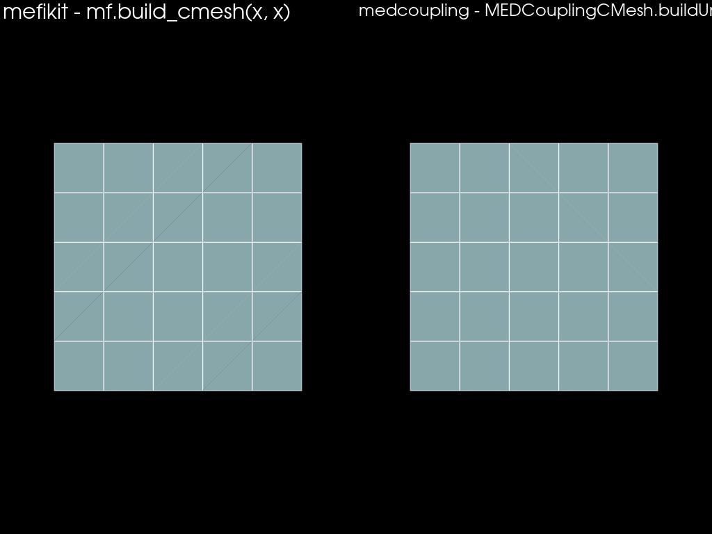
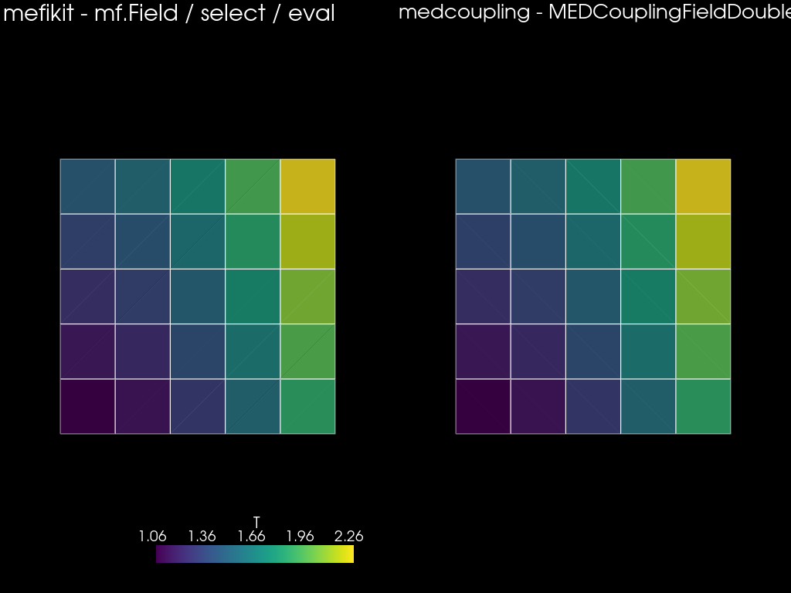
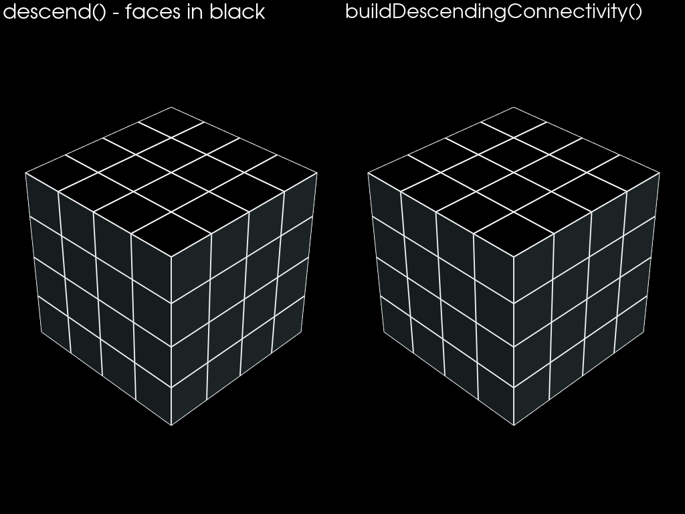
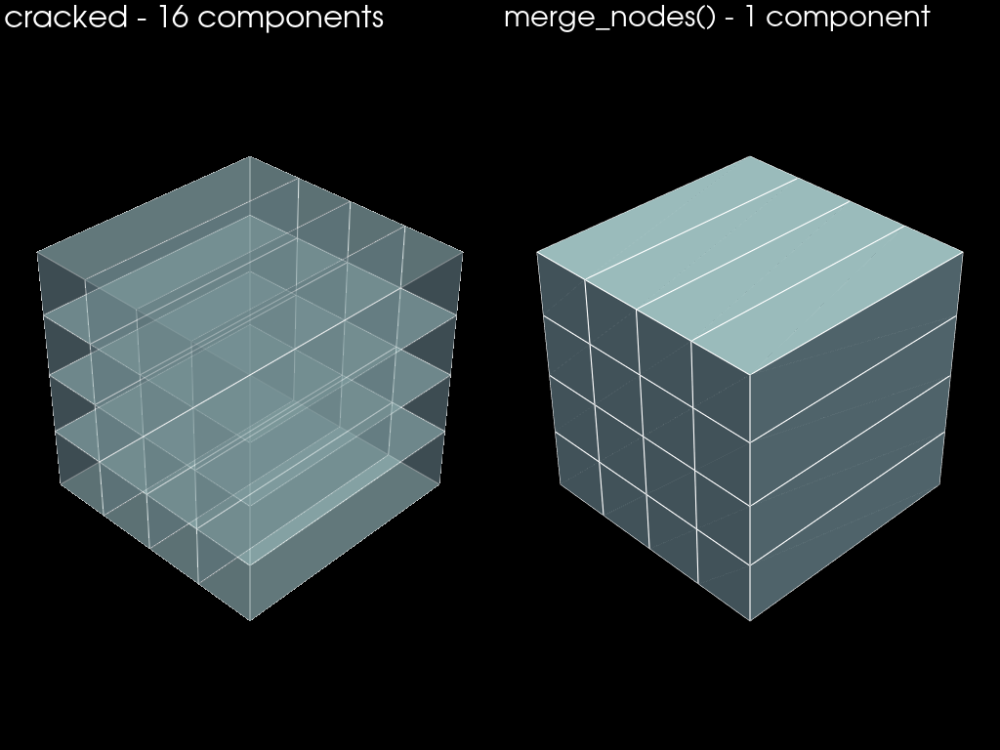
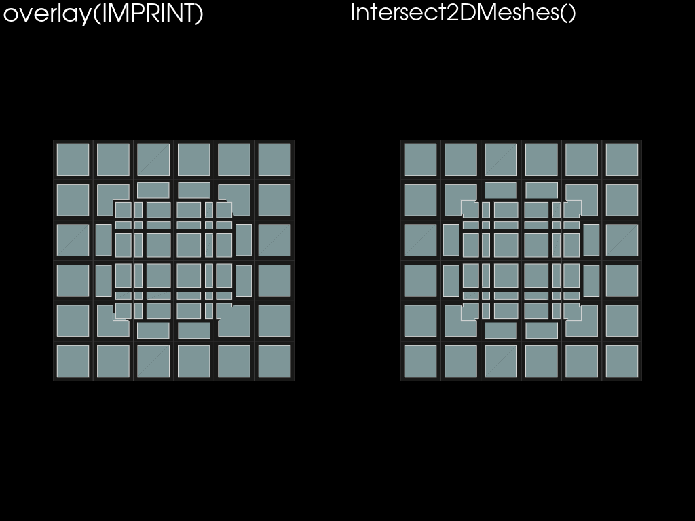
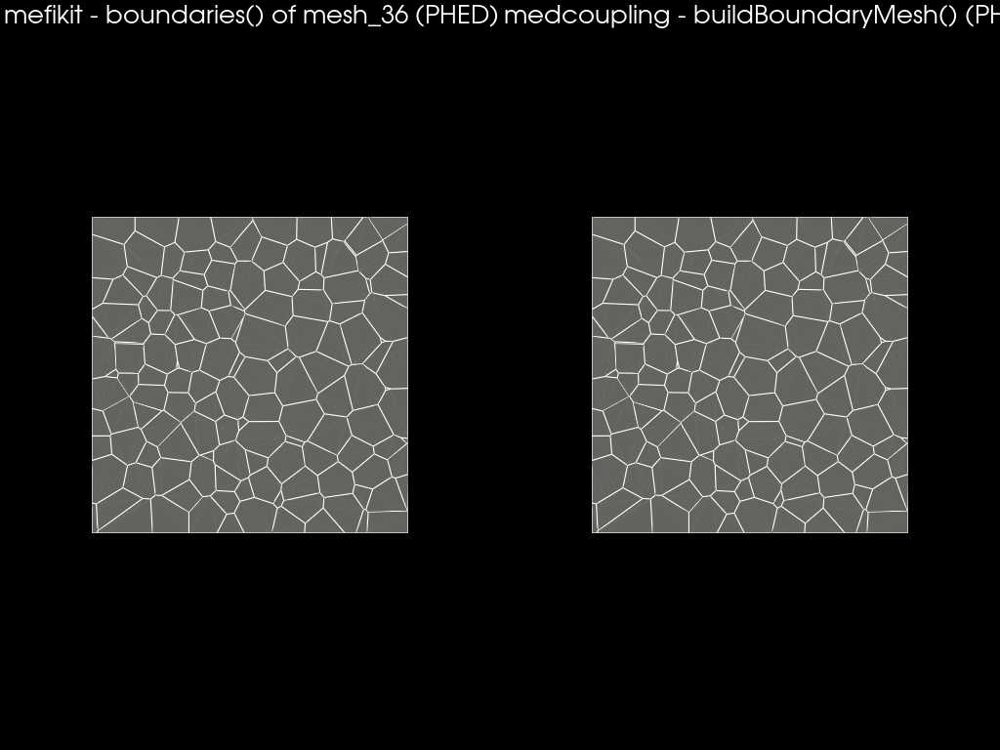
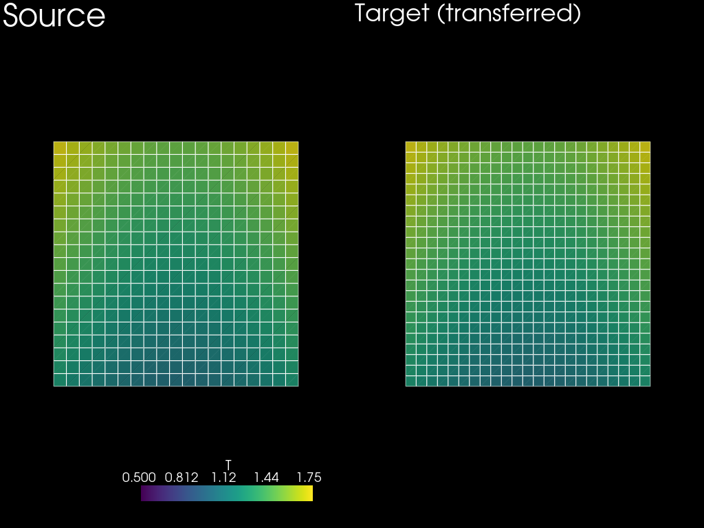
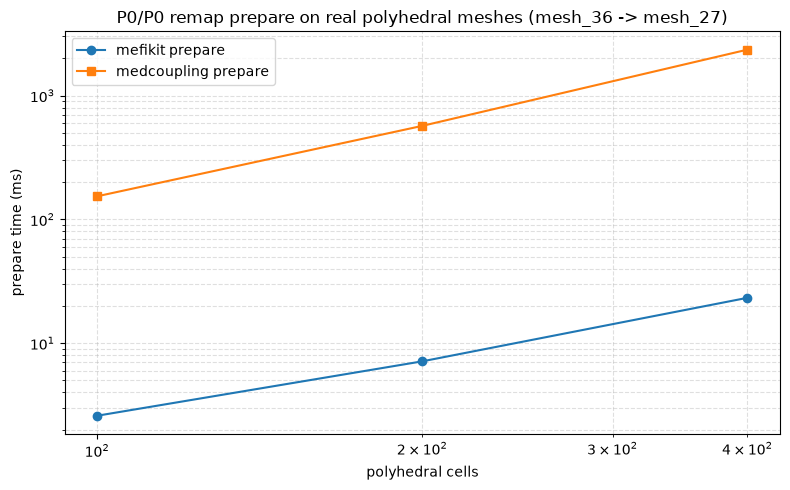
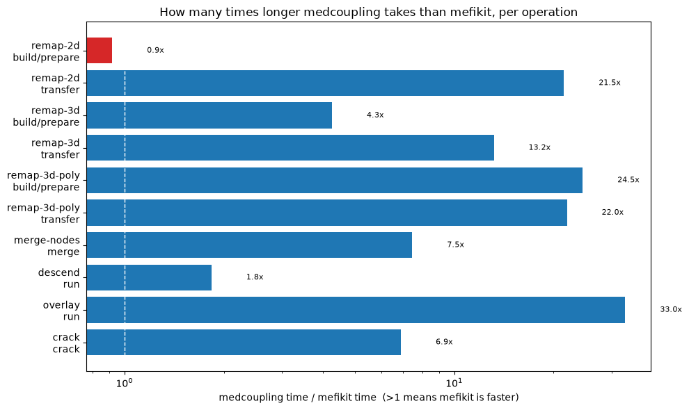

# Mefikit, what and why ?

## MEDCoupling

- Mature C++ library, **the reference implementation** of the MED world and
  used for code coupling.
- Decades of API surface, embedded in many industrial codes (Salome, TRUST, etc).
- Advanced field machinery, spline remapping, a huge ecosystem.

## Mefikit

- Young library, **Rust core** with Python bindings.
- Same goal as MEDCoupling, with a more concise API and a fast core.
- Aimed at the common operations first: polyhedral meshes, fields, transfers.

## Focused exploratory dev

- Strong and handful core memory format
- io and python interoperability
- Algos and functionnalities
- New fresh interface

## Core memory mesh object

### Complete

- Mixed elements types (VERTEX, SEG2, TRI3, QUAD4, PGON, TET4, HEX8, PHED)
- Supports level
- Supports groups
- Supports fields

### Fast

- Implements zero-copy iterators accessors
- More like MED than MEDCoupling, no reordering

## IO and python interop

### File IO

- vtk, vtkhdf
- MED (through hdf)
- CGNS (hdf)
- json, yaml, ... through serde

### Memory python conversions

- `to_pyvista`
- `to_mc`
- `to_meshio`

## Building a grid

### `build_cmesh(*axes)` vs `MEDCouplingCMesh` + `buildUnstructured()`

::::: columns
::: column

```python
# Mefikit
x = np.linspace(0.0, 1.0, 6)
mf_mesh = mf.build_cmesh(x, x)
```

:::
::: column

```python
# MEDCoupling
c = mc.MEDCouplingCMesh()
c.setCoords(mc.DataArrayDouble(x), mc.DataArrayDouble(x))
mc_mesh = c.buildUnstructured()
mc_mesh.setMeshDimension(2)
```

:::
:::::

### Comparison

Identical: **25 QUAD4 cells, 36 nodes.**

---

{width=92%}

## Fields and measures

### `mf.M`, `mf.Field` DSL vs `DataArrayDouble` + field objects

::::: columns
::: {.column width="40%"}

```python
# Mefikit
mesh.fields["Measure"] = mf.M
mesh.fields["T"] = 1.0 + mf.X**2 + 0.5 * mf.Y
T = mf.Field("T")  # symbolic
hot = mesh.select(T > 1.5)
print(hot.mean(T))
```

:::
::: column

```python
# MEDCoupling
m = mesh.getMeasureField(True)
c = mesh.computeCellCenterOfMass()
T = 1.0 + c[:, 0] ** 2 + 0.5 * c[:, 1]
f = mc.MEDCouplingFieldDouble(mc.ON_CELLS, mc.ONE_TIME)
f.setArray(mc.DataArrayDouble(T))
f.setMesh(mesh)
```

:::
:::::

### Comparison

Same values: measure sum = 1.0, max delta T ~ 1.3e-15.

---

{width=92%}


## Faces of a volume mesh

### `descend()` vs `buildDescendingConnectivity()`

::::: columns
::: {.column width="30%"}

```python
# Mefikit
faces = mesh.descend()
```

:::
::: column

```python
# MEDCoupling
desc = mesh.buildDescendingConnectivity()
faces = desc[0]
```

:::
:::::

### Comparison

Identical: **240 faces** on a 4³ hexa grid.

---

{width=92%}

## Merge duplicated nodes

### `merge_nodes()` vs `mergeNodes(1e-12)`

::::: columns
::: column

```python
# Mefikit
merged = cracked.merge_nodes()
```

:::
::: column

```python
# MEDCoupling
m = cracked_mc.deepCopy()
m.mergeNodes(1e-12)
```

:::
:::::

### Comparison

- Cracked hex stack: **128 -> 50 nodes**, **16 -> 1 component**, both sides.
- Mefikit rewires connectivity (no node compaction); MEDCoupling compacts.

---

{width=88%}

## 2D overlay / imprint

### `overlay(operation=...)` vs `Intersect2DMeshes()`

::::: columns
::: {.column width="30%"}

```python
# Mefikit
imprint = g1.overlay(g2, mf.OverlayOperation.IMPRINT)
```

:::
::: column

```python
# MEDCoupling
imprint = mc.MEDCouplingUMesh.Intersect2DMeshes(g1m, g2m, 1e-12)[0]
```

:::
:::::

### Comparison

Unit area preserved — **1.0 on both sides.**

---

{width=92%}

## Polyhedral boundaries

### `boundaries()` vs `buildBoundaryMesh()`

::::: columns
::: {.column width="30%"}

```python
# Mefikit
bnd = mf_src.boundaries()
```

:::
::: column

```python
# MEDCoupling
bnd = mc_src.buildBoundaryMesh(True)
```

:::
:::::

### Comparison

Real 2000-cell PHED meshes (`mesh_36.med`, `mesh_27.med`): **888 faces each**.

---

{width=92%}

## Conservative P0/P0 transfer

### Prepare once, apply many. `ConservativeP0` vs `MEDCouplingRemapper`

::::: columns
::: column

```python
# Mefikit
tr = mf.transfer.ConservativeP0(src, tgt)
T = mf.Field("T")
tgt.fields["T"] = tr(T)
```

:::
::: column

```python
# MEDCoupling
remap = mc.MEDCouplingRemapper()
remap.prepare(src, tgt, "P0P0")
f_tgt = remap.transferField(f_src, 0.0)
```

:::
:::::

### Comparison

Transferred fields match to ~ 3.6e-15.

---

{width=92%}

## New post-treatment approach

### Expression based DSL

  ```python
  T = mf.Field("T")
  s = mf.sel.sphere([0.0, 0.0, 0.0], r=1.0)
  # m has T field
  m.fields["K"] = T - 273.25
  mean_K = m.select(s & (T > 100.0)).mean("K")
  ```

# Performance comparison

## Approach

- Both libraries always work on the **same geometry**.
- Only a **handful of operations** are timed — no general claim.
- Every result is **cross-checked** with the other library - agreement ~ 1e-15.
- Timings are **medians of repeated runs** on one machine.

## Common operations

| Operation | Mefikit | MEDCoupling | ratio |
|---|---:|---:|---:|
| Merge nodes · 3D HEX8 | 0.5 ms | 4.0 ms | 7.5× |
| Descend · 24³ HEX8 | 56.5 ms | 103.7 ms | 1.8× |
| Overlay · 32² QUAD4 | 2.1 ms | 68.4 ms | 33.0× |
| Crack · 20³ HEX8 | 235.6 ms | 1624.4 ms | 6.9× |

## Prepare / build — one-off cost

| Operation | Mefikit | MEDCoupling | ratio |
|---|---:|---:|---:|
| Remap 2D · QUAD4 (9216 cells) | 27.0 ms | 24.8 ms | 0.9× |
| Remap 3D · HEX8 (4096 cells) | 162.6 ms | 692.3 ms | 4.3× |
| Remap 3D · polyhedral | 356.6 ms | 8746.1 ms | 24.5× |

> ratio = MEDCoupling / Mefikit — > 1 -> Mefikit faster.
On this set, only 2D remap prepare goes MEDCoupling's way (0.9×).

---

{width=78%}

> 101× faster at 400 cells on this test, and the gap grows with size — fields
> still match to ~1e-14.

## Transfer / apply — per-step cost

| P0/P0 remap | Mefikit | MEDCoupling | ratio |
|---|---:|---:|---:|
| 2D QUAD4 | 0.18 ms | 3.90 ms | 21.5× |
| 3D HEX8 | 0.09 ms | 1.24 ms | 13.2× |
| 3D polyhedral | 0.10 ms | 2.17 ms | 22.0× |

---

{width=95%}

# DevOps

## Software project overview

- OpenSource on GitHub
- CI/CD
- Performance benchmark suite

## CI/CD

### CI

- tests on each push / PR on dev/master
- pre-commit hooks enforced (format, lints, best practices, ...)
- check on all platforms (windows, linux, macos, muslinux, ARM, x86, etc)

### CD

- automatic semver version increase on push on master
- docs.rs rust mefikit doc deployment
- mdbook high level doc deployment
- crates.io publication
- PyPI publication

## Performance benchs

### Wall time measure

- using criterion on rust side, single-thread
- with python time and compared to medcoupling

### Stable perf measure

- callgrind (with gungraun)
- emulates material
- counts instructions, cache access, etc

### Algo scaling measure

- a few scaling measures to ensure ~linear

# Overview

## Feature comparison

| Operation | MEDCoupling | Mefikit |
|---|---|---|
| Structured grid | `buildUnstructured()` | `build_cmesh(*axes)` |
| Per-cell measure | `getMeasureField()` | `mf.M` - symbolic |
| Faces / boundary | `buildBoundaryMesh`, ... | `descend()`, `boundaries()` |
| Merge nodes | `mergeNodes()` | `merge_nodes()` |
| 2D overlay / imprint | `Intersect2DMeshes()` | `overlay()` |
| P0/P0 2D or 3D | `MEDCouplingRemapper` | `ConservativeP0` |
| File formats | med, vtk | med, vtkhdf, cgns, json |
| Core | C++ (Python bindings) | Rust (first-class Python) |

And also connected components decomposition, extrusions, splitting cells,
polyze/unpolyze, snapping nodes, etc.

## What Mefikit offers today

### Strong MEDCoupling basis enhanced

- A concise API for common mesh and field operations.
- Strong speed on some operations — polyhedral remap, overlay.

### Some new features

- CGNS and VTKHDF IO
- new expression based post-treatment approach
- mutli-threaded selection/connectivity engine
- niche algos:
  - connected_components
  - split elements

## Where MEDCoupling stays ahead

### Status

- **Breadth**: spline remapping, advanced field machinery, big ecosystem.
- **Proven** in many production codes over decades.
- Mefikit still has a lot to implement before reaching that level.

### Mefikit lacking big features

- 2D embedded mesh intersections
- QPOLY elements and intersection
- conformize3D

## Conclusion: step by step

- Mefikit is faster on several operations — but **partial** feature covering.
- Many features remain to be written; the API is still evolving.
- MEDCoupling lives in many other codes; Mefikit is young and has only 1 consumer.
- The long-term aim is to go further — increasing Mefikit features, one step at
  a time.

## Try it

- Full side-by-side notebook: `docs/python_examples/compare_medcoupling.ipynb`.
- Same workloads live in `tests/bench_vs_medcoupling.py`.
- [Roadmap](https://github.com/asonolet/Mefikit/blob/master/ROADMAP.md) and the
  other notebooks of this book.
