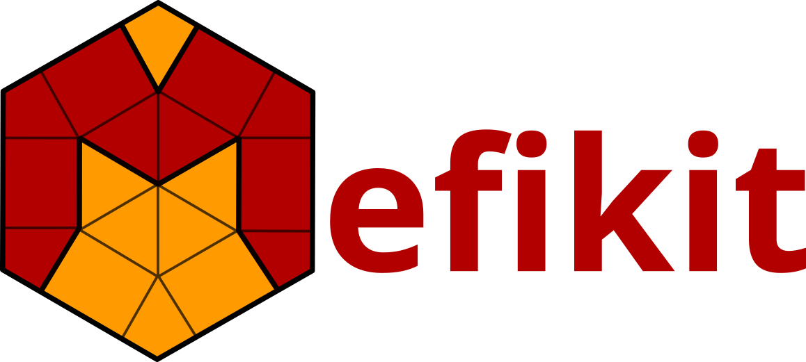

# Introduction

## About `mefikit`

**`mefikit`** — short for **Mesh and Field Kit** — is a comprehensive library for
generating, manipulating, and analyzing unstructured meshes together with
associated scalar, vector, and tensor fields. Its goal is to provide a unified
in-memory representation of meshes and fields, along with a set of robust,
efficient tools that support numerical simulation workflows in research,
engineering, and scientific computing.

`mefikit` focuses on three core principles:

1. **A flexible mesh model** capable of representing mixed-element unstructured
   meshes.
2. **A consistent field and group architecture** that attaches data to mesh
   entities across dimensions.
3. **Zero-copy, iterator-based access patterns** to efficiently navigate and
   process large meshes.

This design positions `mefikit` as a modern core library for algorithm
development.

## `mefikit` provides

- `umesh` the unstructured mesh container supporting mixed element types,
  fields, and groups.
- `io` modules for reading and writing meshes in various formats
  (e.g., VTK, serde_json, serde_yaml).
- `topology` tools for analyzing mesh connectivity, computing descending meshes,
  neighbours, domain frontier, etc.
- `geometry` tools for computing element measures, centroids, etc.
- `Selector` utilities for querying and filtering mesh elements
  based on geometric or topological criteria.

**Continue to [Getting Started](./python_examples/getting_started.md).**
