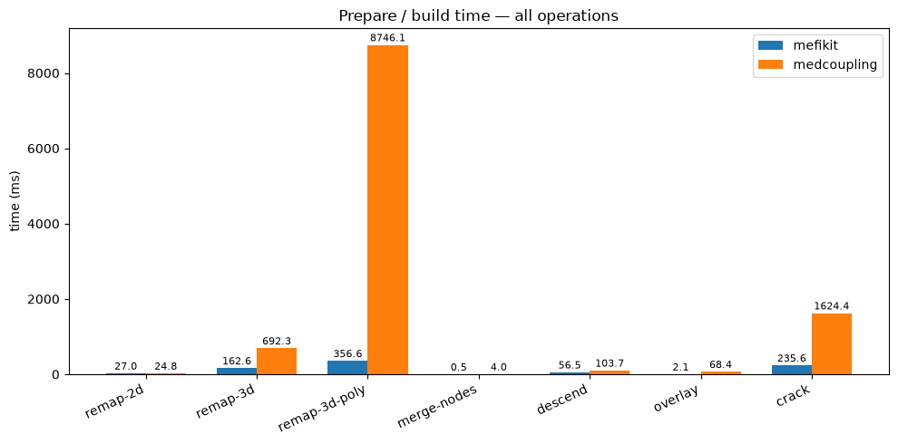
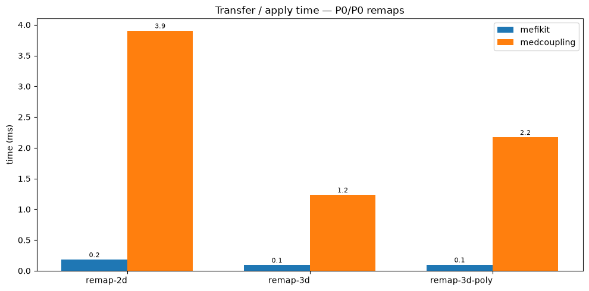

# mefikit vs. medcoupling

A friendly, side-by-side look at two libraries that solve the same class of
problems, in slightly different ways.

**[medcoupling](https://docs.salome-platform.org/latest/dev/MEDCoupling/)** is
the reference implementation of the MED world: mature, broad and
battle-tested in industrial workflows. It set the bar for mesh interchange —
mefikit itself happily reads and writes the very same `.med` files.

**[mefikit](https://github.com/asonolet/mefikit)** is a younger library, written
in Rust and exposed to Python. It pursues the same goal — manipulate
unstructured meshes and their fields — with a shorter, more expressive API and
a performance-oriented core.

This notebook is neither a verdict nor a "rip and replace". It is an
invitation: we build the **same meshes**, run the **same operations**, and
compare the **interface** and the **timings** step by step. If you know
medcoupling, you should find your bearings immediately — and, hopefully, be
tempted.

Every mesh below is built from the *exact same geometry* on both sides, and
every value is cross-checked against the other library before we say one word
about speed.


```python
import os
import time
from pathlib import Path

import matplotlib.pyplot as plt
import medcoupling as mc
import numpy as np
import pyvista as pv

import mefikit as mf

pv.set_plot_theme("dark")
pv.set_jupyter_backend("static")

print("mefikit     :", mf.__file__)
print("medcoupling :", mc.__file__)
print("medcoupling version:", mc.__version__)
print("numpy       :", np.__version__)
```

    mefikit     : /home/asonolet/Codes/mefikit/src/mefikit/__init__.py
    medcoupling : /home/asonolet/Codes/mefikit/.venv/lib/python3.13/site-packages/medcoupling.py
    medcoupling version: V9_15_0
    numpy       : 2.5.2


### A couple of plumbing helpers

Nothing to learn here — two small utilities used to cross-check node counts
and surface areas between the libraries below.


```python
def used_nodes(mesh):
    ids = np.concatenate([np.asarray(b) for b in mesh.blocks().values()])
    return int(np.unique(ids).size)


def area_2d(mesh):
    return float(sum(np.asarray(v).sum() for v in mesh.measure().values()))
```

## Building the same mesh

Every mesh workflow starts with creating a grid. In mefikit, `build_cmesh`
builds a structured (cartesian) mesh from the coordinate axes in **one call**.

In medcoupling the standard route goes through a structured `MEDCouplingCMesh`,
materialised as an unstructured mesh with `buildUnstructured()`. Three lines,
still very readable.

The good news: the result is *the same mesh* — same nodes, same cells —
because a cartesian grid is just a very regular unstructured mesh.


```python
def medcoupling_cmesh(*axes):
    # medcoupling counterpart of mf.build_cmesh(*axes): build a structured
    # MEDCouplingCMesh, then materialise it as an unstructured mesh with the
    # standard buildUnstructured() call.
    cmesh = mc.MEDCouplingCMesh()
    cmesh.setCoords(
        *[mc.DataArrayDouble(np.ascontiguousarray(a, np.float64)) for a in axes]
    )
    umesh = cmesh.buildUnstructured()
    umesh.setMeshDimension(len(axes))
    return umesh


x = np.linspace(0.0, 1.0, 6)
mf_mesh = mf.build_cmesh(x, x)  # mefikit    : one call
mc_mesh = medcoupling_cmesh(x, x)  # medcoupling: structured -> unstructured
```


```python
print(
    "mefikit     :",
    mf_mesh.num_elements(),
    "QUAD4 cells,",
    mf_mesh.coords().shape[0],
    "nodes",
)
print(
    "medcoupling :",
    mc_mesh.getNumberOfCells(),
    "QUAD4 cells,",
    mc_mesh.getNumberOfNodes(),
    "nodes",
)

assert mc_mesh.getNumberOfCells() == mf_mesh.num_elements()
assert np.allclose(mc_mesh.getCoords().toNumPyArray(), mf_mesh.coords())
print("identical geometry (nodes and cells): OK")
```

    mefikit     : 25 QUAD4 cells, 36 nodes
    medcoupling : 25 QUAD4 cells, 36 nodes
    identical geometry (nodes and cells): OK


```python
# The bridge in the other direction is a one-liner: mefikit meshes
# export to medcoupling with to_mc(), geometry untouched.
twin = mf_mesh.to_mc()
twin.setMeshDimension(2)
print(
    "to_mc() bridge:",
    twin.getNumberOfCells(),
    "cells,",
    twin.getNumberOfNodes(),
    "nodes",
)
```

    to_mc() bridge: 25 cells, 36 nodes


```python
def mc_to_pyvista(mmesh):
    # Render a medcoupling mesh with pyvista, in-memory (no temp files).
    vtk_type = {
        mc.NORM_SEG2: pv.CellType.LINE,
        mc.NORM_TRI3: pv.CellType.TRIANGLE,
        mc.NORM_QUAD4: pv.CellType.QUAD,
        mc.NORM_POLYGON: pv.CellType.POLYGON,
        mc.NORM_HEXA8: pv.CellType.HEXAHEDRON,
    }
    n = mmesh.getNumberOfCells()
    coords = mmesh.getCoords().toNumPyArray()
    if coords.shape[1] == 2:
        coords = np.c_[coords, np.zeros(len(coords))]
    conn = mmesh.getNodalConnectivity().toNumPyArray()
    off = mmesh.getNodalConnectivityIndex().toNumPyArray()
    cells_arr = np.concatenate(
        [
            np.r_[off[i + 1] - off[i] - 1, conn[off[i] + 1 : off[i + 1]]]
            for i in range(n)
        ]
    ).astype(np.int64)
    cell_types = np.array(
        [vtk_type[mmesh.getTypeOfCell(i)] for i in range(n)], np.uint8
    )
    return pv.UnstructuredGrid(cells_arr, cell_types, coords)


pt = pv.Plotter(shape=(1, 2))
pt.subplot(0, 0)
pt.add_text("mefikit - mf.build_cmesh(x, x)")
pt.add_mesh(mf_mesh.to_pyvista(), show_edges=True)
pt.camera_position = "xy"
pt.subplot(0, 1)
pt.add_text("medcoupling - MEDCouplingCMesh.buildUnstructured()")
pt.add_mesh(mc_to_pyvista(mc_mesh), show_edges=True)
pt.camera_position = "xy"
pt.show()
```


## Fields, measures, and one-line expressions

Everyone needs per-cell measures in remapping workflows. mefikit exposes a
symbolic field `mf.M` — the measure — evaluated on demand, together with a
small expression DSL on `mf.Field`: you *write* the computation, mefikit
*evaluates* it on the mesh, and combinations of `select` / `mean` / `sum`
become one-liners.

medcoupling takes the more explicit route: you build a `DataArrayDouble`,
wrap it into a `MEDCouplingFieldDouble`, and attach it to the mesh. Both
compute exactly the same numbers.


```python
# --- mefikit ----------------------------------------------------------------
mf_mesh.fields["Measure"] = mf.M  # symbolic measure
mf_mesh.fields["T"] = 1.0 + mf.X**2 + 0.5 * mf.Y

print("measure sum  :", mf_mesh.fields["Measure"].sum())
hot = mf_mesh.select(mf.Field("T") > 1.5)
print("cells T > 1.5:", len(hot))
print("mean T above :", hot.mean("T"))
```

    measure sum  : 1.0
    cells T > 1.5: 13
    mean T above : 1.8338461538461535


```python
# --- medcoupling -------------------------------------------------------------
mc_measure = mc_mesh.getMeasureField(True)
mc_measure.setNature(mc.IntensiveConservation)

centers = np.asarray(mc_mesh.computeCellCenterOfMass().toNumPyArray())
mc_T_vals = 1.0 + centers[:, 0] ** 2 + 0.5 * centers[:, 1]

mc_T = mc.MEDCouplingFieldDouble(mc.ON_CELLS, mc.ONE_TIME)
_arr = mc.DataArrayDouble(np.ascontiguousarray(mc_T_vals, np.float64))
_arr.setName("T")
mc_T.setArray(_arr)
mc_T.setMesh(mc_mesh)
mc_T.setNature(mc.IntensiveConservation)

print("measure sum  :", float(mc_measure.getArray().toNumPyArray().sum()))
```

    measure sum  : 1.0


```python
# identical numbers, whichever library computed them
mf_T_vals = np.asarray(mf_mesh.fields["T"].numpy()).ravel()
mc_T_vals = mc_T.getArray().toNumPyArray()
print("max |mf_T - mc_T|:", float(np.abs(mf_T_vals - mc_T_vals).max()))
assert np.allclose(mf_T_vals, mc_T_vals, atol=1e-12)
```

    max |mf_T - mc_T|: 1.3322676295501878e-15


```python
pt = pv.Plotter(shape=(1, 2))
pt.subplot(0, 0)
pt.add_text("mefikit - mf.Field / select / eval")
g1 = mf_mesh.to_pyvista()
g1["T"] = mf_T_vals
pt.add_mesh(g1, scalars="T", show_edges=True)
pt.camera_position = "xy"
pt.subplot(0, 1)
pt.add_text("medcoupling - MEDCouplingFieldDouble")
g2 = mc_to_pyvista(mc_mesh)
g2["T"] = mc_T_vals
pt.add_mesh(g2, scalars="T", show_edges=True)
pt.camera_position = "xy"
pt.show()
```


## Common operations, side by side

### Descending connectivity

The faces of a volume mesh — the bread and butter of boundary conditions and
surface integrals. mefikit: one call, `descend()`. medcoupling:
`buildDescendingConnectivity()`. Both report the same face count.


```python
axes3 = [np.linspace(0.0, 1.0, 5)] * 3
m3 = mf.build_cmesh(*axes3)
mc3 = medcoupling_cmesh(*axes3)

mf_faces = m3.descend()
mc_desc = mc3.buildDescendingConnectivity()
mc_faces = mc_desc[0] if isinstance(mc_desc, tuple) else mc_desc

print("faces (mefikit)    :", mf_faces.num_elements())
print("faces (medcoupling):", mc_faces.getNumberOfCells())
assert mf_faces.num_elements() == mc_faces.getNumberOfCells()
print("identical face count: OK")
```

    faces (mefikit)    : 240
    faces (medcoupling): 240
    identical face count: OK


```python
pt = pv.Plotter(shape=(1, 2))
pt.subplot(0, 0)
pt.add_text("descend() - faces in black")
pt.add_mesh(m3.to_pyvista(), show_edges=True, opacity=0.35)
pt.add_mesh(mf_faces.to_pyvista(), show_edges=True, color="black", line_width=2)
pt.subplot(0, 1)
pt.add_text("buildDescendingConnectivity()")
pt.add_mesh(mc_to_pyvista(mc3), show_edges=True, opacity=0.35)
pt.add_mesh(mc_to_pyvista(mc_faces), show_edges=True, color="black", line_width=2)
pt.show()
```


### Merging duplicated nodes

Meshes often carry duplicated nodes (split or intersected interfaces). The
reference cure is a node merge. mefikit's `merge_nodes()` and medcoupling's
`mergeNodes()` collapse the same duplicates.

A small nuance worth knowing: mefikit keeps the coordinate array untouched and
rewires the connectivity — cheap and zero-copy friendly — while medcoupling
physically compacts nodes. The *number of used nodes* is identical.


```python
# crack a small hex stack so its shared interface is duplicated
volumes = mf.build_cmesh([0.0, 1.0], np.linspace(0.0, 1.0, 5), np.linspace(0.0, 1.0, 5))
faces = volumes.descend()
cracked = volumes.crack(faces)
cracked_mc = cracked.to_mc()
cracked_mc.setMeshDimension(3)

merged = cracked.merge_nodes()
merged_mc = cracked_mc.deepCopy()
merged_mc.mergeNodes(1e-12)

print("components before merge:", len(cracked.connected_components()))
print("components after merge :", len(merged.connected_components()))
print(
    "used nodes  before/after (mefikit)    :",
    used_nodes(cracked),
    "->",
    used_nodes(merged),
)
print(
    "nodes       before/after (medcoupling):",
    cracked_mc.getNumberOfNodes(),
    "->",
    merged_mc.getNumberOfNodes(),
)
assert len(merged.connected_components()) == 1
assert used_nodes(merged) == merged_mc.getNumberOfNodes()
print("identical result: OK")
```

    components before merge: 16
    components after merge : 1
    used nodes  before/after (mefikit)    : 128 -> 50
    nodes       before/after (medcoupling): 128 -> 50
    identical result: OK


```python
pt = pv.Plotter(shape=(1, 2))
pt.subplot(0, 0)
pt.add_text(f"cracked - {len(cracked.connected_components())} components")
for compo in cracked.connected_components():
    pt.add_mesh(compo.to_pyvista(), show_edges=True, opacity=0.6)
pt.subplot(0, 1)
pt.add_text("merge_nodes() - 1 component")
pt.add_mesh(merged.to_pyvista(), show_edges=True)
pt.show()
```


### 2D overlay / imprint

Boolean overlay of two 2D meshes (insert an embedded mesh into a background
one). mefikit: `overlay()`. medcoupling: `Intersect2DMeshes()`. Both imprint
the embedded grid into the background and preserve the total area.


```python
g1 = mf.build_cmesh(np.linspace(0.0, 1.0, 7), np.linspace(0.0, 1.0, 7))
g2 = mf.build_cmesh(np.linspace(0.25, 0.75, 5), np.linspace(0.25, 0.75, 5))

imprint = g1.overlay(g2, mf.OverlayOperation.IMPRINT)

g1m, g2m = g1.to_mc(), g2.to_mc()
g1m.setMeshDimension(2)
g2m.setMeshDimension(2)
mc_imprint = mc.MEDCouplingUMesh.Intersect2DMeshes(g1m, g2m, 1e-12)[0]

a_mf = area_2d(imprint)
a_mc = float(np.asarray(mc_imprint.getMeasureField(True).getArray().getValues()).sum())
print("imprint area (mefikit)    :", a_mf)
print("imprint area (medcoupling):", a_mc)
assert abs(a_mf - 1.0) < 1e-9 and abs(a_mc - 1.0) < 1e-9
print("identical (unit) area: OK")
```

    imprint area (mefikit)    : 1.0000000000000002
    imprint area (medcoupling): 1.0
    identical (unit) area: OK


```python
pt = pv.Plotter(shape=(1, 2))
pt.subplot(0, 0)
pt.add_text("overlay(IMPRINT)")
pt.add_mesh(g1.to_pyvista(), show_edges=True, opacity=0.25, color="grey")
pt.add_mesh(imprint.to_pyvista().shrink(0.8), show_edges=True, line_width=2)
pt.camera_position = "xy"
pt.subplot(0, 1)
pt.add_text("Intersect2DMeshes()")
pt.add_mesh(mc_to_pyvista(g1m), show_edges=True, opacity=0.25, color="grey")
pt.add_mesh(mc_to_pyvista(mc_imprint).shrink(0.8), show_edges=True, line_width=2)
pt.camera_position = "xy"
pt.show()
```


### Conservative P0/P0 field transfer (QUAD4)

The flagship operation: transfer a cell field from a source mesh to a target
mesh, conserving mass. Same prepare / apply split on both sides:

- mefikit: build the operator once (`mf.transfer.ConservativeP0`), then call
  `apply_update`.
- medcoupling: `MEDCouplingRemapper`, `prepare("P0P0")`, then `transferField`.

The transferred fields match to machine precision.


```python
# --- mefikit ----------------------------------------------------------------
src2 = mf.build_cmesh(np.linspace(0.0, 1.0, 20), np.linspace(0.0, 1.0, 20))
tgt2 = mf.build_cmesh(np.linspace(0.0, 1.0, 24), np.linspace(0.0, 1.0, 24))
src2.fields["T"] = 1.0 + (mf.X - 0.5) ** 2 + 0.5 * mf.Y

op = mf.transfer.ConservativeP0(src2, tgt2)  # prepare once
op.apply_update(src2, "T", tgt2, "T", def_val=0.0)
mf_tgt_vals = tgt2.fields["T"].numpy()

# --- medcoupling -------------------------------------------------------------
sc = src2.to_mc()
sc.setMeshDimension(2)
tc = tgt2.to_mc()
tc.setMeshDimension(2)

f_src = mc.MEDCouplingFieldDouble(mc.ON_CELLS, mc.ONE_TIME)
_arr = mc.DataArrayDouble(
    np.ascontiguousarray(np.asarray(src2.fields["T"].numpy()).ravel())
)
_arr.setName("T")
f_src.setArray(_arr)
f_src.setMesh(sc)
f_src.setNature(mc.IntensiveConservation)

remap = mc.MEDCouplingRemapper()
remap.prepare(sc, tc, "P0P0")  # prepare once
f_tgt = remap.transferField(f_src, 0.0)
mc_tgt_vals = f_tgt.getArray().toNumPyArray()

print(
    "max |mefikit - medcoupling| after P0P0:",
    float(np.abs(mf_tgt_vals - mc_tgt_vals).max()),
)
assert np.allclose(mf_tgt_vals, mc_tgt_vals, atol=1e-9)
print("transferred fields match: OK")
```

    max |mefikit - medcoupling| after P0P0: 3.552713678800501e-15
    transferred fields match: OK


```python
vmin, vmax = 0.5, 1.75
pt = pv.Plotter(shape=(1, 2))
pt.subplot(0, 0)
pt.add_text("Source")
s_pv = src2.to_pyvista()
s_pv["T"] = np.asarray(src2.fields["T"].numpy()).ravel()
pt.add_mesh(s_pv, scalars="T", clim=[vmin, vmax], show_edges=True)
pt.camera_position = "xy"
pt.subplot(0, 1)
pt.add_text("Target (transferred)")
t_pv = tgt2.to_pyvista()
t_pv["T"] = mf_tgt_vals
pt.add_mesh(t_pv, scalars="T", clim=[vmin, vmax], show_edges=True)
pt.camera_position = "xy"
pt.show()
```


## Polyhedra, where mefikit shines the most

Real-world meshes are very often polyhedral: Voronoi meshes, cell-centred
finite volumes, unrolled CAD... Both libraries store them; the difference
shows when it is time to *use* them.

We take two different 2000-cell polyhedral meshes shipped with mefikit's test
suite — `mesh_36.med` and `mesh_27.med` — and feed the *same .med files* to
both libraries.


```python
# locate the test meshes whatever the current working directory is
root = Path(os.getcwd())
while root != root.parent and not (root / "tests" / "data" / "mesh_36.med").exists():
    root = root.parent
data = root / "tests" / "data"

mf_src = mf.UMesh.read(str(data / "mesh_36.med"))  # mefikit : 1 line
mf_tgt = mf.UMesh.read(str(data / "mesh_27.med"))
mc_src = mc.ReadMeshFromFile(str(data / "mesh_36.med"), 0)  # medcoupling
mc_tgt = mc.ReadMeshFromFile(str(data / "mesh_27.med"), 0)

print("mefikit  mesh_36 :", mf_src.block_types(), mf_src.num_elements(), "cells")
print("mefikit  mesh_27 :", mf_tgt.block_types(), mf_tgt.num_elements(), "cells")
print(
    "medcoupl mesh_36 :",
    mc_src.getNumberOfCells(),
    "cells,",
    mc_src.getNumberOfNodes(),
    "nodes",
)
print("medcoupl mesh_27 :", mc_tgt.getNumberOfCells(), "cells")

# measure + a field + a selection, poly edition, all in mefikit
mf_src.fields["Measure"] = mf.M
mf_src.fields["T"] = 1.0 + 2.0 * mf.M
print("volume(mesh_36):", mf_src.fields["Measure"].sum())
big = mf_src.select(mf.M > mf_src.fields["Measure"].mean())
print("cells above mean volume:", len(big))
```

    mefikit  mesh_36 : ['PHED'] 2000 cells
    mefikit  mesh_27 : ['PHED'] 2000 cells
    medcoupl mesh_36 : 2000 cells, 12404 nodes
    medcoupl mesh_27 : 2000 cells


    volume(mesh_36): 0.99999999869571
    cells above mean volume: 898


```python
# boundaries and descending connectivity on polyhedra
mf_bnd = mf_src.boundaries()
mf_desc = mf_src.descend()

mc_bnd = mc_src.buildBoundaryMesh(True)
mc_d = mc_src.buildDescendingConnectivity()
mc_desc = mc_d[0] if isinstance(mc_d, tuple) else mc_d

print(
    "boundary faces (mefikit)     :",
    mf_bnd.num_elements(),
    "| medcoupling:",
    mc_bnd.getNumberOfCells(),
)
print(
    "descending    (mefikit)     :",
    mf_desc.num_elements(),
    "| medcoupling:",
    mc_desc.getNumberOfCells(),
)
assert mf_bnd.num_elements() == mc_bnd.getNumberOfCells()
assert mf_desc.num_elements() == mc_desc.getNumberOfCells()
print("identical counts: OK")
```

    boundary faces (mefikit)     : 888 | medcoupling: 888
    descending    (mefikit)     : 14401 | medcoupling: 14401
    identical counts: OK


```python
pt = pv.Plotter(shape=(1, 2))
pt.subplot(0, 0)
pt.add_text("mefikit - boundaries() of mesh_36 (PHED)")
pt.add_mesh(mf_bnd.to_pyvista(), color="grey", show_edges=True)
pt.camera_position = "xy"
pt.subplot(0, 1)
pt.add_text("medcoupling - buildBoundaryMesh() (PHED)")
pt.add_mesh(mc_to_pyvista(mc_bnd), color="grey", show_edges=True)
pt.camera_position = "xy"
pt.show()
```


### Polyhedral-to-polyhedral remap

Same P0/P0 transfer, but between the two *real polyhedral* meshes. Prepare
once, apply many times is the name of the game for unsteady runs, so both
sides are timed separately. We scan a few mesh sizes (always the same geometry
on both sides) and check that the actual transferred fields coincide.


```python
def poly_subset(path, n, mc_side):
    if mc_side:
        m = mc.ReadMeshFromFile(str(path), 0)
        m = m.buildPartOfMySelf(np.arange(n, dtype=np.int64).tolist())
        m.mergeNodes(1e-12)
        return m
    m = mf.UMesh.read(str(path))
    return m.select(mf.sel.ids({"PHED": np.arange(n)})).to_mesh()


def mc_p0_field(mesh, vals):
    f = mc.MEDCouplingFieldDouble(mc.ON_CELLS, mc.ONE_TIME)
    a = mc.DataArrayDouble(np.ascontiguousarray(vals, np.float64))
    a.setName("T")
    f.setArray(a)
    f.setMesh(mesh)
    f.setNature(mc.IntensiveConservation)
    return f


def median_ms(fn, n=3):
    times = []
    for _ in range(n):
        t0 = time.perf_counter()
        fn()
        times.append(time.perf_counter() - t0)
    return float(np.median(times) * 1e3)


poly_res = []
for n in (100, 200, 400):
    p_src = poly_subset(data / "mesh_36.med", n, False)
    p_tgt = poly_subset(data / "mesh_27.med", n, False)
    p_src.fields["T"] = 1.0 + 2.0 * mf.M

    mf_prepare = median_ms(
        lambda p_src=p_src, p_tgt=p_tgt: mf.transfer.ConservativeP0(p_src, p_tgt)
    )
    op = mf.transfer.ConservativeP0(p_src, p_tgt)
    mf_apply = median_ms(
        lambda op=op, p_src=p_src, p_tgt=p_tgt: op.apply_update(
            p_src, "T", p_tgt, "T", def_val=0.0
        )
    )

    c_src = poly_subset(data / "mesh_36.med", n, True)
    c_tgt = poly_subset(data / "mesh_27.med", n, True)
    f_src = mc_p0_field(c_src, np.asarray(p_src.fields["T"].numpy()).ravel())

    remap = mc.MEDCouplingRemapper()
    mc_prepare = median_ms(
        lambda remap=remap, c_src=c_src, c_tgt=c_tgt: remap.prepare(
            c_src, c_tgt, "P0P0"
        )
    )
    mc_apply = median_ms(
        lambda remap=remap, f_src=f_src: remap.transferField(f_src, 0.0)
    )

    op.apply_update(p_src, "T", p_tgt, "T", def_val=0.0)
    out_mf = np.asarray(p_tgt.fields["T"].numpy()).ravel()
    remap.prepare(c_src, c_tgt, "P0P0")
    out_mc = remap.transferField(f_src, 0.0).getArray().toNumPyArray()

    diff = float(np.abs(out_mf - out_mc).max())
    poly_res.append((n, mf_prepare, mf_apply, mc_prepare, mc_apply, diff))
    print(
        f"poly n={n:4d} | mefikit {mf_prepare:7.2f} ms (prepare) / {mf_apply:5.2f} ms (apply)"
        f" | medcoupling {mc_prepare:8.1f} ms / {mc_apply:5.2f} ms | {mc_prepare / mf_prepare:4.0f}x faster"
    )
    print(
        f"            | max |mefikit - medcoupling| on the transferred field: {diff:.2e}"
    )

assert all(r[5] < 1e-9 for r in poly_res)
print("transferred fields match at every size: OK")
```

    poly n= 100 | mefikit    2.59 ms (prepare) /  0.01 ms (apply) | medcoupling    153.5 ms /  0.20 ms |   59x faster
                | max |mefikit - medcoupling| on the transferred field: 5.88e-15


    poly n= 200 | mefikit    7.14 ms (prepare) /  0.01 ms (apply) | medcoupling    568.9 ms /  0.38 ms |   80x faster
                | max |mefikit - medcoupling| on the transferred field: 6.38e-15


    poly n= 400 | mefikit   23.26 ms (prepare) /  0.02 ms (apply) | medcoupling   2347.4 ms /  0.74 ms |  101x faster
                | max |mefikit - medcoupling| on the transferred field: 7.22e-15
    transferred fields match at every size: OK


```python
ns = [r[0] for r in poly_res]
fig, ax = plt.subplots(figsize=(8, 5))
ax.loglog(ns, [r[1] for r in poly_res], "o-", label="mefikit prepare")
ax.loglog(ns, [r[3] for r in poly_res], "s-", label="medcoupling prepare")
ax.set_xlabel("polyhedral cells")
ax.set_ylabel("prepare time (ms)")
ax.set_title("P0/P0 remap prepare on real polyhedral meshes (mesh_36 -> mesh_27)")
ax.grid(True, which="both", ls="--", alpha=0.4)
ax.legend()
fig.tight_layout()
plt.show()


r = poly_res[-1]
print(
    f"At {r[0]} cells mefikit prepares the polyhedral remap {r[3] / r[1]:.0f} times faster "
    "than medcoupling, and the gap grows with the mesh size."
)
```


    At 400 cells mefikit prepares the polyhedral remap 101 times faster than medcoupling, and the gap grows with the mesh size.


## Performance on common operations

Now the same benchmark spirit on the structured meshes (quad / hexa) of daily
life. Timings are **medians of several runs** on this machine; tiny absolute
values should be read with perspective. Both libraries always work on the
*exact same geometry*: this is what fairness looks like.

Workloads are the same ones used in mefikit's `tests/bench_vs_medcoupling.py`.


```python
N_ITER = 10
MC_INTENSIVE = 37
MC_EXTENSIVE = 35

N2D = 96  # 96x96  = 9216 QUAD4 cells
N3D = 16  # 16^3   = 4096 HEX8 cells
NPOLY = 16  # poly remap target, 16^3 source
MERGE_N = 24  # 2 stacked 24x24 HEX8 layers, duplicated interface
DESCEND_N = 24  # 24^3 hexa grid -> faces
OVERLAY_N = 32  # 32x32 grid overlayed by an embedded 8x8 block
CRACK_N = 20  # 20^3 hexa grid, cracked along all its faces

RTOL = 1e-9
ATOL = 1e-9


def median_time(fn, n=N_ITER):
    # median wall time of fn over n runs, in milliseconds
    times = []
    for _ in range(n):
        t0 = time.perf_counter()
        fn()
        times.append(time.perf_counter() - t0)
    return float(np.median(times) * 1e3)


def mc_mesh(mesh, dim):
    m = mesh.to_mc()
    m.setMeshDimension(dim)
    return m


def mc_field(mmesh, vals, nature, name="T"):
    f = mc.MEDCouplingFieldDouble(mc.ON_CELLS, mc.ONE_TIME)
    a = mc.DataArrayDouble(np.ascontiguousarray(vals.ravel()))
    a.setName(name)
    f.setArray(a)
    f.setMesh(mmesh)
    f.setNature(nature)
    return f


def field_2d(nx):
    i, j = np.meshgrid(np.arange(nx), np.arange(nx), indexing="ij")
    xc, yc = (i + 0.5) / nx, (j + 0.5) / nx
    return (1.0 + 0.5 * np.sin(2 * np.pi * xc) * np.cos(np.pi * yc)).reshape(-1, 1)


def field_3d(nx):
    i, j, k = np.meshgrid(np.arange(nx), np.arange(nx), np.arange(nx), indexing="ij")
    xc, yc, zc = (i + 0.5) / nx, (j + 0.5) / nx, (k + 0.5) / nx
    return (
        1.0 + 0.5 * np.sin(2 * np.pi * xc) * np.cos(np.pi * yc) * np.cos(np.pi * zc)
    ).reshape(-1, 1)


def dump_merged_mesh(nx):
    # two stacked HEX8 layers; the shared interface is duplicated (2 node sets)
    gx = np.linspace(0.0, 1.0, nx + 1)
    px, py = np.meshgrid(gx, gx, indexing="ij")
    z0 = np.c_[px.ravel(), py.ravel(), np.zeros((nx + 1) ** 2)]
    z1 = np.c_[px.ravel(), py.ravel(), np.ones((nx + 1) ** 2)]
    coords = np.ascontiguousarray(np.vstack([z0, z1, z1, z0 + 2.0]), np.float64)

    def nid(i, j, layer):
        return layer * (nx + 1) ** 2 + i * (nx + 1) + j

    conn = []
    for i in range(nx):
        for j in range(nx):
            conn += [
                [
                    nid(i, j, 0),
                    nid(i + 1, j, 0),
                    nid(i + 1, j + 1, 0),
                    nid(i, j + 1, 0),
                    nid(i, j, 1),
                    nid(i + 1, j, 1),
                    nid(i + 1, j + 1, 1),
                    nid(i, j + 1, 1),
                ],
                [
                    nid(i, j, 2),
                    nid(i + 1, j, 2),
                    nid(i + 1, j + 1, 2),
                    nid(i, j + 1, 2),
                    nid(i, j, 3),
                    nid(i + 1, j, 3),
                    nid(i + 1, j + 1, 3),
                    nid(i, j + 1, 3),
                ],
            ]
    mesh = mf.UMesh(coords)
    mesh.add_regular_block("HEX8", np.ascontiguousarray(np.array(conn), np.uintp))
    return mesh
```


```python
def bench_remap(dim, n, build_iter, poly=False):
    x = np.linspace(0.0, 1.0, n + 1)
    axes = [x] * dim
    shift = [0.5 / n] + [0.0] * (dim - 1)
    et = "QUAD4" if dim == 2 else "HEX8"
    vals = field_2d(n) if dim == 2 else field_3d(n)

    src = mf.build_cmesh(*axes)
    tgt = mf.build_cmesh(*[a + s for a, s in zip(axes, shift)])
    if poly:
        tgt = tgt.polyze()

    sm = mc_mesh(src, dim)
    tm = mc_mesh(mf.build_cmesh(*[a + s for a, s in zip(axes, shift)]), dim)
    if poly:
        tm.convertAllToPoly()

    mf_build = median_time(lambda: mf.ConservativeP0(src, tgt), build_iter)

    vt = mc.MEDCouplingRemapper()
    mc_prepare = median_time(lambda: vt.prepare(sm, tm, "P0P0"), build_iter)

    src.set_field("T", {et: np.ascontiguousarray(vals)})
    op = mf.ConservativeP0(src, tgt)
    mf_apply = median_time(lambda: op.apply_update(src, "T", tgt, "T", def_val=0.0))

    field = mc_field(sm, vals, MC_INTENSIVE)
    mc_transfer = median_time(lambda: vt.transferField(field, 0.0))

    checks = {}

    def read_mf():
        parts = [np.asarray(v).ravel() for v in tgt.fields["T"].values().values()]
        return np.concatenate(parts)

    op.apply_update(src, "T", tgt, "T", def_val=0.0)
    out_mf = read_mf()
    out_mc = np.asarray(vt.transferField(field, 0.0).getArray().getValues())

    if not poly:
        diff = np.max(np.abs(out_mf - out_mc))
        checks["intensive match (mf == mc)"] = (
            np.allclose(out_mf, out_mc, rtol=RTOL, atol=ATOL),
            diff,
        )

    vol = 1.0 / n**dim
    mass_analytic = float(vals.sum() * vol)
    cs = mf.build_cmesh(*axes)
    ct = cs.polyze() if poly else mf.build_cmesh(*axes)
    cs.set_field("T", {et: np.ascontiguousarray(vals)})
    opc = mf.ConservativeP0(cs, ct)
    opc.apply_update(cs, "T", ct, "T", def_val=0.0, extensive=True)
    parts = [np.asarray(v).ravel() for v in ct.fields["T"].values().values()]
    mass_mf = float(np.concatenate(parts).sum())
    csm = mc_mesh(cs, dim)
    ctm = mc_mesh(mf.build_cmesh(*axes), dim)
    if poly:
        ctm.convertAllToPoly()
    mass_mc = float(
        np.asarray(
            vt.transferField(mc_field(csm, vals * vol, MC_EXTENSIVE), 0.0)
            .getArray()
            .getValues()
        ).sum()
    )
    tol = max(1e-9, mass_analytic * 1e-9)
    checks["mass (mf == analytic)"] = (
        abs(mass_mf - mass_analytic) <= tol,
        (round(mass_analytic, 10), round(mass_mf, 10)),
    )
    checks["mass (mc == mf)"] = (
        abs(mass_mc - mass_mf) <= tol,
        (round(mass_mf, 10), round(mass_mc, 10)),
    )

    return {
        "mf_build": mf_build,
        "mc_prepare": mc_prepare,
        "mf_apply": mf_apply,
        "mc_transfer": mc_transfer,
        "checks": checks,
    }


def bench_merge():
    mesh = dump_merged_mesh(MERGE_N)
    mm = mesh.to_mc()
    mf_t = median_time(lambda: mesh.merge_nodes(1e-12))
    mc_t = median_time(lambda: mm.mergeNodes(1e-12))
    used_after = used_nodes(mesh.merge_nodes(1e-12))
    mc_ref = mc_mesh(mesh, 3)
    mc_ref.mergeNodes(1e-12)
    nodes_after = mc_ref.getNumberOfNodes()
    return {
        "mf": mf_t,
        "mc": mc_t,
        "checks": {
            "used nodes == 1875": (used_after == 1875, used_after),
            "mc nodes == mf": (nodes_after == used_after, (used_after, nodes_after)),
        },
    }


def bench_descend():
    n = DESCEND_N
    axes = [np.linspace(0.0, 1.0, n + 1)] * 3
    mesh = mf.build_cmesh(*axes)
    mm = mc_mesh(mesh, 3)
    mf_t = median_time(mesh.descend)
    mc_t = median_time(mm.buildDescendingConnectivity)
    f_mf = int(mesh.descend().blocks()["QUAD4"].shape[0])
    f_mc = int(mm.buildDescendingConnectivity()[0].getNumberOfCells())
    expected = 3 * n * n * (n + 1)
    return {
        "mf": mf_t,
        "mc": mc_t,
        "checks": {
            "faces == 3 n^2 (n+1)": (
                (f_mf == expected) and (f_mc == expected),
                (expected, f_mf, f_mc),
            )
        },
    }


def bench_overlay():
    n = OVERLAY_N
    m1 = mf.build_cmesh(np.linspace(0.0, 1.0, n + 1), np.linspace(0.0, 1.0, n + 1))
    m2 = mf.build_cmesh(np.linspace(0.2, 0.7, 9), np.linspace(0.2, 0.7, 9))
    m1m = mc_mesh(m1, 2)
    m2m = mc_mesh(m2, 2)
    mf_t = median_time(lambda: m1.overlay(m2), 5)
    mc_t = median_time(
        lambda: mc.MEDCouplingUMesh.Intersect2DMeshes(m1m, m2m, 1e-12), 5
    )
    a_mf = area_2d(m1.overlay(m2))
    a_mc = float(
        np.asarray(
            mc.MEDCouplingUMesh.Intersect2DMeshes(m1m, m2m, 1e-12)[0]
            .getMeasureField(True)
            .getArray()
            .getValues()
        ).sum()
    )
    return {
        "mf": mf_t,
        "mc": mc_t,
        "checks": {
            "area == 1 (both)": (
                abs(a_mf - 1.0) < ATOL and abs(a_mc - 1.0) < ATOL,
                (a_mf, a_mc),
            )
        },
    }


def bench_crack():
    n = CRACK_N
    axes = [np.linspace(0.0, 1.0, n + 1)] * 3
    mesh = mf.build_cmesh(*axes)
    faces = mesh.descend()

    # medcoupling cracks an MEDFileUMesh along a group of M1 faces
    vm = mc_mesh(mesh, 3)
    fm = vm.buildDescendingConnectivity()[0]
    fm.setName(vm.getName())
    grp = mc.DataArrayInt(np.arange(fm.getNumberOfCells(), dtype=np.int64))
    grp.setName("crack-line")
    fmu = mc.MEDFileUMesh.New()
    fmu.setMeshAtLevel(0, vm)
    fmu.setMeshAtLevel(-1, fm)
    fmu.setGroupsAtLevel(-1, [grp])

    def run_mc():
        box = fmu.deepCopy()
        box.crackAlong("crack-line")
        return box

    mf_t = median_time(lambda: mesh.crack(faces))
    mc_t = median_time(run_mc, n=3)

    n_mf = used_nodes(mesh.crack(faces))
    n_mc = run_mc().getNumberOfNodes()
    return {
        "mf": mf_t,
        "mc": mc_t,
        "checks": {"node count (mf == mc)": (n_mf == n_mc, (n_mf, n_mc))},
    }
```


```python
bench = {}
bench["remap-2d"] = bench_remap(2, N2D, build_iter=10, poly=False)
print("remap-2d done")
bench["remap-3d"] = bench_remap(3, N3D, build_iter=10, poly=False)
print("remap-3d done")
bench["remap-3d-poly"] = bench_remap(3, NPOLY, build_iter=5, poly=True)
print("remap-3d-poly done")
bench["merge-nodes"] = bench_merge()
print("merge-nodes done")
bench["descend"] = bench_descend()
print("descend done")
bench["overlay"] = bench_overlay()
print("overlay done")
bench["crack"] = bench_crack()
print("crack done")
```

    remap-2d done


    remap-3d done


    remap-3d-poly done
    merge-nodes done


    descend done


    overlay done


    crack done


```python
rows = [
    (
        "remap-2d",
        "build/prepare",
        bench["remap-2d"]["mf_build"],
        bench["remap-2d"]["mc_prepare"],
    ),
    (
        "remap-2d",
        "transfer",
        bench["remap-2d"]["mf_apply"],
        bench["remap-2d"]["mc_transfer"],
    ),
    (
        "remap-3d",
        "build/prepare",
        bench["remap-3d"]["mf_build"],
        bench["remap-3d"]["mc_prepare"],
    ),
    (
        "remap-3d",
        "transfer",
        bench["remap-3d"]["mf_apply"],
        bench["remap-3d"]["mc_transfer"],
    ),
    (
        "remap-3d-poly",
        "build/prepare",
        bench["remap-3d-poly"]["mf_build"],
        bench["remap-3d-poly"]["mc_prepare"],
    ),
    (
        "remap-3d-poly",
        "transfer",
        bench["remap-3d-poly"]["mf_apply"],
        bench["remap-3d-poly"]["mc_transfer"],
    ),
    ("merge-nodes", "merge", bench["merge-nodes"]["mf"], bench["merge-nodes"]["mc"]),
    ("descend", "run", bench["descend"]["mf"], bench["descend"]["mc"]),
    ("overlay", "run", bench["overlay"]["mf"], bench["overlay"]["mc"]),
    ("crack", "crack", bench["crack"]["mf"], bench["crack"]["mc"]),
]

print(
    f"{'case':<14s} {'step':<14s} {'mefikit ms':>12s} {'medcoup ms':>12s} {'mc/mf':>9s}"
)
print("-" * 62)
for case, step, mf_t, mc_t in rows:
    print(f"{case:<14s} {step:<14s} {mf_t:>12.3f} {mc_t:>12.3f} {mc_t / mf_t:>8.1f}x")

print()
print("correctness cross-checks:")
all_ok = True
for tag in bench:
    for label, (ok, info) in bench[tag]["checks"].items():
        all_ok &= ok
        print(f"  [{'OK' if ok else 'FAIL'}] {tag}: {label}  {info}")
assert all_ok, "a cross-check failed"
```

    case           step             mefikit ms   medcoup ms     mc/mf
    --------------------------------------------------------------
    remap-2d       build/prepare        27.045       24.817      0.9x
    remap-2d       transfer              0.181        3.905     21.5x
    remap-3d       build/prepare       162.564      692.317      4.3x
    remap-3d       transfer              0.094        1.235     13.2x
    remap-3d-poly  build/prepare       356.550     8746.085     24.5x
    remap-3d-poly  transfer              0.099        2.171     22.0x
    merge-nodes    merge                 0.538        4.019      7.5x
    descend        run                  56.470      103.696      1.8x
    overlay        run                   2.071       68.392     33.0x
    crack          crack               235.632     1624.416      6.9x

    correctness cross-checks:
      [OK] remap-2d: intensive match (mf == mc)  7.752687380957468e-13
      [OK] remap-2d: mass (mf == analytic)  (1.0, 1.0)
      [OK] remap-2d: mass (mc == mf)  (1.0, 1.0)
      [OK] remap-3d: intensive match (mf == mc)  0.0
      [OK] remap-3d: mass (mf == analytic)  (1.0, 1.0)
      [OK] remap-3d: mass (mc == mf)  (1.0, 1.0)
      [OK] remap-3d-poly: mass (mf == analytic)  (1.0, 1.0)
      [OK] remap-3d-poly: mass (mc == mf)  (1.0, 1.0)
      [OK] merge-nodes: used nodes == 1875  1875
      [OK] merge-nodes: mc nodes == mf  (1875, 1875)
      [OK] descend: faces == 3 n^2 (n+1)  (43200, 43200, 43200)
      [OK] overlay: area == 1 (both)  (1.0, 1.0)
      [OK] crack: node count (mf == mc)  (64000, 64000)


```python
def twin_bars(labels, mf_vals, mc_vals, ylabel, title, rot=0):
    x = np.arange(len(labels))
    w = 0.36
    fig, ax = plt.subplots(figsize=(10, 5))
    b1 = ax.bar(x - w / 2, mf_vals, w, label="mefikit")
    b2 = ax.bar(x + w / 2, mc_vals, w, label="medcoupling")
    ax.set_xticks(x)
    ax.set_xticklabels(labels, rotation=rot, ha="right")
    ax.set_ylabel(ylabel)
    ax.set_title(title)
    ax.legend()
    ax.bar_label(b1, fmt="%.1f", padding=1, fontsize=8)
    ax.bar_label(b2, fmt="%.1f", padding=1, fontsize=8)
    fig.tight_layout()
    plt.show()


# --- prepare / build: every operation has exactly one ---
codes = ["remap-2d", "remap-3d", "remap-3d-poly"]
singles = ["merge-nodes", "descend", "overlay", "crack"]
labels = codes + singles
twin_bars(
    labels,
    [bench[c]["mf_build"] for c in codes] + [bench[c]["mf"] for c in singles],
    [bench[c]["mc_prepare"] for c in codes] + [bench[c]["mc"] for c in singles],
    "time (ms)",
    "Prepare / build time — all operations",
    rot=25,
)


# --- transfer / apply: only the P0/P0 remaps have a separate apply step ---
twin_bars(
    codes,
    [bench[c]["mf_apply"] for c in codes],
    [bench[c]["mc_transfer"] for c in codes],
    "time (ms)",
    "Transfer / apply time — P0/P0 remaps",
)
```








```python
labels = [f"{c}\n{s}" for c, s, _, _ in rows]
ratios = [mc_t / mf_t for _, _, mf_t, mc_t in rows]

fig, ax = plt.subplots(figsize=(10, 6))
colors = ["tab:blue" if r >= 1 else "tab:red" for r in ratios]
yloc = np.arange(len(ratios))[::-1]
ax.barh(yloc, ratios, color=colors)
ax.axvline(1.0, color="white", ls="--", lw=1)
ax.set_yticks(yloc)
ax.set_yticklabels(labels)
ax.set_xscale("log")
ax.set_xlabel("medcoupling time / mefikit time  (>1 means mefikit is faster)")
ax.set_title("How many times longer medcoupling takes than mefikit, per operation")
for y, r in zip(yloc, ratios):
    ax.text(r * 1.25, y, f" {r:.1f}x", va="center", ha="left", fontsize=8)
fig.tight_layout()
plt.show()
```


## Feature comparison at a glance

Both libraries cover the common operations shown above. Beyond that, mefikit
adds ergonomics of its own — most of it already exercised in this notebook.

| Operation                                        | medcoupling                                    | mefikit                                      |
|--------------------------------------------------|------------------------------------------------|----------------------------------------------|
| Structured grid                                  | `MEDCouplingCMesh` + `buildUnstructured()`     | `build_cmesh(*axes)` — one call              |
| Read / write `.med`                              | `ReadMeshFromFile` / `write`                   | `UMesh.read` / `write` (same format)         |
| Per-cell measure                                 | `getMeasureField` + field plumbing             | `mf.M` — symbolic, evaluated on demand       |
| P0/P0 conservative remap (quad / hex)            | `MEDCouplingRemapper.prepare("P0P0")`          | `mf.transfer.ConservativeP0`                 |
| Polyhedral remap                                 | `MEDCouplingRemapper.prepare("P0P0")`          | `mf.transfer.ConservativeP0`                 |
| Faces of a volume mesh                           | `buildDescendingConnectivity`                  | `descend()`                                  |
| Merge duplicated nodes                           | `mergeNodes`                                   | `merge_nodes()`                              |
| 2D boolean overlay / imprint                     | `Intersect2DMeshes`                            | `overlay(operation=...)`                     |
| Mixed element types                              | yes                                            | yes                                          |
| Fields, groups and selections                    | DataArray arithmetic + explicit plumbing       | `mf.Field` DSL, `select` / `eval`, groups    |
| Meshless field transfers                         | manual / lower-level                           | `ConstantPiecewise`, `MovingLeastSquares`    |
| File formats                                     | MED, VTK, ENSIGHT, ...                         | med, vtk/vtu, vtkhdf, cgns, json, yaml       |
| Native API language                              | C++ (with Python bindings)                     | Rust core with first-class Python bindings   |

Let us be perfectly honest: medcoupling remains far broader than mefikit —
decades of API surface, advanced field machinery, spline remapping and a huge
ecosystem around the MED format. mefikit does not try to replace that. It
tries to be *direct* for the operations above, and *fast* where it counts:
two propositions you have just measured.


## Closing thoughts

A fair question: should a medcoupling user switch to mefikit? As always, it
depends.

- You already have a solid, mature medcoupling pipeline: nothing here is
  broken, and mefikit reads the very same `.med` files — you can adopt it as a
  **complement**. `mesh.to_mc()` hands you the medcoupling twin of a mefikit
  mesh in one line.
- You are starting a new project, work a lot with **polyhedral** meshes, value
  a short readable API and care about remap performance: give mefikit a try,
  you should feel at home very quickly.

Both libraries agree on the most important thing: the meshes are the same, the
physics is the same, and the results match to machine precision. Thank you
medcoupling for setting such a high bar — mefikit simply tries to reach it
with fewer keystrokes and a bit more speed.

If you want to go further: browse the other notebooks of this book, have a
look at the [roadmap](https://github.com/asonolet/mefikit/blob/master/ROADMAP.md)
and try the operations above on your own meshes.
