# mefikit vs. medcoupling

*Figures use PyVista; verbose plotting boilerplate is omitted.*

A friendly, side-by-side look at two libraries that solve the same class of
problems, in slightly different ways.

**[medcoupling](https://docs.salome-platform.org/latest/dev/MEDCoupling/)** is
the reference implementation of the MED world: mature, broad and
battle-tested in industrial workflows. It set the bar for mesh interchange —
mefikit itself happily reads and writes the very same `.med` files.

**[mefikit](https://github.com/asonolet/mefikit)** is a younger library, written
in Rust and exposed to Python. It pursues the same goal — manipulate
unstructured meshes and their fields — with a shorter, more expressive API and
a performance-oriented core.

This notebook is neither a verdict nor a "rip and replace". It is an
invitation: we build the **same meshes**, run the **same operations**, and
compare the **interface** and the **timings** step by step. If you know
medcoupling, you should find your bearings immediately — and, hopefully, be
tempted.

Every mesh below is built from the *exact same geometry* on both sides, and
every value is cross-checked against the other library before we say one word
about speed.


```python
import os
import time
from pathlib import Path

import medcoupling as mc
import numpy as np

import mefikit as mf

print("medcoupling version:", mc.__version__)
print("numpy       :", np.__version__)
```

    medcoupling version: V9_15_0
    numpy       : 2.5.2


### Helpers

Small utilities :


```python
def used_nodes(mesh):
    ids = np.concatenate([np.asarray(b) for b in mesh.blocks().values()])
    return int(np.unique(ids).size)


def area_2d(mesh):
    return float(sum(np.asarray(v).sum() for v in mesh.measure().values()))
```

## Building the same mesh

Every mesh workflow starts with creating a grid. In mefikit, `build_cmesh`
builds a structured (cartesian) mesh from the coordinate axes in **one call**.

In medcoupling the standard route goes through a structured `MEDCouplingCMesh`,
materialised as an unstructured mesh with `buildUnstructured()`. Three lines,
still very readable.

The good news: the result is *the same mesh* — same nodes, same cells —
because a cartesian grid is just a very regular unstructured mesh.


```python
def medcoupling_cmesh(*axes):
    # medcoupling counterpart of mf.build_cmesh(*axes): build a structured
    # MEDCouplingCMesh, then materialise it as an unstructured mesh with the
    # standard buildUnstructured() call.
    cmesh = mc.MEDCouplingCMesh()
    cmesh.setCoords(
        *[mc.DataArrayDouble(np.ascontiguousarray(a, np.float64)) for a in axes]
    )
    umesh = cmesh.buildUnstructured()
    umesh.setMeshDimension(len(axes))
    return umesh


x = np.linspace(0.0, 1.0, 6)
mf_mesh = mf.build_cmesh(x, x)  # mefikit    : one call
mc_mesh = medcoupling_cmesh(x, x)  # medcoupling: structured -> unstructured
```


```python
print(
    "mefikit     :",
    mf_mesh.num_elements(),
    "QUAD4 cells,",
    mf_mesh.coords().shape[0],
    "nodes",
)
print(
    "medcoupling :",
    mc_mesh.getNumberOfCells(),
    "QUAD4 cells,",
    mc_mesh.getNumberOfNodes(),
    "nodes",
)

assert mc_mesh.getNumberOfCells() == mf_mesh.num_elements()
assert np.allclose(mc_mesh.getCoords().toNumPyArray(), mf_mesh.coords())
print("identical geometry (nodes and cells): OK")
```

    mefikit     : 25 QUAD4 cells, 36 nodes
    medcoupling : 25 QUAD4 cells, 36 nodes
    identical geometry (nodes and cells): OK


```python
# The bridge in the other direction is a one-liner: mefikit meshes
# export to medcoupling with to_mc(), geometry untouched.
twin = mf_mesh.to_mc()
twin.setMeshDimension(2)
print(
    "to_mc() bridge:",
    twin.getNumberOfCells(),
    "cells,",
    twin.getNumberOfNodes(),
    "nodes",
)
```

    to_mc() bridge: 25 cells, 36 nodes


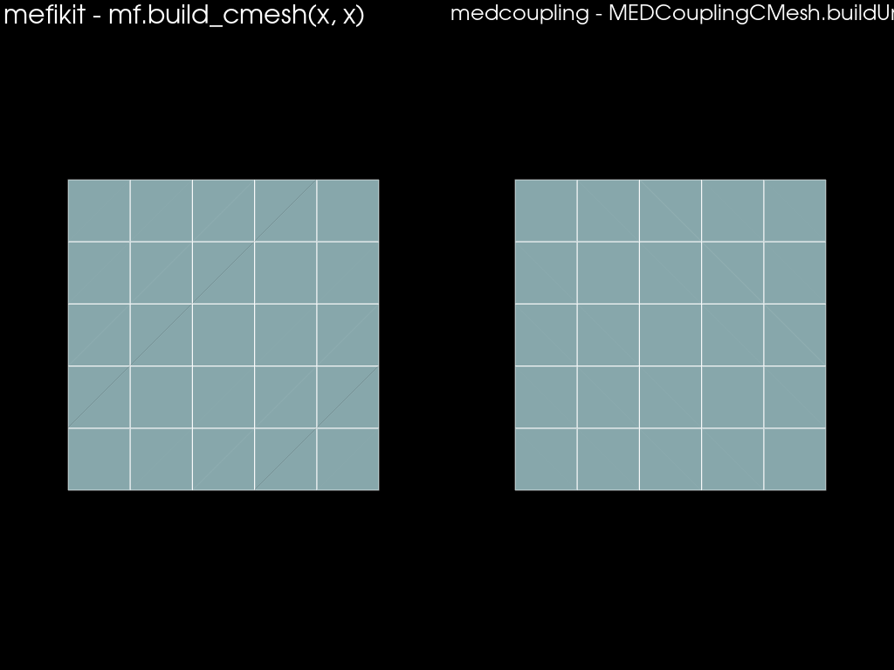


## Fields, measures, and one-line expressions

Everyone needs per-cell measures in remapping workflows. mefikit exposes a
symbolic field `mf.M` — the measure — evaluated on demand, together with a
small expression DSL on `mf.Field`: you *write* the computation, mefikit
*evaluates* it on the mesh, and combinations of `select` / `mean` / `sum`
become one-liners.

medcoupling takes the more explicit route: you build a `DataArrayDouble`,
wrap it into a `MEDCouplingFieldDouble`, and attach it to the mesh. Both
compute exactly the same numbers.


```python
# --- mefikit ----------------------------------------------------------------
mf_mesh.fields["Measure"] = mf.M  # symbolic measure
mf_mesh.fields["T"] = 1.0 + mf.X**2 + 0.5 * mf.Y

print("measure sum  :", mf_mesh.fields["Measure"].sum())
hot = mf_mesh.select(mf.Field("T") > 1.5)
print("cells T > 1.5:", len(hot))
print("mean T above :", hot.mean("T"))
```

    measure sum  : 1.0
    cells T > 1.5: 13
    mean T above : 1.8338461538461535


```python
# --- medcoupling -------------------------------------------------------------
mc_measure = mc_mesh.getMeasureField(True)
mc_measure.setNature(mc.IntensiveConservation)

centers = mc_mesh.computeCellCenterOfMass().toNumPyArray()
mc_T = mc_cell_field(
    mc_mesh,
    1.0 + centers[:, 0] ** 2 + 0.5 * centers[:, 1],
    nature=mc.IntensiveConservation,
)

print("measure sum  :", mc_measure_sum(mc_mesh))
```

    measure sum  : 1.0


```python
# identical numbers, whichever library computed them
mf_T_vals = mf_mesh.fields["T"].numpy()
mc_T_vals = mc_T.getArray().toNumPyArray()
print("max |mf_T - mc_T|:", np.abs(mf_T_vals - mc_T_vals).max())
assert np.allclose(mf_T_vals, mc_T_vals, atol=1e-12)
```

    max |mf_T - mc_T|: 1.3322676295501878e-15


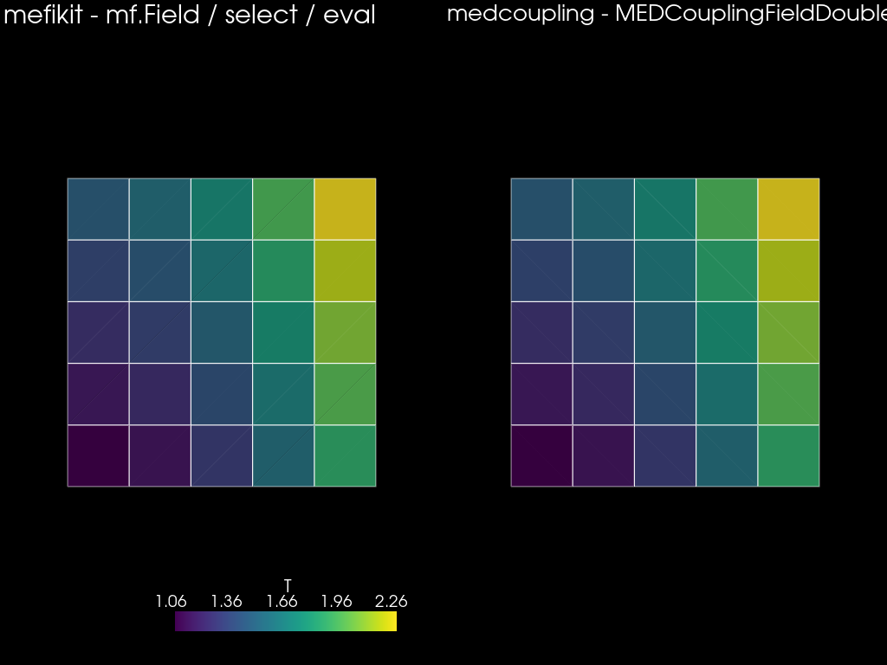


## Common operations, side by side

### Descending connectivity

The faces of a volume mesh — the bread and butter of boundary conditions and
surface integrals. mefikit: one call, `descend()`. medcoupling:
`buildDescendingConnectivity()`. Both report the same face count.


```python
axes3 = [np.linspace(0.0, 1.0, 5)] * 3
m3 = mf.build_cmesh(*axes3)
mc3 = medcoupling_cmesh(*axes3)

mf_faces = m3.descend()
mc_faces = mc_descend(mc3)

print("faces (mefikit)    :", mf_faces.num_elements())
print("faces (medcoupling):", mc_faces.getNumberOfCells())
assert mf_faces.num_elements() == mc_faces.getNumberOfCells()
print("identical face count: OK")
```

    faces (mefikit)    : 240
    faces (medcoupling): 240
    identical face count: OK


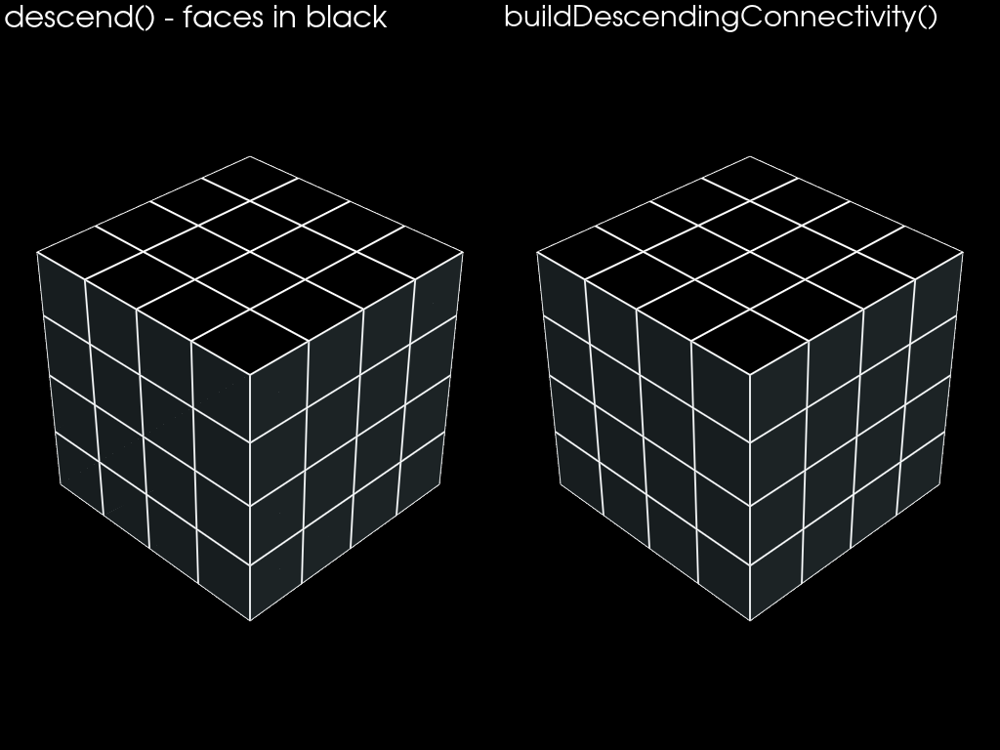


### Merging duplicated nodes

Meshes often carry duplicated nodes (split or intersected interfaces). The
reference cure is a node merge. mefikit's `merge_nodes()` and medcoupling's
`mergeNodes()` collapse the same duplicates.

A small nuance worth knowing: mefikit keeps the coordinate array untouched and
rewires the connectivity — cheap and zero-copy friendly — while medcoupling
physically compacts nodes. The *number of used nodes* is identical.


```python
# crack a small hex stack so its shared interface is duplicated
volumes = mf.build_cmesh([0.0, 1.0], np.linspace(0.0, 1.0, 5), np.linspace(0.0, 1.0, 5))
faces = volumes.descend()
cracked = volumes.crack(faces)
cracked_mc = mc_twin(cracked, 3)

merged = cracked.merge_nodes()
merged_mc = cracked_mc.deepCopy()
merged_mc.mergeNodes(1e-12)

print("components before merge:", len(cracked.connected_components()))
print("components after merge :", len(merged.connected_components()))
print(
    "used nodes  before/after (mefikit)    :",
    used_nodes(cracked),
    "->",
    used_nodes(merged),
)
print(
    "nodes       before/after (medcoupling):",
    cracked_mc.getNumberOfNodes(),
    "->",
    merged_mc.getNumberOfNodes(),
)
assert len(merged.connected_components()) == 1
assert used_nodes(merged) == merged_mc.getNumberOfNodes()
print("identical result: OK")
```

    components before merge: 16
    components after merge : 1
    used nodes  before/after (mefikit)    : 128 -> 50
    nodes       before/after (medcoupling): 128 -> 50
    identical result: OK


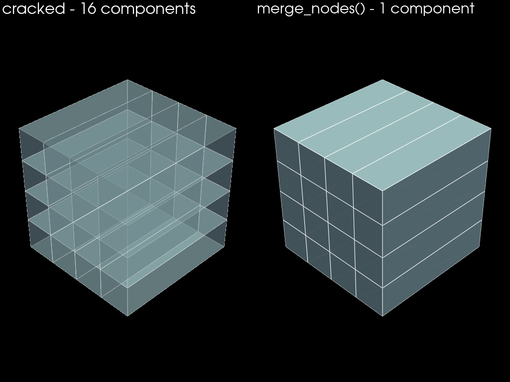


### 2D overlay / imprint

Boolean overlay of two 2D meshes (insert an embedded mesh into a background
one). mefikit: `overlay()`. medcoupling: `Intersect2DMeshes()`. Both imprint
the embedded grid into the background and preserve the total area.


```python
g1 = mf.build_cmesh(np.linspace(0.0, 1.0, 7), np.linspace(0.0, 1.0, 7))
g2 = mf.build_cmesh(np.linspace(0.25, 0.75, 5), np.linspace(0.25, 0.75, 5))

imprint = g1.overlay(g2, mf.OverlayOperation.IMPRINT)

g1m, g2m = mc_twin(g1, 2), mc_twin(g2, 2)
mc_imprint = mc.MEDCouplingUMesh.Intersect2DMeshes(g1m, g2m, 1e-12)[0]

a_mf = area_2d(imprint)
a_mc = mc_measure_sum(mc_imprint)
print("imprint area (mefikit)    :", a_mf)
print("imprint area (medcoupling):", a_mc)
assert abs(a_mf - 1.0) < 1e-9 and abs(a_mc - 1.0) < 1e-9
print("identical (unit) area: OK")
```

    imprint area (mefikit)    : 1.0000000000000002
    imprint area (medcoupling): 1.0
    identical (unit) area: OK


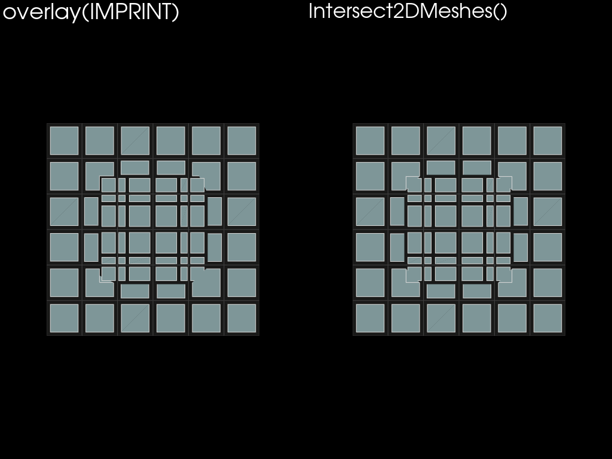


### Conservative P0/P0 field transfer (QUAD4)

The flagship operation: transfer a cell field from a source mesh to a target
mesh, conserving mass. Same prepare / apply split on both sides:

- mefikit: build the operator once (`mf.transfer.ConservativeP0`), then call
  `apply_update`.
- medcoupling: `MEDCouplingRemapper`, `prepare("P0P0")`, then `transferField`.

The transferred fields match to machine precision.


```python
# --- mefikit ----------------------------------------------------------------
src2 = mf.build_cmesh(np.linspace(0.0, 1.0, 20), np.linspace(0.0, 1.0, 20))
tgt2 = mf.build_cmesh(np.linspace(0.0, 1.0, 24), np.linspace(0.0, 1.0, 24))
src2.fields["T"] = 1.0 + (mf.X - 0.5) ** 2 + 0.5 * mf.Y

op = mf.transfer.ConservativeP0(src2, tgt2)  # prepare once
op.apply_update(src2, "T", tgt2, "T", def_val=0.0)
mf_tgt_vals = tgt2.fields["T"].numpy()

# --- medcoupling -------------------------------------------------------------
sc, tc = mc_twin(src2, 2), mc_twin(tgt2, 2)
f_src = mc_cell_field(sc, src2.fields["T"].numpy(), nature=mc.IntensiveConservation)

remap = mc.MEDCouplingRemapper()
remap.prepare(sc, tc, "P0P0")  # prepare once
f_tgt = remap.transferField(f_src, 0.0)
mc_tgt_vals = f_tgt.getArray().toNumPyArray()

print(
    "max |mefikit - medcoupling| after P0P0:",
    float(np.abs(mf_tgt_vals - mc_tgt_vals).max()),
)
assert np.allclose(mf_tgt_vals, mc_tgt_vals, atol=1e-9)
print("transferred fields match: OK")
```

    max |mefikit - medcoupling| after P0P0: 3.552713678800501e-15
    transferred fields match: OK


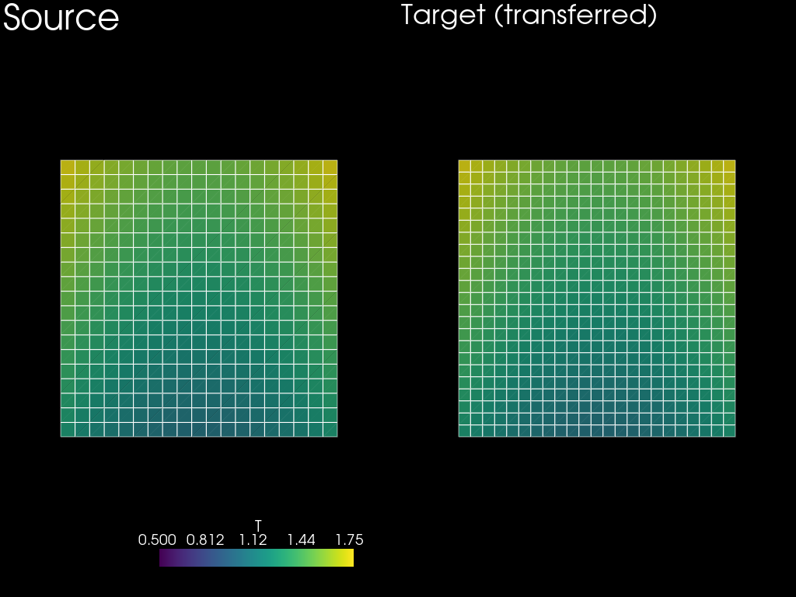


## Polyhedra, where mefikit shines the most

Real-world meshes are very often polyhedral: Voronoi meshes, cell-centred
finite volumes, unrolled CAD... Both libraries store them; the difference
shows when it is time to *use* them.

We take two different 2000-cell polyhedral meshes shipped with mefikit's test
suite — `mesh_36.med` and `mesh_27.med` — and feed the *same .med files* to
both libraries.


```python
# locate the test meshes whatever the current working directory is
root = Path(os.getcwd())
while root != root.parent and not (root / "tests" / "data" / "mesh_36.med").exists():
    root = root.parent
data = root / "tests" / "data"

mf_src = mf.UMesh.read(str(data / "mesh_36.med"))  # mefikit : 1 line
mf_tgt = mf.UMesh.read(str(data / "mesh_27.med"))
mc_src = mc.ReadMeshFromFile(str(data / "mesh_36.med"), 0)  # medcoupling
mc_tgt = mc.ReadMeshFromFile(str(data / "mesh_27.med"), 0)

print("mefikit  mesh_36 :", mf_src.block_types(), mf_src.num_elements(), "cells")
print("mefikit  mesh_27 :", mf_tgt.block_types(), mf_tgt.num_elements(), "cells")
print(
    "medcoupl mesh_36 :",
    mc_src.getNumberOfCells(),
    "cells,",
    mc_src.getNumberOfNodes(),
    "nodes",
)
print("medcoupl mesh_27 :", mc_tgt.getNumberOfCells(), "cells")

# measure + a field + a selection, poly edition, all in mefikit
mf_src.fields["Measure"] = mf.M
mf_src.fields["T"] = 1.0 + 2.0 * mf.M
print("volume(mesh_36):", mf_src.fields["Measure"].sum())
big = mf_src.select(mf.M > mf_src.fields["Measure"].mean())
print("cells above mean volume:", len(big))
```

    mefikit  mesh_36 : ['PHED'] 2000 cells
    mefikit  mesh_27 : ['PHED'] 2000 cells
    medcoupl mesh_36 : 2000 cells, 12404 nodes
    medcoupl mesh_27 : 2000 cells
    volume(mesh_36): 0.99999999869571
    cells above mean volume: 898


```python
# boundaries and descending connectivity on polyhedra
mf_bnd = mf_src.boundaries()
mf_desc = mf_src.descend()

mc_bnd = mc_src.buildBoundaryMesh(True)
mc_desc = mc_descend(mc_src)

print(
    "boundary faces (mefikit)     :",
    mf_bnd.num_elements(),
    "| medcoupling:",
    mc_bnd.getNumberOfCells(),
)
print(
    "descending    (mefikit)     :",
    mf_desc.num_elements(),
    "| medcoupling:",
    mc_desc.getNumberOfCells(),
)
assert mf_bnd.num_elements() == mc_bnd.getNumberOfCells()
assert mf_desc.num_elements() == mc_desc.getNumberOfCells()
print("identical counts: OK")
```

    boundary faces (mefikit)     : 888 | medcoupling: 888
    descending    (mefikit)     : 14401 | medcoupling: 14401
    identical counts: OK


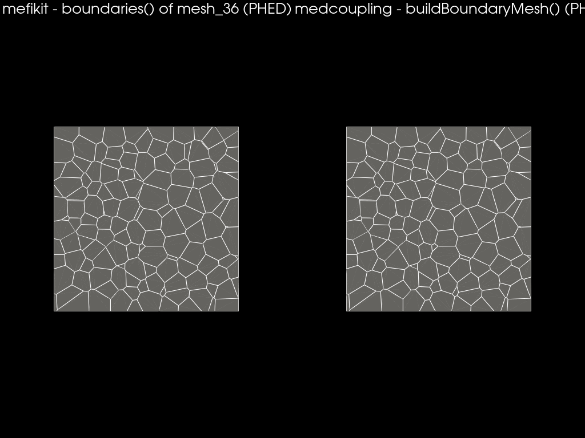


### Polyhedral-to-polyhedral remap

Same P0/P0 transfer, but between the two *real polyhedral* meshes. Prepare
once, apply many times is the name of the game for unsteady runs, so both
sides are timed separately. We scan a few mesh sizes (always the same geometry
on both sides) and check that the actual transferred fields coincide.

The `poly_subset` / `median_ms` helpers used below are small bookkeeping
utilities (isolating a sub-mesh, taking a median timing) — hidden here for
readability.


```python
def bench_poly_once(n, data):
    # Time one P0/P0 polyhedral remap size on both libraries; return the
    # (prepare, apply) medians in ms plus the transferred-field difference.
    p_src = poly_subset(data / "mesh_36.med", n, False)
    p_tgt = poly_subset(data / "mesh_27.med", n, False)
    p_src.fields["T"] = 1.0 + 2.0 * mf.M

    mf_prepare = median_ms(lambda: mf.transfer.ConservativeP0(p_src, p_tgt))
    op = mf.transfer.ConservativeP0(p_src, p_tgt)
    mf_apply = median_ms(lambda: op.apply_update(p_src, "T", p_tgt, "T", def_val=0.0))

    c_src = poly_subset(data / "mesh_36.med", n, True)
    c_tgt = poly_subset(data / "mesh_27.med", n, True)
    f_src = mc_cell_field(
        c_src, p_src.fields["T"].numpy(), nature=mc.IntensiveConservation
    )

    remap = mc.MEDCouplingRemapper()
    mc_prepare = median_ms(lambda: remap.prepare(c_src, c_tgt, "P0P0"))
    mc_apply = median_ms(lambda: remap.transferField(f_src, 0.0))

    op.apply_update(p_src, "T", p_tgt, "T", def_val=0.0)
    out_mf = p_tgt.fields["T"].numpy()
    remap.prepare(c_src, c_tgt, "P0P0")
    out_mc = remap.transferField(f_src, 0.0).getArray().toNumPyArray()
    diff = float(np.abs(out_mf - out_mc).max())
    return mf_prepare, mf_apply, mc_prepare, mc_apply, diff


poly_res = []
for n in (100, 200, 400):
    mf_prepare, mf_apply, mc_prepare, mc_apply, diff = bench_poly_once(n, data)
    poly_res.append((n, mf_prepare, mf_apply, mc_prepare, mc_apply, diff))
    print(
        f"poly n={n:4d} | mefikit {mf_prepare:7.2f} ms (prepare) / {mf_apply:5.2f} ms (apply)"
        f" | medcoupling {mc_prepare:8.1f} ms / {mc_apply:5.2f} ms | {mc_prepare / mf_prepare:4.0f}x faster"
    )
    print(
        f"            | max |mefikit - medcoupling| on the transferred field: {diff:.2e}"
    )

assert all(r[5] < 1e-9 for r in poly_res)
print("transferred fields match at every size: OK")
```

    poly n= 100 | mefikit    3.18 ms (prepare) /  0.01 ms (apply) | medcoupling    191.1 ms /  0.20 ms |   60x faster
                | max |mefikit - medcoupling| on the transferred field: 5.88e-15


    poly n= 200 | mefikit   13.22 ms (prepare) /  0.01 ms (apply) | medcoupling    853.8 ms /  0.41 ms |   65x faster
                | max |mefikit - medcoupling| on the transferred field: 6.38e-15


    poly n= 400 | mefikit   43.79 ms (prepare) /  0.02 ms (apply) | medcoupling   3338.4 ms /  0.78 ms |   76x faster
                | max |mefikit - medcoupling| on the transferred field: 7.22e-15
    transferred fields match at every size: OK


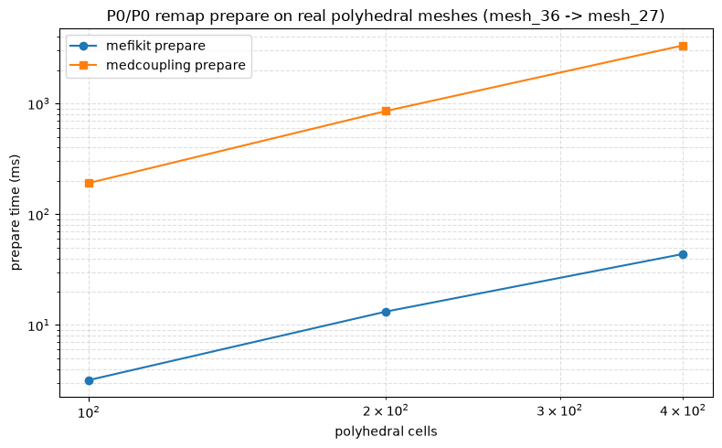


```python
r = poly_res[-1]
print(
    f"At {r[0]} cells mefikit prepares the polyhedral remap {r[3] / r[1]:.0f} times faster "
    "than medcoupling, and the gap grows with the mesh size."
)
```

    At 400 cells mefikit prepares the polyhedral remap 76 times faster than medcoupling, and the gap grows with the mesh size.


## Performance on common operations

Now the same benchmark spirit on the structured meshes (quad / hexa) of daily
life. Timings are **medians of several runs** on this machine; tiny absolute
values should be read with perspective. Both libraries always work on the
*exact same geometry*: this is what fairness looks like.

The benchmark harness itself is hidden for readability. It mirrors mefikit's
`tests/bench_vs_medcoupling.py`, where the full workload definitions live; the
cells below only show how the runs are launched.


```python
bench = {}
bench["remap-2d"] = bench_remap(2, N2D, build_iter=10, poly=False)
print("remap-2d done")
bench["remap-3d"] = bench_remap(3, N3D, build_iter=10, poly=False)
print("remap-3d done")
bench["remap-3d-poly"] = bench_remap(3, NPOLY, build_iter=5, poly=True)
print("remap-3d-poly done")
bench["merge-nodes"] = bench_merge()
print("merge-nodes done")
bench["descend"] = bench_descend()
print("descend done")
bench["overlay"] = bench_overlay()
print("overlay done")
bench["crack"] = bench_crack()
print("crack done")
```

    remap-2d done


    remap-3d done


    remap-3d-poly done
    merge-nodes done


    descend done
    overlay done


    crack done


```python
def mf_mc(case, mf_key, mc_key):
    return bench[case][mf_key], bench[case][mc_key]


spec = [
    ("remap-2d", "build/prepare", "mf_build", "mc_prepare"),
    ("remap-2d", "transfer", "mf_apply", "mc_transfer"),
    ("remap-3d", "build/prepare", "mf_build", "mc_prepare"),
    ("remap-3d", "transfer", "mf_apply", "mc_transfer"),
    ("remap-3d-poly", "build/prepare", "mf_build", "mc_prepare"),
    ("remap-3d-poly", "transfer", "mf_apply", "mc_transfer"),
    ("merge-nodes", "merge", "mf", "mc"),
    ("descend", "run", "mf", "mc"),
    ("overlay", "run", "mf", "mc"),
    ("crack", "crack", "mf", "mc"),
]
rows = [(case, step, *mf_mc(case, mk, ck)) for case, step, mk, ck in spec]

print(
    f"{'case':<14s} {'step':<14s} {'mefikit ms':>12s} {'medcoup ms':>12s} {'mc/mf':>9s}"
)
print("-" * 62)
for case, step, mf_t, mc_t in rows:
    print(f"{case:<14s} {step:<14s} {mf_t:>12.3f} {mc_t:>12.3f} {mc_t / mf_t:>8.1f}x")

print()
print("correctness cross-checks:")
all_ok = True
for tag in bench:
    for label, (ok, info) in bench[tag]["checks"].items():
        all_ok &= ok
        print(f"  [{'OK' if ok else 'FAIL'}] {tag}: {label}  {info}")
assert all_ok, "a cross-check failed"
```

    case           step             mefikit ms   medcoup ms     mc/mf
    --------------------------------------------------------------
    remap-2d       build/prepare        35.108       40.813      1.2x
    remap-2d       transfer              0.124        0.762      6.1x
    remap-3d       build/prepare       260.281      865.010      3.3x
    remap-3d       transfer              0.046        1.319     28.5x
    remap-3d-poly  build/prepare       173.516     2844.467     16.4x
    remap-3d-poly  transfer              0.049        2.027     41.6x
    merge-nodes    merge                 0.599        0.531      0.9x
    descend        run                  15.889       27.950      1.8x
    overlay        run                   2.191       19.334      8.8x
    crack          crack                73.527      525.266      7.1x

    correctness cross-checks:
      [OK] remap-2d: intensive match (mf == mc)  7.752687380957468e-13
      [OK] remap-2d: mass (mf == analytic)  (1.0, 1.0)
      [OK] remap-2d: mass (mc == mf)  (1.0, 1.0)
      [OK] remap-3d: intensive match (mf == mc)  0.0
      [OK] remap-3d: mass (mf == analytic)  (1.0, 1.0)
      [OK] remap-3d: mass (mc == mf)  (1.0, 1.0)
      [OK] remap-3d-poly: mass (mf == analytic)  (1.0, 1.0)
      [OK] remap-3d-poly: mass (mc == mf)  (1.0, 1.0)
      [OK] merge-nodes: used nodes == 1875  1875
      [OK] merge-nodes: mc nodes == mf  (1875, 1875)
      [OK] descend: faces == 3 n^2 (n+1)  (43200, 43200, 43200)
      [OK] overlay: area == 1 (both)  (1.0, 1.0)
      [OK] crack: node count (mf == mc)  (64000, 64000)


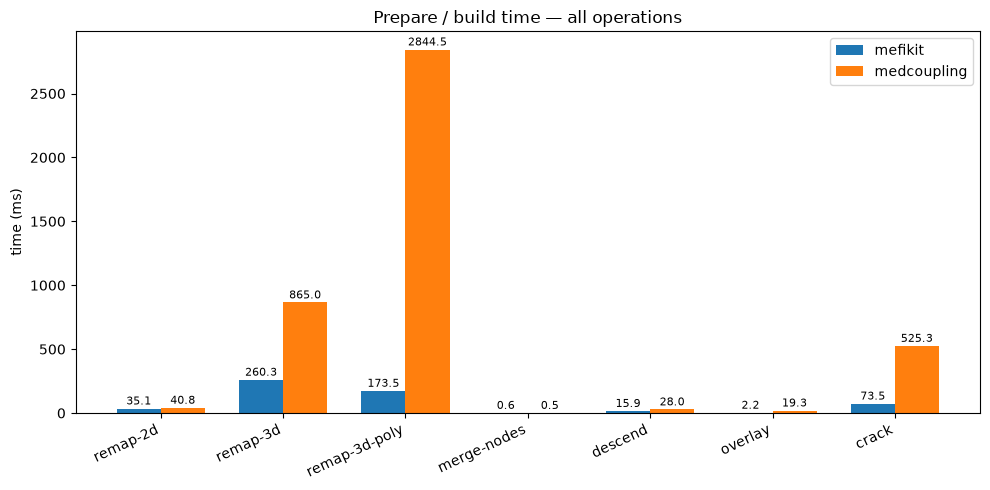


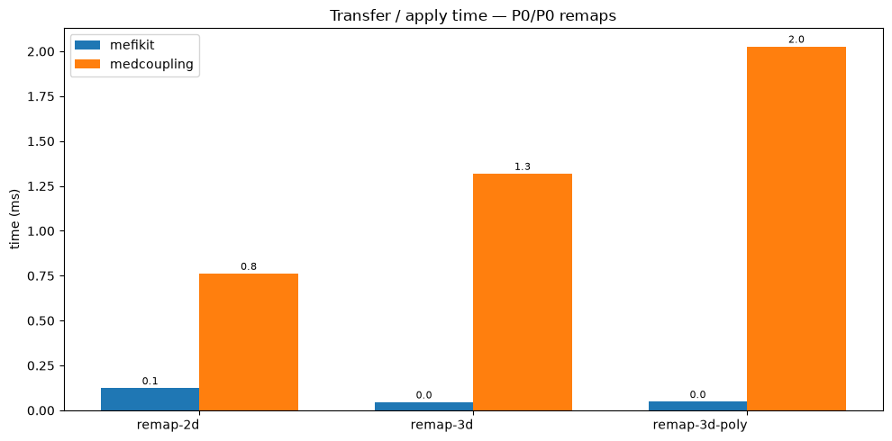


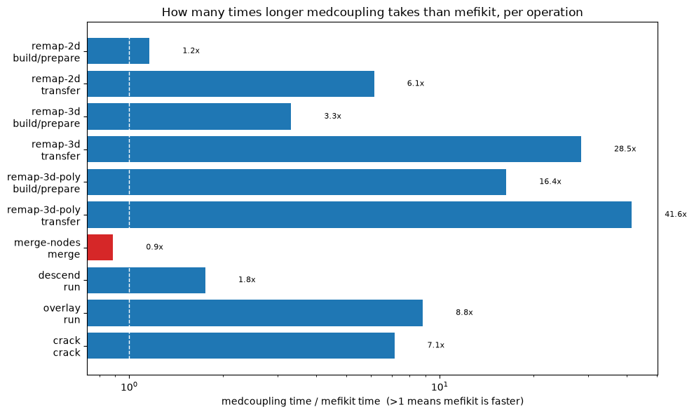


## Feature comparison at a glance

Both libraries cover the common operations shown above. Beyond that, mefikit
adds ergonomics of its own — most of it already exercised in this notebook.

| Operation                                        | medcoupling                                    | mefikit                                      |
|--------------------------------------------------|------------------------------------------------|----------------------------------------------|
| Structured grid                                  | `MEDCouplingCMesh` + `buildUnstructured()`     | `build_cmesh(*axes)` — one call              |
| Read / write `.med`                              | `ReadMeshFromFile` / `write`                   | `UMesh.read` / `write` (same format)         |
| Per-cell measure                                 | `getMeasureField` + field plumbing             | `mf.M` — symbolic, evaluated on demand       |
| P0/P0 conservative remap (quad / hex)            | `MEDCouplingRemapper.prepare("P0P0")`          | `mf.transfer.ConservativeP0`                 |
| Polyhedral remap                                 | `MEDCouplingRemapper.prepare("P0P0")`          | `mf.transfer.ConservativeP0`                 |
| Faces of a volume mesh                           | `buildDescendingConnectivity`                  | `descend()`                                  |
| Merge duplicated nodes                           | `mergeNodes`                                   | `merge_nodes()`                              |
| 2D boolean overlay / imprint                     | `Intersect2DMeshes`                            | `overlay(operation=...)`                     |
| Mixed element types                              | yes                                            | yes                                          |
| Fields, groups and selections                    | DataArray arithmetic + explicit plumbing       | `mf.Field` DSL, `select` / `eval`, groups    |
| Meshless field transfers                         | manual / lower-level                           | `ConstantPiecewise`, `MovingLeastSquares`    |
| File formats                                     | MED, VTK, ENSIGHT, ...                         | med, vtk/vtu, vtkhdf, cgns, json, yaml       |
| Native API language                              | C++ (with Python bindings)                     | Rust core with first-class Python bindings   |

Let us be perfectly honest: medcoupling remains far broader than mefikit —
decades of API surface, advanced field machinery, spline remapping and a huge
ecosystem around the MED format. mefikit does not try to replace that. It
tries to be *direct* for the operations above, and *fast* where it counts:
two propositions you have just measured.


## Closing thoughts

A fair question: should a medcoupling user switch to mefikit? As always, it
depends.

- You already have a solid, mature medcoupling pipeline: nothing here is
  broken, and mefikit reads the very same `.med` files — you can adopt it as a
  **complement**. `mesh.to_mc()` hands you the medcoupling twin of a mefikit
  mesh in one line.
- You are starting a new project, work a lot with **polyhedral** meshes, value
  a short readable API and care about remap performance: give mefikit a try,
  you should feel at home very quickly.

Both libraries agree on the most important thing: the meshes are the same, the
physics is the same, and the results match to machine precision. Thank you
medcoupling for setting such a high bar — mefikit simply tries to reach it
with fewer keystrokes and a bit more speed.

If you want to go further: browse the other notebooks of this book, have a
look at the [roadmap](https://github.com/asonolet/mefikit/blob/master/ROADMAP.md)
and try the operations above on your own meshes.
