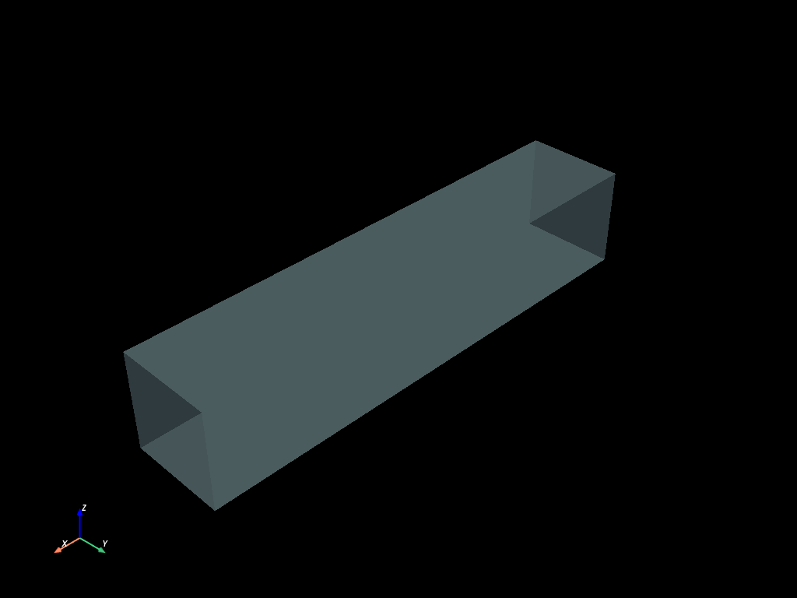
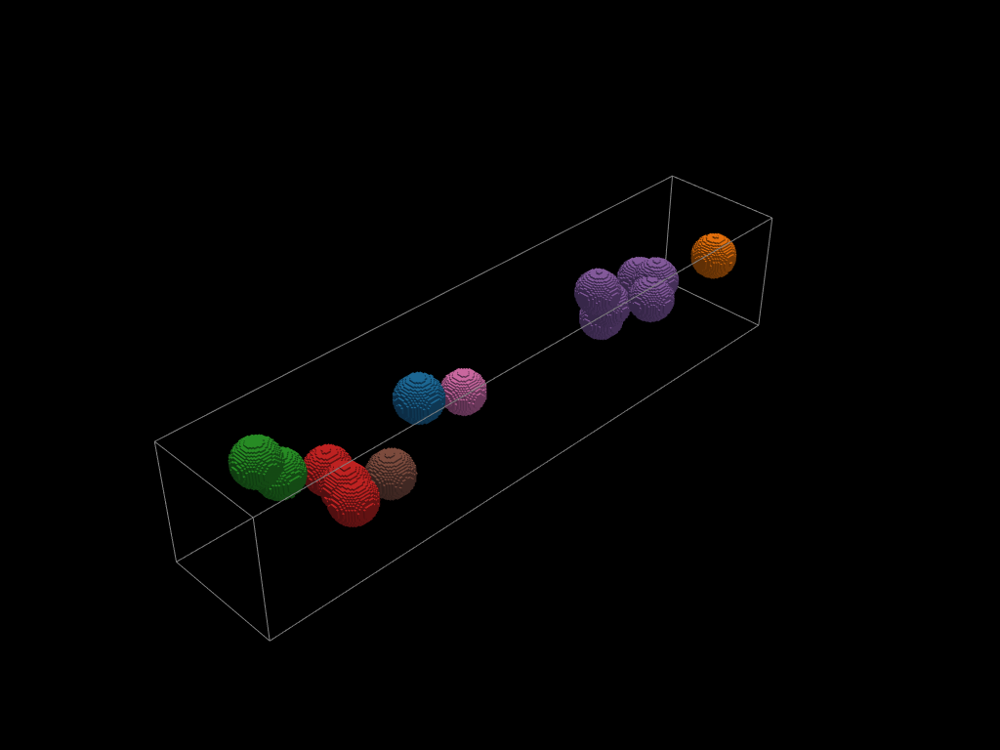
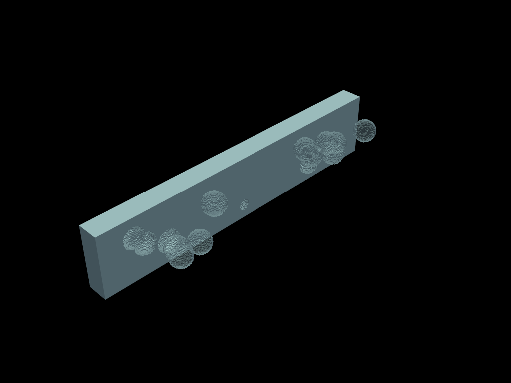

# Bubbles example

*Figures use PyVista; verbose plotting boilerplate is omitted.*

A hexahedral box is seeded with spherical bubbles. This is a small end-to-end
tour of the selection pipeline on a single mesh: tag regions with **groups**,
extract them with `select`, **crack** them out of the matrix, split them into
**connected components**, and measure volumes and positions with one-line
reductions.


```python
import numpy as np

import mefikit as mf

rng = np.random.default_rng(seed=123)
```

## Setup


```python
xmax = 5.0
ymax = 1.0
r = 0.17
nb = 15
nr = 12.5
```


```python
nx = int(xmax / r * nr)
ny = int(ymax / r * nr)
print(f"Number of elements : {nx * ny * ny:,}")
```

    Number of elements : 1,955,743


The box `xmax x ymax x ymax` is discretised with
`nx x ny x ny` cells, fine enough to resolve the `nb = 15` spheres of radius
`r` sitting inside it. Their centres are sampled in the interior so that every
sphere stays fully inside the box; each one becomes a `mf.sel.sphere(...)`
selection, and all of them are combined with `|` into a single union.


```python
xc = rng.uniform(r, xmax - r, nb)
yc = rng.uniform(r, ymax - r, nb)
zc = rng.uniform(r, ymax - r, nb)
spheres = [mf.sel.sphere([x, y, z], r) for x, y, z in zip(xc, yc, zc)]
sphere_union = spheres[0]
for s in spheres[1:]:
    sphere_union = sphere_union | s
```


```python
x = np.linspace(0.0, xmax, nx)
y = np.linspace(0.0, ymax, ny)
volumes = mf.build_cmesh(x, y, y)
```

The background is a plain structured hexa grid. Let us look at
its boundaries first.


```python
volumes.boundaries().to_pyvista().plot(opacity=0.4)
```





## Selecting bubbles

`mesh.select(...)` returns a **lazy view**: nothing is computed until you
materialise it (`.to_mesh()`) or take a reduction. Storing a selection in
`mesh.groups` lets you reuse it later by name.


```python
# `select` returns a lazy view: materialize it into a sub-mesh with `.to_mesh()`.
inner_bubbles = volumes.select(sphere_union).to_mesh()
interface = inner_bubbles.boundaries()
cracked = volumes.crack(interface)
```


```python
# Named groups live in a dict-like mapping on the mesh:
# assign any selection expression (or {etype: ids} dict) to tag elements.
volumes.groups["bubbles"] = sphere_union
print(len(volumes.groups["bubbles"]), "elements tagged in group 'bubbles'")
```

    105990 elements tagged in group 'bubbles'


## Cracking and connected components

`crack` duplicates the nodes that sit on the bubble interfaces, so the bubbles
become elements with their own nodes. Then `connected_components()` isolates
each bubble.

So far `crack` has duplicated the nodes that sit on the cell
interfaces, so neighbouring elements no longer share their faces. The bubble
fronts are now open surfaces wrapped around the matrix:


```python
cracked.boundaries().to_pyvista().plot(opacity=0.4)
```


```python
bubble_groups = inner_bubbles.connected_components()
```

`inner_bubbles.connected_components()` groups the cracked bubble
mesh into its connected parts. Each component is one bubble (or a touching
cluster); the plot colours them one by one on top of the box edges.





Selections compose. A clip is just a `mf.sel.bbox(...)`;
intersecting it with `~sphere_union` selects the box elements that are
*outside* the bubbles — the matrix stays crack-free where bubbles have been
removed from the picture:


```python
clip1 = mf.sel.bbox([-np.inf] * 3, [np.inf, ymax / 3.0, np.inf])
```





## Computing statistics

Reductions evaluate lazily over a selection or a group. Bubble volumes are
compared with the analytic result `4/3 pi r**3` for an ideal sphere, and
`mean(mf.C)` (mean of the node centroids) gives the barycentre of the bubble
mass:


```python
bubble_volumes = volumes.select("bubbles").sum(mf.M)
print(nb * 4.0 / 3.0 * np.pi * r**3.0)
bubble_volumes
```

    0.3086928941417331


    0.2793115007084435


The bubble volume returned by `sum(mf.M)` is close to
`nb * 4/3 pi r**3`; the small gap is the staircase discretisation of spheres
on a regular hexa grid.


```python
bubbles_mean_pos = volumes.select("bubbles").mean(mf.C)
print(bubbles_mean_pos)
```

    [2.49923348 0.4928932  0.5314482 ]
