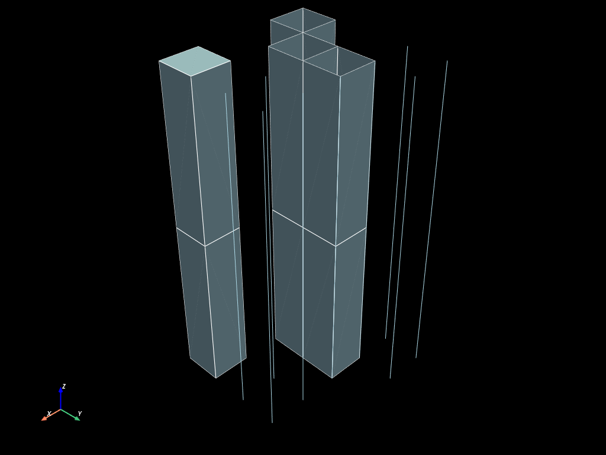
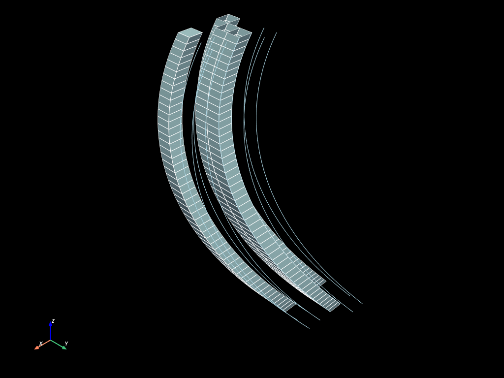
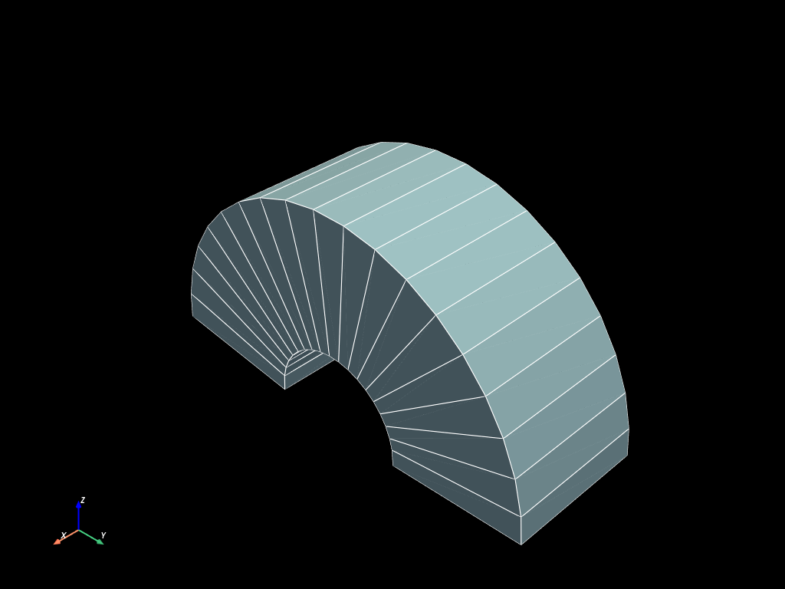

# Mesh extrusions

*Figures use PyVista; verbose plotting boilerplate is omitted.*

Extrusion sweeps a **base** mesh along a direction to build a mesh one
dimension higher: a `VERTEX` becomes a `SEG2`, a `SEG2` a `QUAD4`, a `QUAD4`
a `HEX8`. mefikit offers three flavours — plain `extrude` along an existing
axis, `extrude_parallel` along any 3D line, and `extrude_curv` for a
curvilinear sweep.


```python
import numpy as np

import mefikit as mf
```

## Building a 2D base mesh

Any mesh can be extruded, as long as each of its blocks is a
lower-dimensional "slice". Let us first build one by hand with mixed
topologies (isolated nodes, edges and one quad), so that every sweeping demo
pulls each block up one dimension at once:


```python
x, y = np.meshgrid(np.linspace(0.0, 1.0, 5), np.linspace(0.0, 1.0, 5))
coords = np.c_[x.flatten(), y.flatten()]
conn = np.array(
    [
        [0, 1],
        [1, 6],
        [6, 5],
        [5, 0],
        [6, 7],
        [7, 12],
        [12, 11],
        [11, 6],
        [12, 17],
        [17, 16],
        [16, 11],
    ],
    dtype=np.uint,
)
```


```python
mesh = mf.UMesh(coords)
mesh.add_regular_block("VERTEX", np.arange(13, 22, dtype=np.uint)[..., np.newaxis])
mesh.add_regular_block("SEG2", conn)
mesh.add_regular_block("QUAD4", np.array([[3, 4, 9, 8]], dtype=np.uint))
```


```python
mesh.to_pyvista(dim="all").plot(cpos="xy", show_edges=True)
```


## Extrusion along an existing axis

`extrude(along)` stacks copies of the base mesh at the node ids given by
`along`. Here `range(3)` steps through three existing nodes, so the quad is
swept into three HEX8 cells, the edges into QUAD4 faces and the vertices into
SEG2 segments:

### Build simple extruded mesh


```python
extruded = mesh.extrude(range(3))
```


```python
extruded.to_pyvista(dim="all").plot(show_edges=True)
```





### Extrusion along a 3D line, with parallel z faces

`extrude_parallel(line)` sweeps the base mesh along an arbitrary 3D polyline;
the layers follow the line while staying parallel to each other:


```python
n = 50
x = np.sin(np.linspace(0.0, np.pi, n))
y = np.cos(np.linspace(0.0, np.pi, n))
z = np.linspace(0.0, 4.0, n)
line = np.c_[x, y, z]

extruded_par = mesh.extrude_parallel(line)
```


```python
extruded_par.to_pyvista(dim="all").plot(show_edges=True)
```





### Curvilinear extrusion

Finally, `extrude_curv(line)` builds a *curvilinear* sweep: the base mesh is
swept along a curve and the nodes settle on it, so the result can be bent or
wrapped — a natural fit for pipes, blades and other swept geometries:


```python
mesh = mf.build_cmesh(range(2), range(2))
n = 20
x = np.zeros((n,))
y = np.cos(np.linspace(0.0, np.pi, n))
z = np.sin(np.linspace(0.0, np.pi, n))
line = np.c_[x, y, z]

extruded_curv = mesh.extrude_curv(line)
```


```python
extruded_curv.to_pyvista(dim="all").plot(show_edges=True)
```



