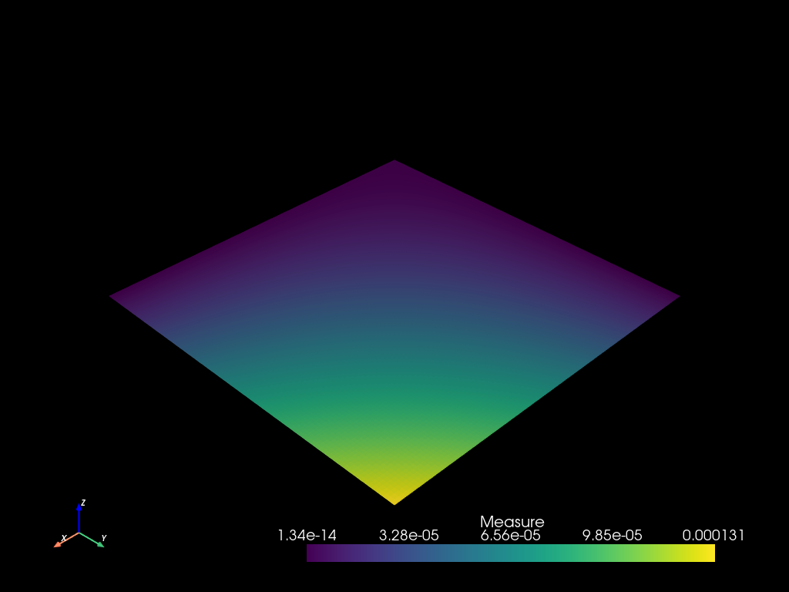
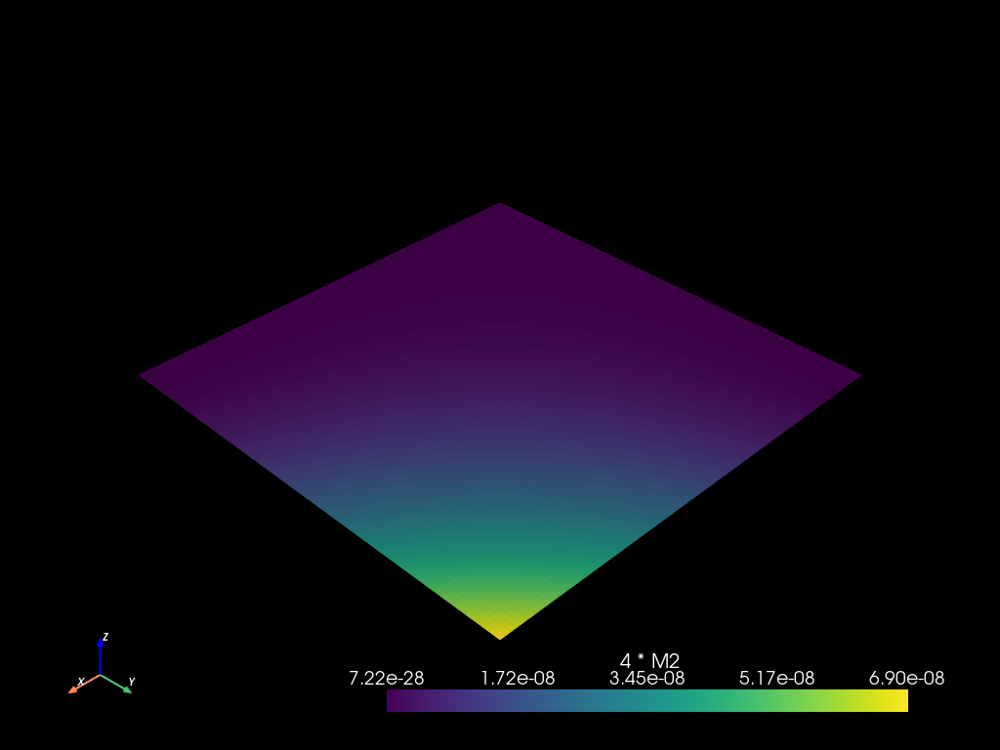
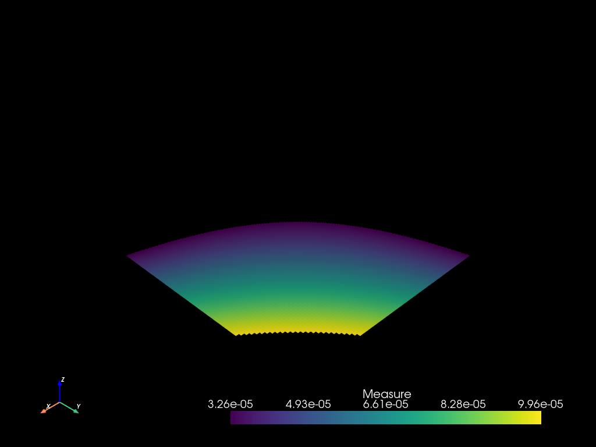
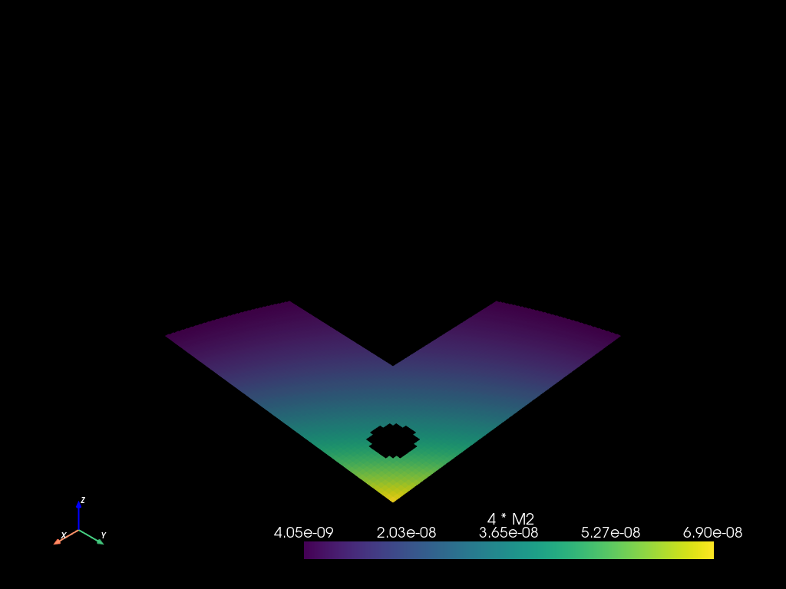

# Fields


```python
import mefikit as mf
import numpy as np
import pyvista as pv

pv.set_plot_theme("dark")
pv.set_jupyter_backend("static")
```

## Field expressions


FieldExpr are composition of floats and mf.sel.field("fieldname") or custom fields :
- field("toto") * field("tata")
- field("toto") + field("tata")
- field("toto") - field("tata")
- field("toto") / field("tata")
- field("toto") ** field("tata")
- field("toto").dot(field("tata"))
- field("toto") @ field("tata")
- sin(field("toto"))
- cos(field("toto"))
- abs(field("toto"))
- log(field("toto"))
- log10(field("toto"))
- exp(field("toto"))
- field("toto")[0]
- normals()
- x()
- y()
- z()
- centroids()


```python
x = np.logspace(-5, 0.0, 1000)
mesh2 = mf.build_cmesh(x, x)
```


```python
mesh2.measure_update()
```


```python
mesh2.to_pyvista().plot()
```





```python
m = mf.Field("Measure")
```

## Field operations evaluation


```python
mesh2.eval_update("4 * M2", m * m * 4.0)
```


```python
mesh2.to_pyvista().plot()
```





```python
mesh2.fields()
```


    {'4 * M2': {'QUAD4': array([7.22038631e-28, 7.38874101e-28, 7.56102117e-28, ...,
             6.58446349e-08, 6.73799065e-08, 6.89509753e-08], shape=(998001,))},
     'Measure': {'QUAD4': array([1.34353883e-14, 1.35911194e-14, 1.37486555e-14, ...,
             1.28301047e-04, 1.29788199e-04, 1.31292589e-04], shape=(998001,))}}


```python
m2 = mf.Field("4 * M2")
mesh2.eval(m2 - 4.0 * m.square())
```


    {'QUAD4': array([0., 0., 0., ..., 0., 0., 0.], shape=(998001,))}


## How does it work ?


```python
print(4.0 * m * m)
```

    BinarayExpr {
        operator: Mul,
        left: BinarayExpr {
            operator: Mul,
            left: Array(
                4.0, shape=[], strides=[], layout=CFcf (0xf), dynamic ndim=0,
            ),
            right: Field(
                "Measure",
            ),
        },
        right: Field(
            "Measure",
        ),
    }


## Why is it awesome ?

This enables two patterns :
- reusability and composition of filters
- evaluation optimizations, some selection filters are evaluated in parallel, some are evaluated first if they are discriminant

# Field to Selection

Fields can be converted to threshold selections :


```python
th = (m > 3.25e-5) & (m < 1e-4)
```


```python
m2sel = mesh2.select(th)
pvm2: pv.UnstructuredGrid = m2sel.to_pyvista()
pvm2.active_scalars_name = "Measure"
pvm2.plot()
```





Thoses threasholds selections can be combined with other selections.


```python
r = mf.sel.rect([0.25, 0.25], [0.7, 0.7])
c = mf.sel.circle([0.875, 0.875], 0.05)
```


```python
mesh2.select((m2 > 4e-9) - r - c).to_pyvista().plot()
```



