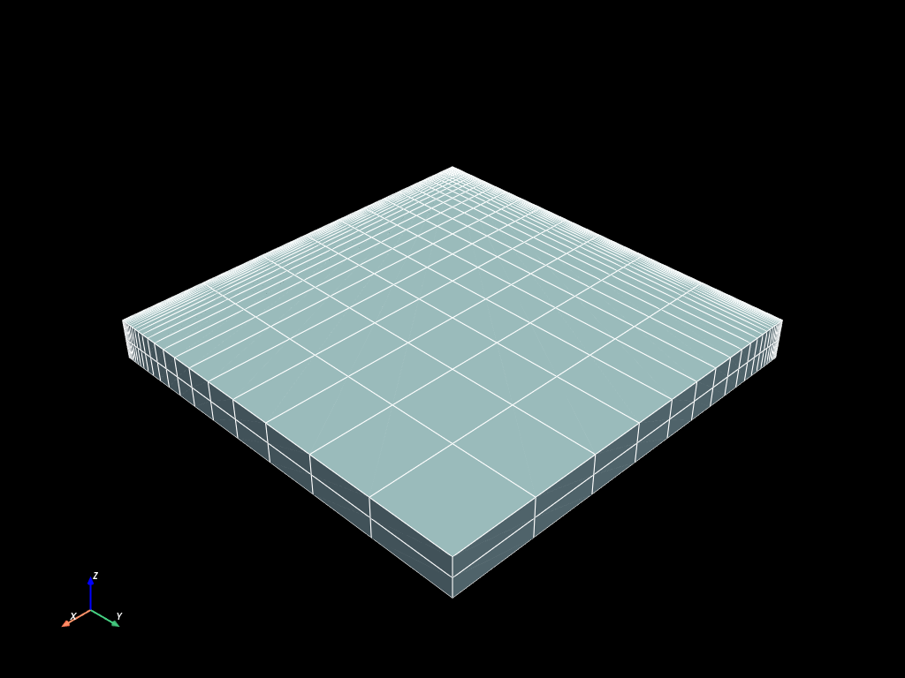
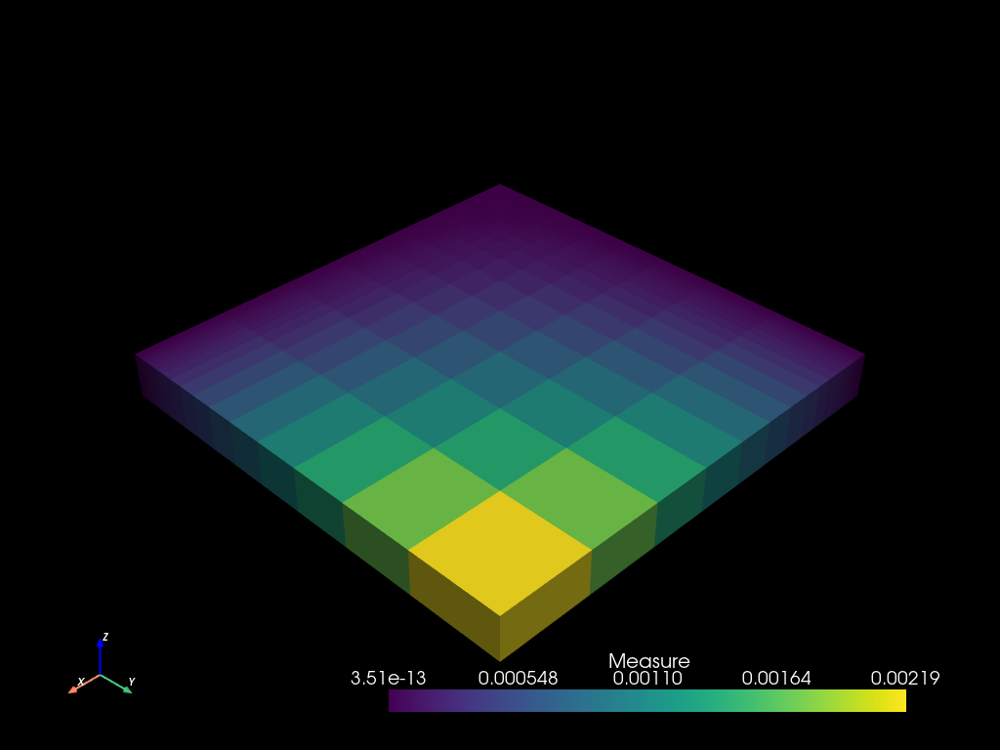
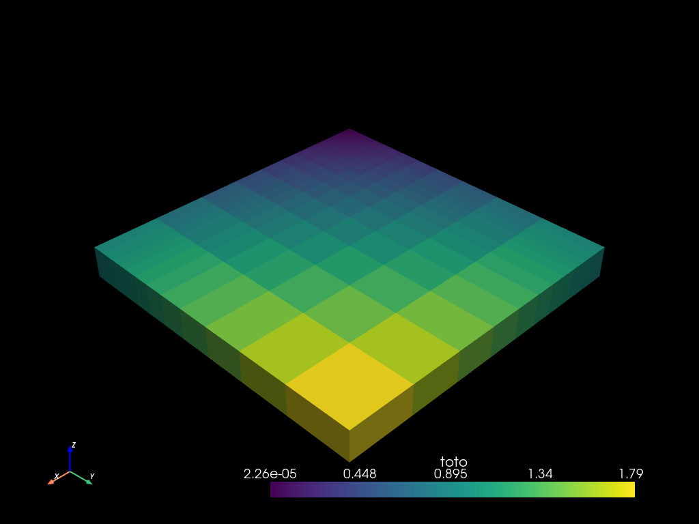
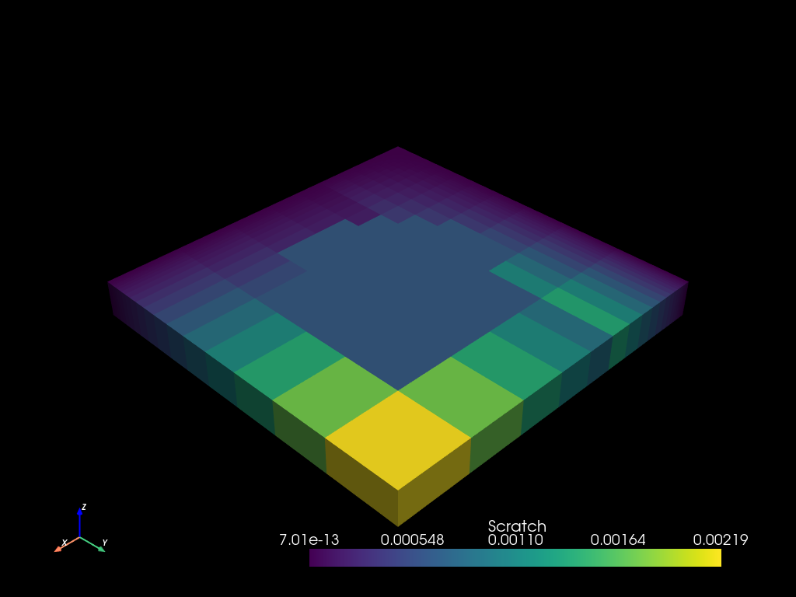
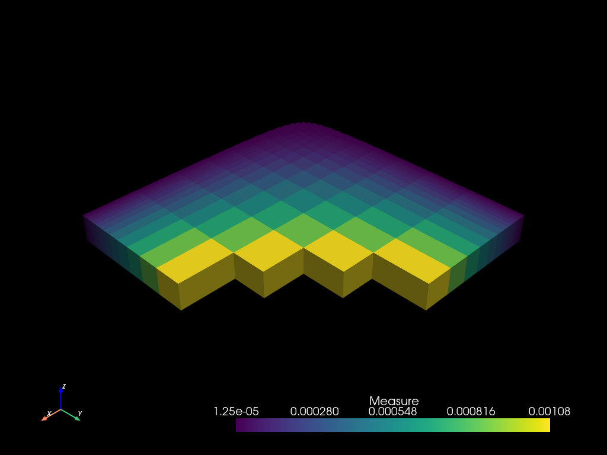
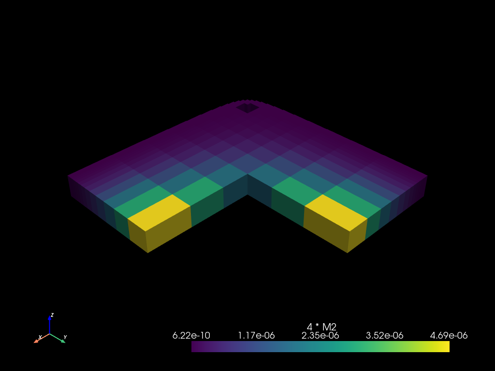
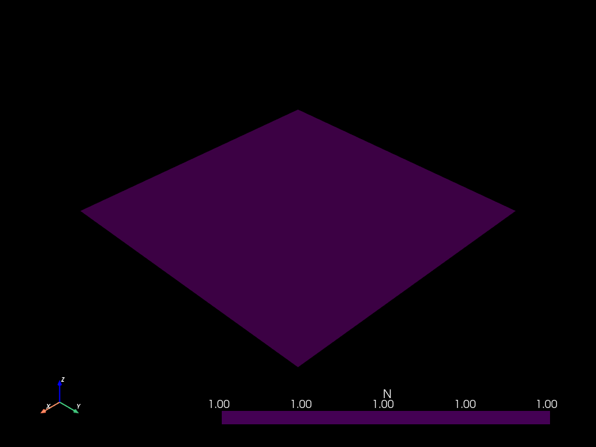

# Fields


```python
import numpy as np
import pyvista as pv

import mefikit as mf

pv.set_plot_theme("dark")
pv.set_jupyter_backend("static")
```

## Field expressions


FieldExpr are composition of floats and mf.sel.field("fieldname") or custom fields. Available operations on fields include :
- binary expresions `+ - / *`
- unary expr `sin(), cos(), abs(), ln(), log10(), exp()`
- primitives :
    - M: the measure, ie length/area/volume of an element
    - C: the node centroid of an element, not the volume barycenter
    - X: the X compo of the node centroid
    - Y: the Y compo of the node centroid
    - Z: the Z compo of the node centroid

### Scalar binary operations


```python
toto = mf.Field("toto")
tata = mf.Field("tata")
toto + tata
toto * tata
toto - tata
toto / tata
toto + 2.0
toto - 2.0
toto * 2.0
```

### Scalar unary ops

toto.sin()
toto.cos()
toto.abs()
toto.exp()
toto.ln()
toto.square()
toto.sqrt()
toto.tan()
toto.log10();


```python
### Vector ops
```


```python
# TODO:
# toto.dot(tata) and toto @ tata
# toto[0]
# toto.cross(tata)
```

### Primitives


```python
m = mf.M  # measure: length/area/volume
c = mf.C  # node centroids
x = mf.X  # x compo of node centroid
y = mf.Y  # y compo of node centroid
z = mf.Z  # z compo of node centroid
# b = mf.B  # volume barycenter
n = mf.Normal  # normal to n-1 dim elements, ie 2d elems in 3d or 1d elems in 2d
nx = mf.Nx  # x compo of element normal
ny = mf.Ny  # y compo of element normal
nz = mf.Nz  # z compo of element normal
```

### How does it work ?


The operations build a binary operation tree structure. `Mefikit` knows how to interpret this binary tree to compute fields.


```python
print(toto * mf.M + 3.0 * mf.X)
```

    BinaryExpr {
        operator: Add,
        left: BinaryExpr {
            operator: Mul,
            left: Field(
                "toto",
            ),
            right: Measure,
        },
        right: BinaryExpr {
            operator: Mul,
            left: Array(
                3.0, shape=[], strides=[], layout=CFcf (0xf), dynamic ndim=0,
            ),
            right: X,
        },
    }


This is quite handfull because it enables two patterns:
- reusability and composition of filters
- evaluation optimizations of selections : some selection filters are evaluated in parallel, some are evaluated first if they are discriminant

## Mesh fields mapping


```python
x = np.logspace(-5, 0.0, 50)
z = np.linspace(0.0, 0.1, 3)
mesh2 = mf.build_cmesh(x, x, z)
```


```python
mesh2.to_pyvista().plot(show_edges=True)
```





Fields attribute is dictionnary like: fields can be accessed, modified, added, defined through it using field expressions evaluation on the mesh.

Fields expressions are independent from the mesh and light, fields are evaluated field expressions stored alongside the mesh.


```python
mesh2.fields["Measure"] = mf.M
```


```python
mesh2.to_pyvista().plot()
```





```python
mesh2.fields["toto"] = mf.X + mf.Y
```


```python
pvm = mesh2.to_pyvista()
pvm.active_scalars_name = "toto"
pvm.plot()
```





```python
# List and look up fields by name.
print(mesh2.fields.keys())
print(mesh2.fields.values())
```

    ['Measure', 'toto']
    [FieldRef("Measure"), FieldRef("toto")]


```python
for n, f in mesh2.fields.items():
    print(n, ":", f)
```

    Measure : FieldRef("Measure")
    toto : FieldRef("toto")


```python
del mesh2.fields["toto"]  # remove it
print(mesh2.fields)
```

    FieldsMapping(["Measure"])


## Field references

Fields live in a dict-like mapping on the mesh, keyed by name. Each entry is a handle (`FieldRef`) to read values, reduce them, or write through selectors. Fields reference are always bound to a given mesh.


```python
mes = mesh2.fields["Measure"]
print("shape:", mes.shape, "| elements:", len(mes))
```

    shape: (1,) | elements: 4802


### Whole reductions

Field references support reductions evaluated eagerly :


```python
# Whole-domain reductions over every element carrying the field.
print(mes.min(), mes.max(), mes.mean())
```

    3.507414294773286e-13 0.002192327517292864 2.0824239902124112e-05


### Numpy input/ouput


```python
# Bulk export as {etype: array} (or a single array via `.numpy()` when the
# mesh has one element type).
vals = mes.values()
print(vals.keys())
shortcut_vals = mes.numpy()
print(shortcut_vals.shape)
assert np.allclose(vals["HEX8"], shortcut_vals)
```

    dict_keys(['HEX8'])
    (4802,)


```python
# Bulk import a dict[str, ndarray] as new field
# Field size checks are done so that the field lay on all elements of the same dim.
mesh2.fields["toto"] = {"HEX8": shortcut_vals * 3.0}
```

## Regional filtered fields

Lazy selections (see selection notebook) allow to compute regional reduction with any field expression,
including plain existing field names as strings.


```python
rect = mf.sel.bbox([0.25, 0.25, 0.0], [0.7, 0.7, 0.1])
zone = mesh2.select(rect)
print(zone.mean("toto"), zone.max(mf.M * 4))
```

    0.0013598121884658915 0.003426116772966117


Writes accept scalars, arrays, field expressions or existing field names,
targeted by wildcards (`...`) or selectors.


```python
mesh2.fields["Scratch"] = 0.0  # create by broadcast
mesh2.fields["Scratch"][...] = (
    "Measure"  # whole selection, copy an existing field inplace
)
```

A field can be overwritten on a specific region. The overwrite is done using an expression formulae which can even reference the previous field values.


```python
sel = mf.sel.bbox([0.0, 0.0, 0.0], [0.3, 1.0, 0.1])
mesh2.fields["Scratch"][sel] = mf.Field("Scratch") * 2  # scaled sub-region
```


```python
sel2 = mf.sel.sphere(center=[0.5, 0.5, 0.05], r=0.3)
m = mesh2.select(sel2).mean("Scratch")  # compute the mean of scratch in a region
mesh2.fields["Scratch"][sel2] = m  # assign this constant value to the whole region
```


```python
pvm = mesh2.to_pyvista()
pvm.active_scalars_name = "Scratch"
pvm.plot()
```





## Direct field expression evaluation to numpy

It is not really recommended not to use the .fields storing mecanism as it provides complete integration with mefikit, but it is nevertheless possible to evaluate an expression on a field and export it directly as a numpy array. The `eval` method does exaclty this.


```python
m = mf.Field("Measure")
m2 = mf.Field("4 * M2")
mesh2.fields["4 * M2"] = 4.0 * m * m
mesh2.eval(m2 - 4.0 * mf.M.square())
```


    {'HEX8': array([0., 0., 0., ..., 0., 0., 0.], shape=(4802,))}


# Field to Selection

Field expressions can be converted to threshold selections expressions. The available comparisons are `<, <=, >, >=, ==` :


```python
maxM = mesh2.select(mf.sel.all()).max(mf.M)
minM = mesh2.select(mf.sel.all()).min(mf.M)
meanM = mesh2.select(mf.sel.all()).mean(mf.M)
lb = (minM + meanM) / 2.0
hb = (maxM + meanM) / 2.0
m = mf.Field("Measure")

th = (m > lb) & (m <= hb)
```


```python
m2sel = mesh2.select(th).to_mesh()
pvm2: pv.UnstructuredGrid = m2sel.to_pyvista()
pvm2.active_scalars_name = "Measure"
pvm2.plot()
```





Those threshold selections can be combined with other selections.


```python
r = mf.sel.bbox([0.5, 0.5, 0.0], [0.8, 0.8, 0.1])
c = mf.sel.sphere([0.12, 0.12, 0.05], 0.05)
```


```python
mesh2.select(th - r - c).to_mesh().to_pyvista().plot()
```





## Vector/Matrix/Tensor fields

### Normals of hyperplane dim elements

Let first add the elements of the boundaries to the current mesh :


```python
mesh2.boundaries_update()
```

Now normals can be computed on those elements.


```python
mesh2.fields["N"] = mf.Normal
mesh2.fields["N"].values()
```


    {'QUAD4': array([[ 0.,  0., -1.],
            [ 0.,  0., -1.],
            [ 0.,  0.,  1.],
            ...,
            [ 0.,  0.,  1.],
            [ 0.,  0.,  1.],
            [ 0.,  0.,  1.]], shape=(5194, 3))}


Dot product / matrix multiplication is available through a numpy like syntax with the `.dot` operator or the `@` operator :


```python
ev = mesh2.eval(mf.Normal @ np.array([0.0, 1.0, 0.0]))["QUAD4"]
(ev > 0.5).sum()  # number of faces oriented towards y
```


    np.int64(98)


```python
mesh2.groups["top"] = mf.Nz > 0.9
top = mesh2.select(mf.sel.group("top")).to_mesh()
top.to_pyvista().plot()
```



