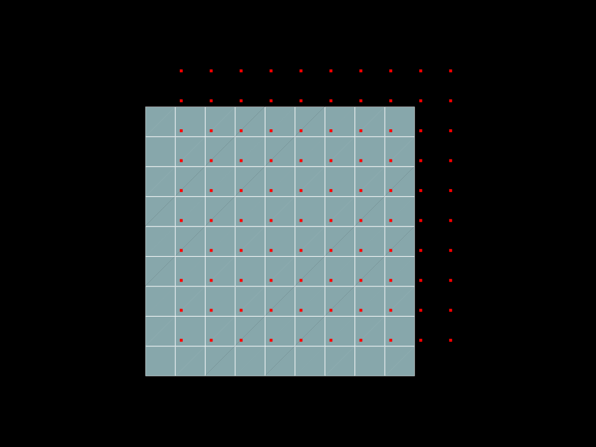
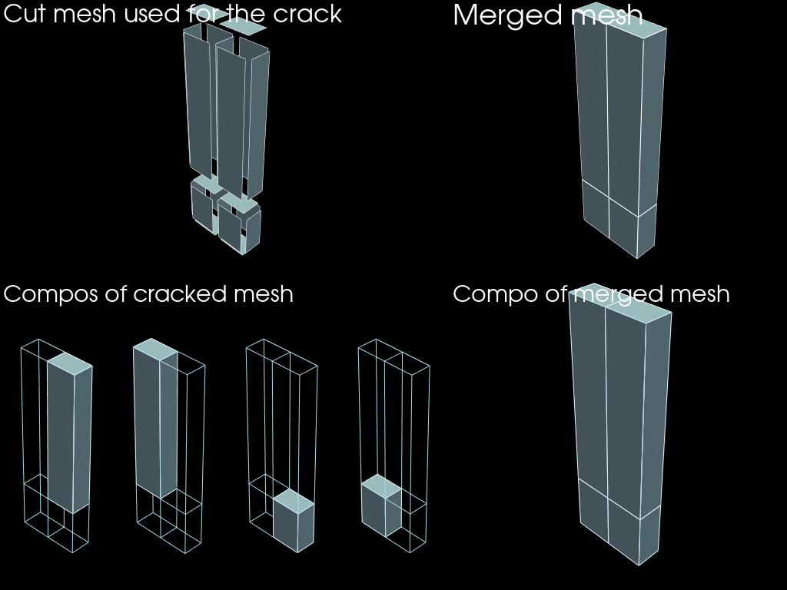
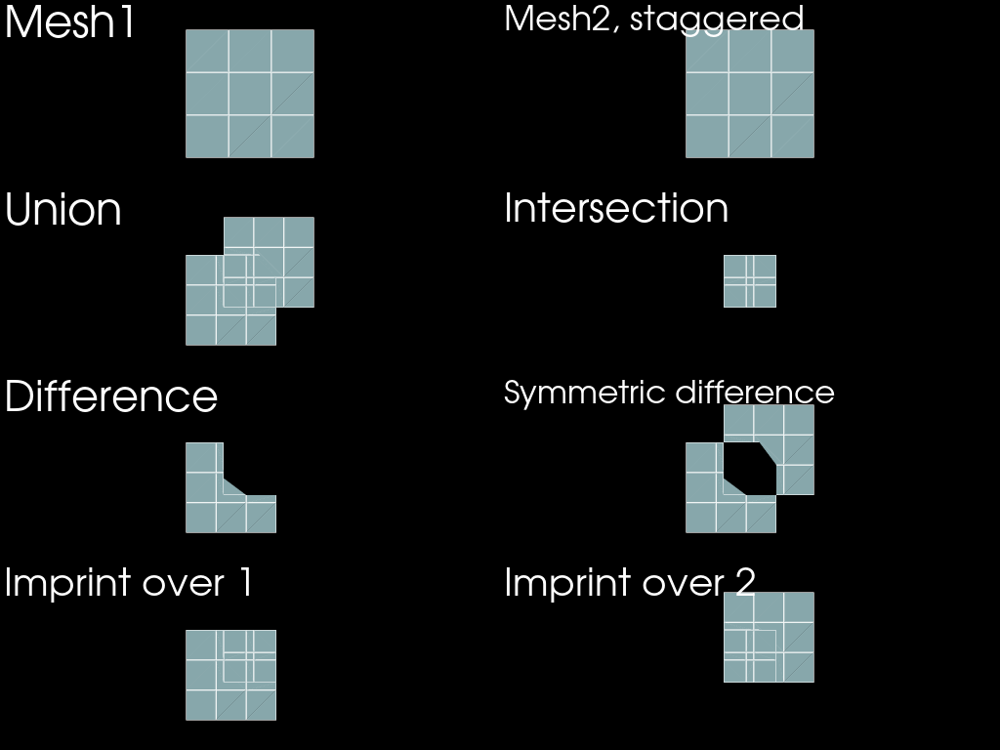

# Geometrical tools


```python
import mefikit as mf
import numpy as np
import pyvista as pv

pv.set_plot_theme("dark")
pv.set_jupyter_backend("static")
```

## Snap points


```python
x = np.linspace(0.0, 3.0, 10, endpoint=True)
mesh = mf.build_cmesh(x, x)

eps = 0.1
dec = x[-1] / len(x) + eps
x2 = np.linspace(dec, x[-1] + dec, len(x), endpoint=True)
mesh2 = mf.build_cmesh(x2, x2)
```

**Note:** epsilon value used in the following operation is big enough so that there are multiple candidates for some points, but low enough so that there is no degenerated cell created.


```python
snaped = mesh.snap(mesh2, eps=x[-1] / len(x))
```


```python
pt = pv.Plotter()
pt.add_mesh(mesh.descend().to_pyvista())
pt.add_mesh(mesh2.descend(target_dim=0).to_pyvista())
pt.show(cpos="xy")
```





```python
pt = pv.Plotter()
pt.add_mesh(snaped.to_pyvista(), show_edges=True)
pt.add_mesh(mesh2.descend(target_dim=0).to_pyvista())
pt.show(cpos="xy")
```


## Merge nodes


```python
x = range(2)
y = np.linspace(0.0, 3.0, 3, endpoint=True)
z = np.logspace(0.0, 1.0, 3, endpoint=True)
volumes = mf.build_cmesh(x, y, z)
faces = volumes.descend()
cracked = volumes.crack(faces)
```


```python
merged = cracked.merge_nodes()
```


```python
edges = faces.descend()
compos_merged = merged.connected_components()
compos_cracked = cracked.connected_components()

assert len(compos_merged) == 1

n_compos = len(compos_cracked)

shape = (3, n_compos + 1)
groups = [
    (0, np.s_[:-1]),  # cracked
    (0, n_compos),  # merged
    (1, np.s_[:-1]),  # cracked txt
    (np.s_[1:], n_compos),  # merged compos
    *((2, i) for i in range(n_compos)),  # cracked compos
]
row_weights = [1.0, 0.1, 1.0]
col_weights = [*(0.5,) * n_compos, 1.5]
pv.set_jupyter_backend("static")
plotter = pv.Plotter(
    shape=shape, groups=groups, row_weights=row_weights, col_weights=col_weights
)

plotter.subplot(0, n_compos)
plotter.add_text("Merged mesh")
plotter.add_mesh(merged.to_pyvista(), show_edges=True)
plotter.subplot(0, 0)
plotter.add_text("Cut mesh used for the crack")
plotter.add_mesh(faces.to_pyvista().shrink(0.8), show_edges=True)

plotter.subplot(1, n_compos)
plotter.add_text("Compo of merged mesh")
plotter.add_mesh(edges.to_pyvista())
plotter.add_mesh(compos_merged[0].to_pyvista(), show_edges=True)

plotter.subplot(1, 0)
plotter.add_text("Compos of cracked mesh")

for i, compo in enumerate(compos_cracked):
    plotter.subplot(2, i)
    plotter.add_mesh(edges.to_pyvista())
    plotter.add_mesh(compo.to_pyvista(), show_edges=True)
    plotter.camera.zoom(2)
plotter.show()
```





## Overlay

The intersection is valid in the following counditions :
- mesh1 and mesh2 are valid (no self recovering),
- mesh1 and mesh2 are 2d (xy),
- correctly oriented (CCW element connectivity),
- and fully merged (no unmerged nodes).

Mesh1 and mesh2 may have any number of kind of 2d elements of the first order (TRI3, QUAD4, PGON).
A future version of this algorithm will work with quadratic elements (TRI7, QUAD8, QPGON).


```python
x = np.linspace(0.0, 3.0, 4, endpoint=True)
mesh = mf.build_cmesh(x, x)

eps = 0.5
dec = x[-1] / len(x) + eps
x2 = np.linspace(dec, x[-1] + dec, len(x), endpoint=True)
mesh2 = mf.build_cmesh(x2, x2)

imprint2on1 = mesh.overlay(mesh2, mf.OverlayOperation.IMPRINT)
imprint1on2 = mesh2.overlay(mesh, mf.OverlayOperation.IMPRINT)

union = mesh.overlay(mesh2, mf.OverlayOperation.UNION)
diff = mesh.overlay(mesh2, mf.OverlayOperation.DIFFERENCE)
symdiff = mesh.overlay(mesh2, mf.OverlayOperation.SYMMETRIC_DIFFERENCE)
intersection = mesh.overlay(mesh2, mf.OverlayOperation.INTERSECTION)

meshes = [
    [mesh, mesh2],
    [union, intersection],
    [diff, symdiff],
    [imprint2on1, imprint1on2],
]
labels = [
    ["Mesh1", "Mesh2, staggered"],
    ["Union", "Intersection"],
    ["Difference", "Symmetric difference"],
    ["Imprint over 1", "Imprint over 2"],
]
```


```python
pt = pv.Plotter(shape=(4, 2))
for i in range(4):
    for j in range(2):
        m = meshes[i][j]
        t = labels[i][j]
        pt.subplot(i, j)
        pt.add_text(t)
        pt.add_mesh(m.to_pyvista(), show_edges=True)
        pt.camera_position = "xy"
pt.show(cpos="xy")
```





The ugly cell in the center in the difference and symmetric difference comes from the plotting of non convex cells in pyvista. It is just a known plotting bug (due to optimisation quirks).
