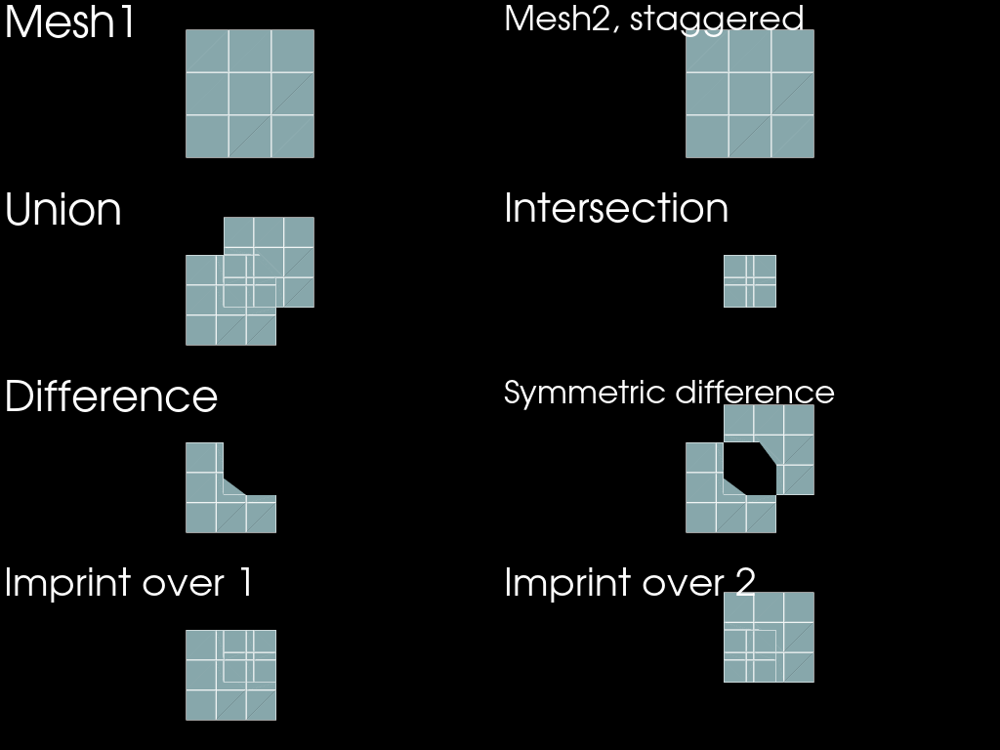

# Geometrical tools

*Figures use PyVista; verbose plotting boilerplate is omitted.*


```python
import numpy as np

import mefikit as mf
```

## Snap points

`mesh.snap(mesh2, eps)` moves the nodes of `mesh` so that they coincide with
the nodes of `mesh2` that are within `eps`. Below, two staggered grids are
offset by about one cell size:


```python
x = np.linspace(0.0, 3.0, 10, endpoint=True)
mesh = mf.build_cmesh(x, x)

eps = 0.1
dec = x[-1] / len(x) + eps
x2 = np.linspace(dec, x[-1] + dec, len(x), endpoint=True)
mesh2 = mf.build_cmesh(x2, x2)
```

**Note:** epsilon value used in the following operation is big enough so that there are multiple candidates for some points, but low enough so that there is no degenerated cell created.


```python
snaped = mesh.snap(mesh2, eps=x[-1] / len(x))
```


## Merge nodes

`merge_nodes()` collapses the duplicated nodes of a single mesh according to a
tolerance. It is the natural counterpart of `crack`: the mesh below was built
with a duplicated internal interface (hence many connected components), and the
merge re-glues it into one piece:


```python
x = range(2)
y = np.linspace(0.0, 3.0, 3, endpoint=True)
z = np.logspace(0.0, 1.0, 3, endpoint=True)
volumes = mf.build_cmesh(x, y, z)
faces = volumes.descend()
cracked = volumes.crack(faces)
```


```python
merged = cracked.merge_nodes()
```


```python
edges = faces.descend()
compos_merged = merged.connected_components()
compos_cracked = cracked.connected_components()

assert len(compos_merged) == 1

n_compos = len(compos_cracked)
```


## Overlay

`overlay` computes the boolean combination of two 2D meshes. The two grids
below are staggered by half a cell, and we apply the four classic operations
plus the two ways to imprint one grid into the other:

The intersection is valid in the following conditions :
- mesh1 and mesh2 are valid (no self recovering),
- mesh1 and mesh2 are 2d (xy),
- correctly oriented (CCW element connectivity),
- and fully merged (no unmerged nodes).

Mesh1 and mesh2 may have any number of kind of 2d elements of the first order (TRI3, QUAD4, PGON).
A future version of this algorithm will work with quadratic elements (TRI7, QUAD8, QPGON).


```python
x = np.linspace(0.0, 3.0, 4, endpoint=True)
mesh = mf.build_cmesh(x, x)

eps = 0.5
dec = x[-1] / len(x) + eps
x2 = np.linspace(dec, x[-1] + dec, len(x), endpoint=True)
mesh2 = mf.build_cmesh(x2, x2)

imprint2on1 = mesh.overlay(mesh2, mf.OverlayOperation.IMPRINT)
imprint1on2 = mesh2.overlay(mesh, mf.OverlayOperation.IMPRINT)

union = mesh.overlay(mesh2, mf.OverlayOperation.UNION)
diff = mesh.overlay(mesh2, mf.OverlayOperation.DIFFERENCE)
symdiff = mesh.overlay(mesh2, mf.OverlayOperation.SYMMETRIC_DIFFERENCE)
intersection = mesh.overlay(mesh2, mf.OverlayOperation.INTERSECTION)

meshes = [
    [mesh, mesh2],
    [union, intersection],
    [diff, symdiff],
    [imprint2on1, imprint1on2],
]
labels = [
    ["Mesh1", "Mesh2, staggered"],
    ["Union", "Intersection"],
    ["Difference", "Symmetric difference"],
    ["Imprint over 1", "Imprint over 2"],
]
```





The ugly cell in the center in the difference and symmetric difference comes from the plotting of non convex cells in pyvista. It is just a known plotting bug (due to optimisation quirks).

## Surface overlay

`overlay_surfaces` is the 3D counterpart of `overlay`: it imprints two 2D
surfaces (meshes embedded in 3D space) wherever they coincide.

`overlay_surfaces` imprints two 2D surfaces (meshes embedded in 3D space) wherever they
coincide. Both surfaces must be piecewise planar; here they are built in the plane `z = 0`
and tilted onto a common plane with the same `Transform`.

The two refined surfaces share their intersection nodes, so they become mutually
conformal on the overlap. Parts not covered by the other surface are copied verbatim.


```python
def quad_surface(extent, n):
    """Flat QUAD4 grid spanning extent=(xmin, xmax, ymin, ymax) in the plane z=0."""
    x = np.linspace(extent[0], extent[1], n + 1)
    y = np.linspace(extent[2], extent[3], n + 1)
    flat = mf.build_cmesh(x, y)
    coords = np.c_[flat.coords(), np.zeros(flat.coords().shape[0])]
    mesh = mf.UMesh(coords)
    mesh.add_regular_block("QUAD4", flat.blocks()["QUAD4"])
    return mesh


# Two quad surfaces with different sizes and discretizations on the same plane.
surface1 = quad_surface((0.0, 2.0, 0.0, 2.0), n=4)
surface2 = quad_surface((1.0, 2.8, 0.5, 1.9), n=5)

# Tilt both onto the same plane of 3D space (out-of-place transforms).
tilt = mf.Transform.rotation([1.0, 0.0, 0.0], -0.6) @ mf.Transform.rotation(
    [0.0, 1.0, 0.0], 0.5
)
surface1 = surface1.transform(tilt)
surface2 = surface2.transform(tilt)
```


```python
overlay = surface1.overlay_surfaces(surface2)
```


```python
# The refined surfaces are mutually conformal: they share the very same nodes.
assert np.array_equal(
    np.asarray(overlay.refined1.coords()), np.asarray(overlay.refined2.coords())
)

# The parents maps relate each input face to the elements it produced.
print("surface1:", len(overlay.parents1), "input faces")
print("surface2:", len(overlay.parents2), "input faces")
```

    surface1: 16 input faces
    surface2: 25 input faces
