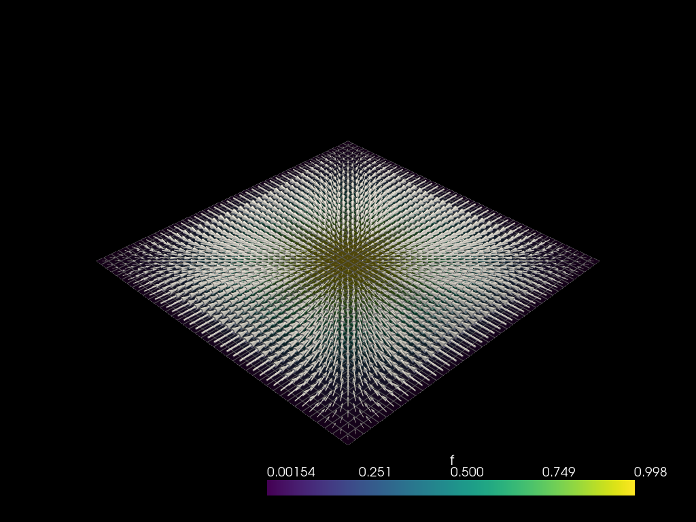
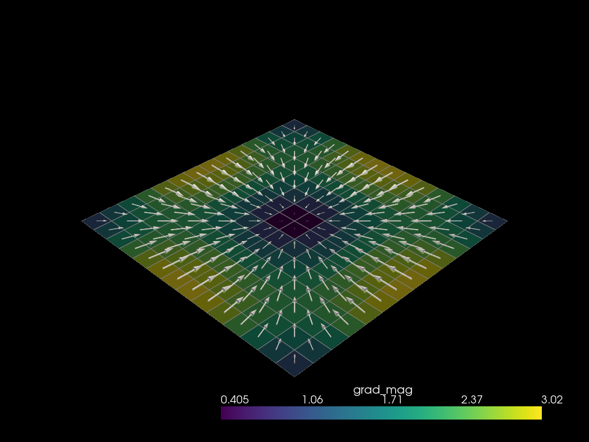
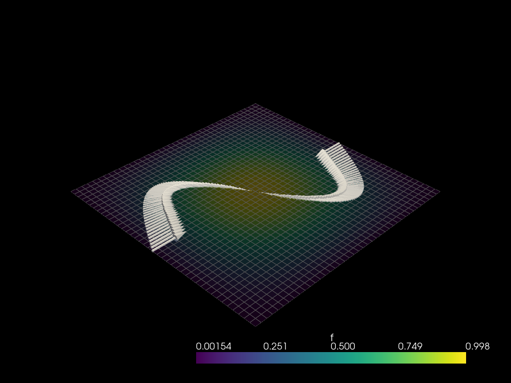

# Field gradients

*Figures use PyVista; verbose plotting boilerplate is omitted.*

A **transfer** copies a field from one mesh onto another; a **gradient**
differentiates it. `mf.Gradient` reconstructs the gradient of a scalar field
with a **moving least-squares** (MLS) fit over the `k` nearest source cell
centres, using the same prepare / apply split as the
[field transfers](./transfers.md): the geometric operator is built once and can
then be applied to any number of scalar fields.

Unlike a transfer, whose per-target weights are scalar, the gradient carries
`d` weights per neighbour — one per space direction — so the result is a
**vector field** with `d` trailing components. This page covers the three
evaluation targets (the source cells, a target mesh, an arbitrary point cloud),
validates them against analytic gradients, and compares the distance kernels.


```python
import numpy as np

import mefikit as mf

# A smooth, non-affine scalar field on the unit square grid:
#     f(x, y) = sin(pi x) sin(pi y)
n = 41
src = mf.build_cmesh(np.linspace(0.0, 1.0, n), np.linspace(0.0, 1.0, n))
src.fields["f"] = (mf.X * np.pi).sin() * (mf.Y * np.pi).sin()
```

## The gradient operator

`mf.Gradient(src, tgt=None, k=10, weighting=..., def_val=0.0)` builds the MLS
operator. The evaluation points depend on how it is built:

| Constructor                          | Evaluated at                       |
| ------------------------------------ | ---------------------------------- |
| `mf.Gradient(src)`                   | the source mesh's own cell centroids |
| `mf.Gradient(src, tgt)`              | the target mesh's cell centroids   |
| `mf.Gradient.at_points(src, points)` | an explicit `(n, d)` point array   |

`k` is the number of nearest source cells used in each local fit and
`weighting` is one of the `mf.DistanceWeighting` kernels — `Constant`,
`InverseDistance(exponent)`, `CompactSupport(exponent)` or `Gaussian` — shared
with the transfer operators. A degree-1 fit reproduces affine fields exactly,
which is the validation used below.

### Gradient at the source cells

With no target mesh the gradient is evaluated at the source cell centroids.
`grad("f")` is a lazy vector `Field`; `grad.eval("f")` materialises it as
`{etype: array}` of shape `(n_cells, d)`.


```python
grad = mf.Gradient(src, k=12)
grad_f = np.asarray(grad.eval("f")["QUAD4"])
grad_f.shape
```


    (1600, 2)


The analytic gradient of `f` is
`grad f = (pi cos(pi x) sin(pi y), pi sin(pi x) cos(pi y))`. Sampling it at the
cell centroids gives a reference to compare against:


```python
cx = np.asarray(src.eval(mf.X)["QUAD4"]).ravel()
cy = np.asarray(src.eval(mf.Y)["QUAD4"]).ravel()
exact = np.c_[
    np.pi * np.cos(np.pi * cx) * np.sin(np.pi * cy),
    np.pi * np.sin(np.pi * cx) * np.cos(np.pi * cy),
]

err = np.linalg.norm(grad_f - exact, axis=1)
h = 1.0 / (n - 1)
interior = (cx > 2 * h) & (cx < 1 - 2 * h) & (cy > 2 * h) & (cy < 1 - 2 * h)
print(f"max |grad f - exact| : {err.max():.3e}")
print(f"interior max error   : {err[interior].max():.3e}")
```

    max |grad f - exact| : 2.844e-01
    interior max error   : 5.152e-02





The reconstruction is accurate in the interior; accuracy drops near the
boundary, where all `k` neighbours lie on one side of the cell.

### Gradient on a target mesh

Passing a second mesh moves the evaluation to its cell centroids — useful to
compute a gradient on a coarser or differently-shaped mesh, or on the boundary
of the source.


```python
tgt = mf.build_cmesh(np.linspace(0.05, 0.95, 15), np.linspace(0.05, 0.95, 15))
grad_tgt = mf.Gradient(src, tgt, k=12)
grad_tgt.eval("f")["QUAD4"].shape
```


    (196, 2)





### Gradient at arbitrary points

`mf.Gradient.at_points` takes the evaluation points explicitly as an `(n, d)`
array; `grad.eval_points("f")` then returns the `(n, d)` gradient directly.
This is convenient to sample the gradient along a curve or at sparse probes.


```python
t = np.linspace(0.0, 1.0, 120)
curve = np.c_[t, 0.5 + 0.3 * np.sin(2 * np.pi * t)]
grad_pts = mf.Gradient.at_points(src, curve, k=12)
grad_curve = grad_pts.eval_points("f")
grad_curve.shape
```


    (120, 2)





### Lazy fields, components and in-place results

Because `grad("f")` returns a lazy `Field`, it composes with the rest of the
expression system: index the components with `[0]` / `[1]`, combine them into
derived quantities, and store them. `apply_update` writes the gradient into a
named target field in a single call.


```python
tgt.fields["dfdx"] = grad_tgt("f")[0]
tgt.fields["dfdy"] = grad_tgt("f")[1]
tgt.fields["grad_mag"] = (grad_tgt("f")[0].square() + grad_tgt("f")[1].square()).sqrt()

grad_tgt.apply_update(src, "f", tgt, "grad_f")
tgt.fields["grad_f"].numpy().shape
```


    (196, 2)


### Kernels and neighbour count

The kernel only changes how the local least-squares weights decay with
distance:

- `Constant` — an unweighted affine fit;
- `InverseDistance(exponent)` — weight `(h / r)**exponent`;
- `CompactSupport(exponent)` — a compactly-supported power kernel;
- `Gaussian` — a bell-shaped kernel.

On a smooth field the kernel choice mostly changes the boundary. `k` balances
locality against smoothness: a small `k` follows the field tightly and is the
most accurate on smooth data, but is more sensitive to noise, while a large `k`
averages over a wider stencil and smooths the reconstruction, at the cost of a
larger error near the boundary.


```python
for name, weighting in {
    "Constant": mf.DistanceWeighting.Constant(),
    "InverseDistance(2)": mf.DistanceWeighting.InverseDistance(2.0),
    "CompactSupport(2)": mf.DistanceWeighting.CompactSupport(2.0),
    "Gaussian": mf.DistanceWeighting.Gaussian(),
}.items():
    vals = np.asarray(mf.Gradient(src, k=12, weighting=weighting).eval("f")["QUAD4"])
    print(f"{name:18s} max |grad f - exact| = {np.abs(vals - exact).max():.3e}")
```

    Constant           max |grad f - exact| = 2.407e-01
    InverseDistance(2) max |grad f - exact| = 1.599e-01
    CompactSupport(2)  max |grad f - exact| = 1.424e-01
    Gaussian           max |grad f - exact| = 2.028e-01


```python
for k in (4, 8, 16, 32):
    vals = np.asarray(mf.Gradient(src, k=k).eval("f")["QUAD4"])
    print(f"k = {k:2d}  max |grad f - exact| = {np.abs(vals - exact).max():.3e}")
```

    k =  4  max |grad f - exact| = 1.222e-01
    k =  8  max |grad f - exact| = 1.700e-01
    k = 16  max |grad f - exact| = 3.360e-01
    k = 32  max |grad f - exact| = 4.692e-01


## 3D gradients

The tool works in 3D space too; the gradient then has three components. On the
linear field `f = 1 + 2x - 3y + 4z` the reconstruction is exact.


```python
mesh3d = mf.build_cmesh(
    np.linspace(0.0, 1.0, 6), np.linspace(0.0, 1.0, 6), np.linspace(0.0, 1.0, 6)
)
mesh3d.fields["f"] = 1.0 + 2.0 * mf.X - 3.0 * mf.Y + 4.0 * mf.Z

grad3d = mf.Gradient(mesh3d, k=8)
vals3d = np.asarray(grad3d.eval("f")["HEX8"])
print(vals3d.shape, np.abs(vals3d - np.array([2.0, -3.0, 4.0])).max())
```

    (125, 3) 4.973799150320701e-14


## Scope and caveats

The MLS fit needs a **full-dimensional** neighbourhood: a 2D region for a 2D
space, a 3D volume for a 3D space. A lower-dimensional mesh embedded in a
higher-dimensional space — a surface in 3D, a line in 2D — has a rank-deficient
local geometry, so the operator returns a **zero** gradient there instead of
failing:


```python
# A planar quad mesh living in 3D: locally rank-deficient, gradient is zero.
flat = mf.build_cmesh(np.linspace(0.0, 1.0, 6), np.linspace(0.0, 1.0, 6))
planar = mf.UMesh(np.c_[flat.coords(), np.zeros(len(flat.coords()))])
planar.add_regular_block("QUAD4", flat.blocks()["QUAD4"])
planar.fields["f"] = 2.0 * mf.X - 3.0 * mf.Y

vals = np.asarray(mf.Gradient(planar, k=8).eval("f")["QUAD4"])
print(vals.shape, np.abs(vals).max())
```

    (25, 3) 0.0


Treat `mf.Gradient` as a meshless differential operator built on the same
machinery as the [field transfers](./transfers.md): build it once, then reuse it
for every scalar field and every time step.
