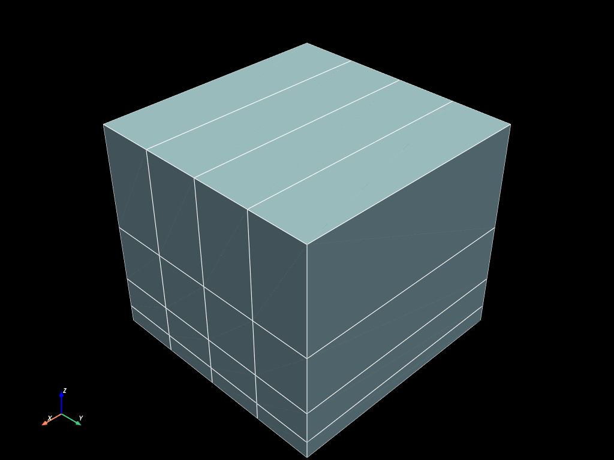

# Input / Output


```python
import numpy as np
import pyvista as pv

import mefikit as mf

pv.set_plot_theme("dark")
pv.set_jupyter_backend("static")
```


```python
volumes = mf.build_cmesh(
    range(2), np.linspace(0.0, 1.0, 5), np.logspace(0.0, 1.0, 5) / 10.0
)
```

## Memory exports

- Through numpy arrays manipulations:
    - medcoupling
    - meshio
    - pyvista
- Through `string` translation to `Python`:
    - json


```python
print(volumes.to_mc())
```

    Unstructured mesh with name : "mf_UMesh"
    Description of mesh : ""
    Time attached to the mesh [unit] : 0 []
    Iteration : -1 Order : -1
     Mesh dimension has not been set or is invalid !3
    Info attached on space dimension : "" "" ""
    Number of nodes : 50
    Number of cells : 15
    Cell types present : NORM_HEXA8


```python
print(volumes.to_pyvista())
```

    UnstructuredGrid (0x781a0a87d600)
      N Cells:    16
      N Points:   50
      X Bounds:   0.000e+00, 1.000e+00
      Y Bounds:   0.000e+00, 1.000e+00
      Z Bounds:   1.000e-01, 1.000e+00
      N Arrays:   0


```python
volumes.to_pyvista().plot(show_edges=True)
```





```python
print(volumes.to_meshio())
```

    <meshio mesh object>
      Number of points: 50
      Number of cells:
        hexahedron: 16


```python
print(volumes.to_json())
```

    {"coords":{"v":1,"dim":[50,3],"data":[0.0,0.0,0.1,1.0,0.0,0.1,0.0,0.25,0.1,1.0,0.25,0.1,0.0,0.5,0.1,1.0,0.5,0.1,0.0,0.75,0.1,1.0,0.75,0.1,0.0,1.0,0.1,1.0,1.0,0.1,0.0,0.0,0.17782794100389226,1.0,0.0,0.17782794100389226,0.0,0.25,0.17782794100389226,1.0,0.25,0.17782794100389226,0.0,0.5,0.17782794100389226,1.0,0.5,0.17782794100389226,0.0,0.75,0.17782794100389226,1.0,0.75,0.17782794100389226,0.0,1.0,0.17782794100389226,1.0,1.0,0.17782794100389226,0.0,0.0,0.31622776601683794,1.0,0.0,0.31622776601683794,0.0,0.25,0.31622776601683794,1.0,0.25,0.31622776601683794,0.0,0.5,0.31622776601683794,1.0,0.5,0.31622776601683794,0.0,0.75,0.31622776601683794,1.0,0.75,0.31622776601683794,0.0,1.0,0.31622776601683794,1.0,1.0,0.31622776601683794,0.0,0.0,0.5623413251903491,1.0,0.0,0.5623413251903491,0.0,0.25,0.5623413251903491,1.0,0.25,0.5623413251903491,0.0,0.5,0.5623413251903491,1.0,0.5,0.5623413251903491,0.0,0.75,0.5623413251903491,1.0,0.75,0.5623413251903491,0.0,1.0,0.5623413251903491,1.0,1.0,0.5623413251903491,0.0,0.0,1.0,1.0,0.0,1.0,0.0,0.25,1.0,1.0,0.25,1.0,0.0,0.5,1.0,1.0,0.5,1.0,0.0,0.75,1.0,1.0,0.75,1.0,0.0,1.0,1.0,1.0,1.0,1.0]},"element_blocks":{"HEX8":{"cell_type":"HEX8","connectivity":{"Regular":{"v":1,"dim":[16,8],"data":[0,1,3,2,10,11,13,12,2,3,5,4,12,13,15,14,4,5,7,6,14,15,17,16,6,7,9,8,16,17,19,18,10,11,13,12,20,21,23,22,12,13,15,14,22,23,25,24,14,15,17,16,24,25,27,26,16,17,19,18,26,27,29,28,20,21,23,22,30,31,33,32,22,23,25,24,32,33,35,34,24,25,27,26,34,35,37,36,26,27,29,28,36,37,39,38,30,31,33,32,40,41,43,42,32,33,35,34,42,43,45,44,34,35,37,36,44,45,47,46,36,37,39,38,46,47,49,48]}},"fields":{},"families":{"v":1,"dim":[16],"data":[0,0,0,0,0,0,0,0,0,0,0,0,0,0,0,0]},"groups":{}}}}


## File read/write

- On rust side, file I/O with the `read`/`write` methods, driven by the file extension:
    - vtk (legacy binary vtk 2.0)
    - yaml
    - json
    - vtkhdf / h5 / hdf5 (HDF5-based VTK)
    - medfile

The legacy vtk reader/writer only supports the old binary vtk 2.0 file format (no rust crate is doing better so far). The HDF5-based `.vtkhdf` reader/writer is the recommended option for a more modern and HPC friendly format. CGNS support is planned.


```python
import pathlib

pathlib.Path("data").mkdir(exist_ok=True)
for ext in ("vtk", "yaml", "json", "vtkhdf", "med"):
    volumes.write(f"data/volumes.{ext}")
    volumes_from_disk = mf.UMesh.read(f"data/volumes.{ext}")
    assert volumes_from_disk
    assert (
        volumes != volumes_from_disk
    )  # this is a new instance, with a different memory adress
```

    I survived
