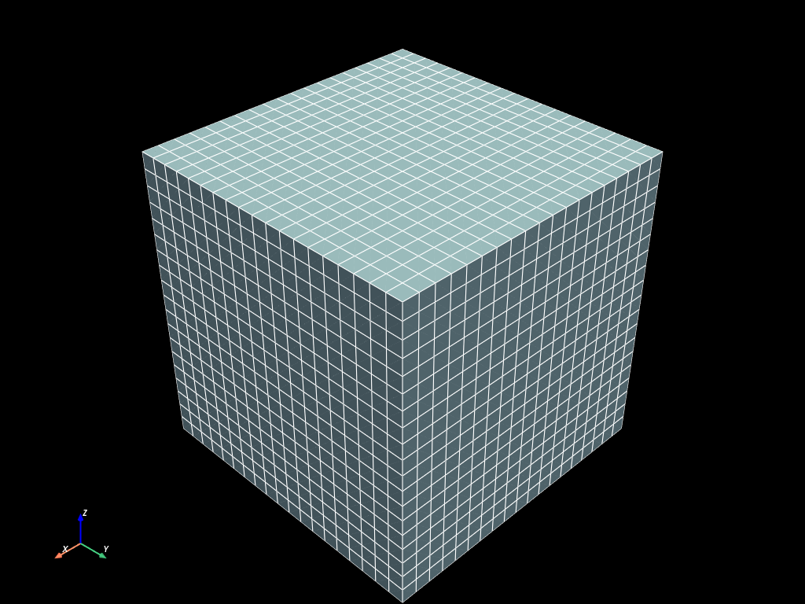
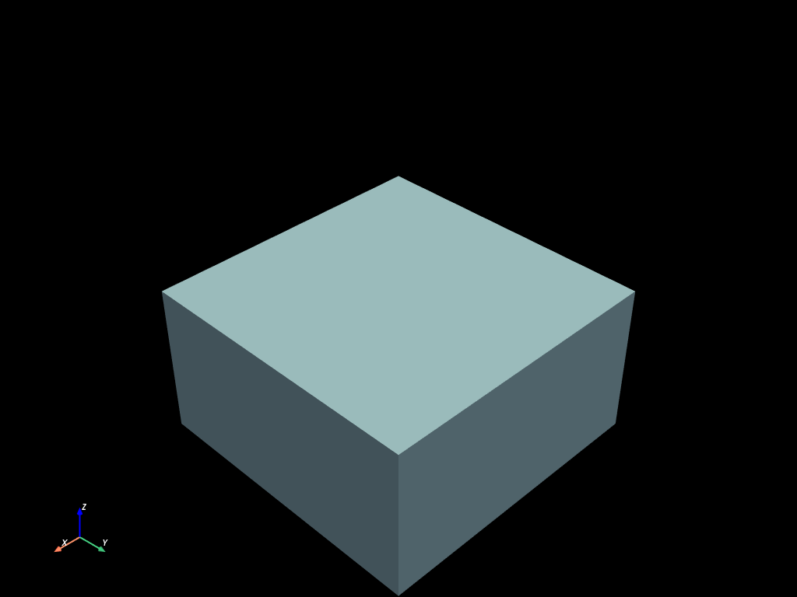
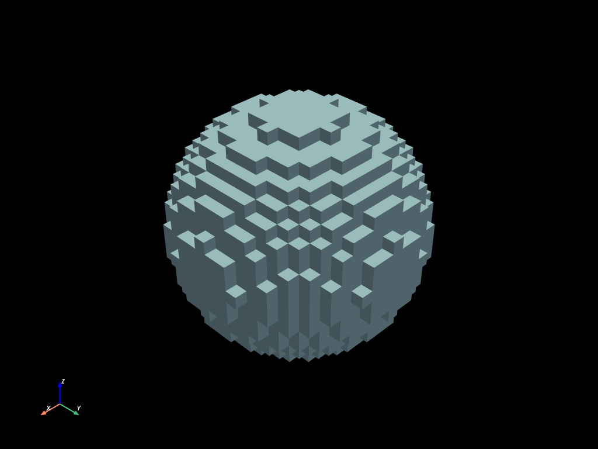
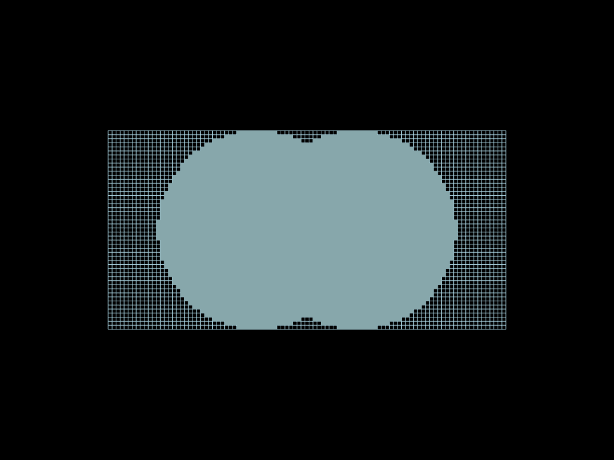
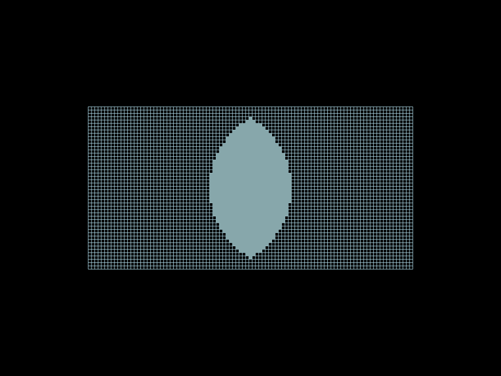
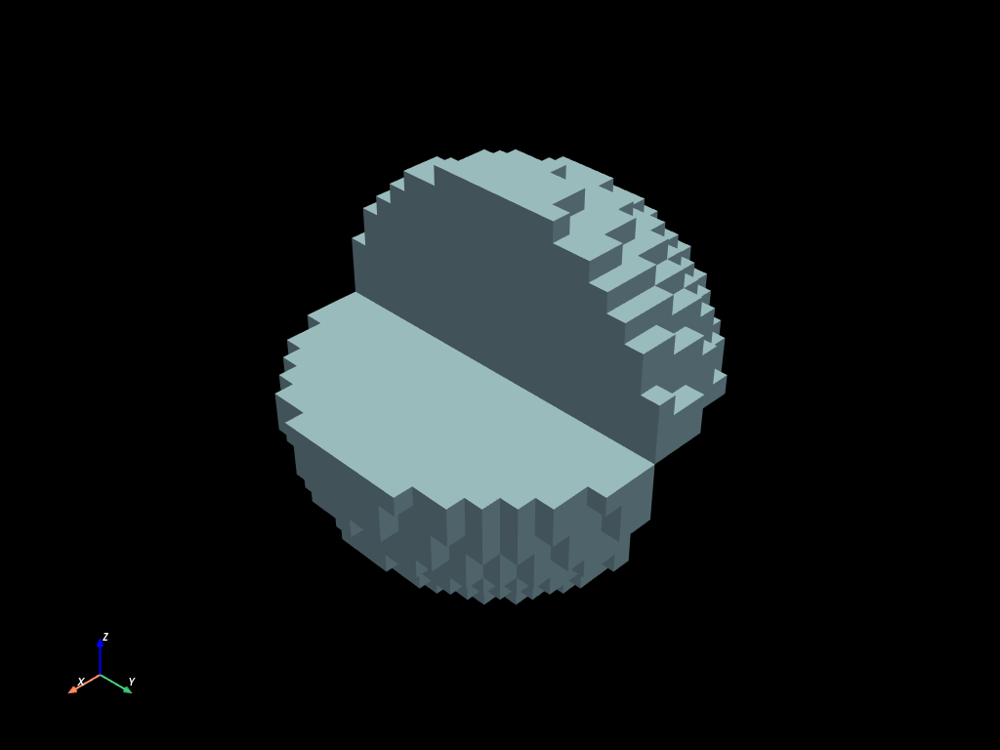
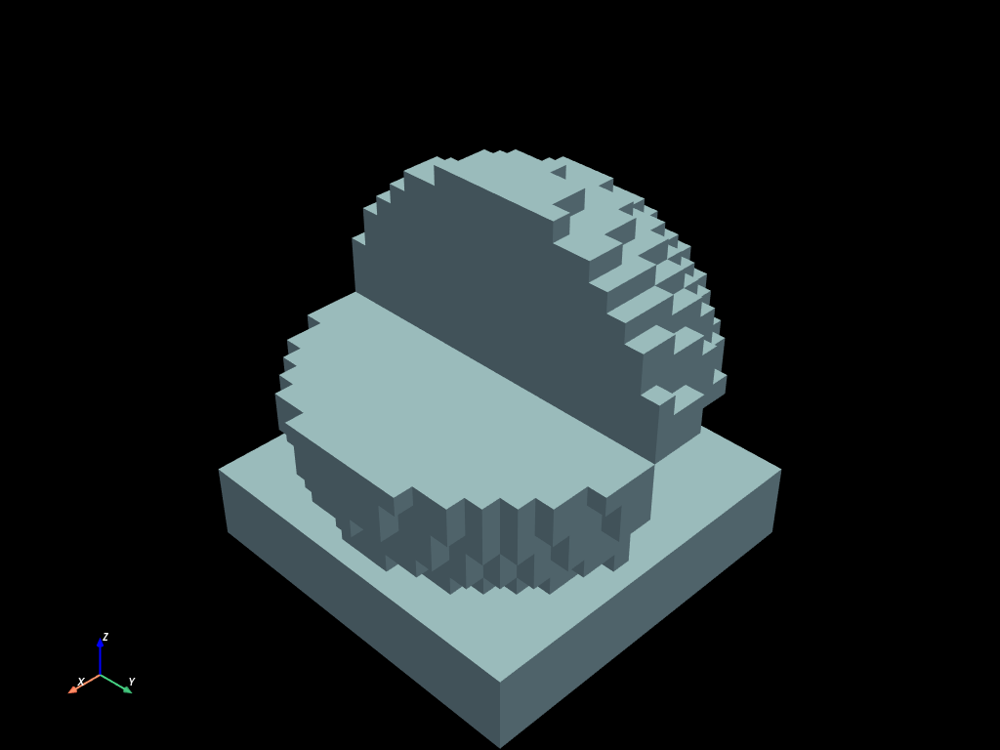

# Selection tool


```python
import numpy as np
import pyvista as pv

import mefikit as mf

pv.set_plot_theme("dark")
pv.set_jupyter_backend("static")
```

## Element selection expressions

Elements can be selected based on their:
- types
- ids
- dimensions

Elements can be selected based on their centroid position. The selection methods using centroids are :
- bbox
- sphere
- rectangle
- circle

As you can guess, bbox and sphere should be used for 3d meshes and rectangle and circle for 2d meshes.

Elements can be selected based on the nodes position and a boolean : whether to select element with all nodes matching the condition or any node matching the condition.
- nbbox
- nsphere
- nrect
- ncircle
- nids

Elements can be selected based on their group membership :
- group(name)
- exclude_group(name)

Elements can be selected based on their scalar fields values :
- FieldExpr > FieldExpr
- FieldExpr >= FieldExpr
- FieldExpr < FieldExpr
- FieldExpr <= FieldExpr
- FieldExpr == FieldExpr

Wherever a selector is expected, the wildcards `None`, `...` and `[:]` select every element — the explicit form is `mf.sel.all()`.


```python
sphere = mf.sel.sphere([0.5, 0.5, 0.5], 0.5)
clip_x = mf.sel.bbox([0.5, -np.inf, -np.inf], [np.inf, np.inf, np.inf])  # x > 0.5
compound_sel = ~(sphere & clip_x)
```

Selections are light objects, there are cheap to create and combine and independent from a support.
You should just not mix 2d selectors with 3d selectors (`sphere` vs `circle`, `bbox` vs `rectangle`).

### How does it works ?

Each objects generated by a selection function (a function from the mf.sel module) is of the `Selection` type. It implements operators so that it knows how to compose in an expression. That way an expression generates a new `SelectionExpr` which can be interpreted by the `.select(expr)` method.


```python
print(sphere)
```

    CentroidSelection(
        Sphere {
            center: [
                0.5,
                0.5,
                0.5,
            ],
            r: 0.5,
        },
    )


```python
print(compound_sel)
```

    NotExpr(
        NotExpr(
            BinarayExpr(
                BinarayExpr {
                    operator: And,
                    left: CentroidSelection(
                        Sphere {
                            center: [
                                0.5,
                                0.5,
                                0.5,
                            ],
                            r: 0.5,
                        },
                    ),
                    right: CentroidSelection(
                        BBox {
                            min: [
                                0.5,
                                -inf,
                                -inf,
                            ],
                            max: [
                                inf,
                                inf,
                                inf,
                            ],
                        },
                    ),
                },
            ),
        ),
    )


You can see two layers of NotExpr and BinaryExpr. That is perfectly normal, it does not mean that the operation is applied twice, both NotExpr operations and both BinaryExpr op actually comes from different namespaces and it is just a form of encapsulation (first is a variant, second is an enum).

### Select to extract part of a mesh

Here the types manipulated are `Selection`. They are simple objects that know how to compose themselves. When applied on a mesh the mesh selection is computed.


```python
clip = mf.sel.bbox([-np.inf, -np.inf, -np.inf], [np.inf, np.inf, 0.5])
sphere = mf.sel.sphere([0.5, 0.5, 0.5], 0.5)
```


```python
x = np.linspace(0.0, 1.0, 20, endpoint=True)
volumes = mf.build_cmesh(x, x, x)
volumes.to_pyvista().plot(show_edges=True)
```





```python
volumes.select(clip).to_mesh().to_pyvista().plot()
```





```python
volumes.select(sphere).to_mesh().to_pyvista().plot()
```





## Selection composition

One of the great strength of the select method is its composability !
Watch by yourself.

The operators `&`, `|`, `^`, `-` and `~` are available.

### 2D composition examples


```python
x = np.linspace(0.0, 2.0, 100)
y = np.linspace(0.0, 1.0, 50)
faces = mf.build_cmesh(x, y)
```


```python
circle1 = mf.sel.circle([0.75, 0.5], 0.5)
circle2 = mf.sel.circle([1.25, 0.5], 0.5)
```


```python
union = faces.select(circle1 | circle2).to_mesh()
```


```python
pt = pv.Plotter()
pt.add_mesh(faces.descend().to_pyvista())
pt.add_mesh(union.to_pyvista())
pt.camera_position = "xy"
pt.show()
```





```python
intersection = faces.select(circle1 & circle2).to_mesh()
```


```python
pt = pv.Plotter()
pt.add_mesh(faces.descend().to_pyvista())
pt.add_mesh(intersection.to_pyvista())
pt.camera_position = "xy"
pt.show()
```





```python
sym_diff = faces.select(circle1 ^ circle2).to_mesh()
```


```python
pt = pv.Plotter()
pt.add_mesh(faces.descend().to_pyvista())
pt.add_mesh(sym_diff.to_pyvista())
pt.camera_position = "xy"
pt.show()
```


```python
diff = faces.select(circle1 - circle2).to_mesh()
```


```python
pt = pv.Plotter()
pt.add_mesh(faces.descend().to_pyvista())
pt.add_mesh(diff.to_pyvista())
pt.camera_position = "xy"
pt.show()
```


```python
notsel = faces.select(~circle1).to_mesh()
```


```python
pt = pv.Plotter()
pt.add_mesh(faces.descend().to_pyvista())
pt.add_mesh(notsel.to_pyvista())
pt.camera_position = "xy"
pt.show()
```


### A 3D complex example


```python
sphere = mf.sel.sphere([0.5, 0.5, 0.5], 0.5)
clip_x = mf.sel.bbox([0.5, -np.inf, -np.inf], [np.inf, np.inf, np.inf])  # x > 0.5
clip_z = mf.sel.bbox([-np.inf, -np.inf, -np.inf], [np.inf, np.inf, 0.5])  # z < 0.5
```


```python
volumes.select(
    (clip_x & sphere & clip_z) | (sphere & ~clip_x & ~clip_z)
).to_mesh().to_pyvista().plot()
```


## Select API

`.select()` returns a lazy view: `ids()`, `len()`, `to_mesh()` and reductions evaluate it on demand.


```python
volumes.select(sphere)
```


    SelectionResult(n_elements=3695)


The number of elements referenced here is the number of elements of `volumes`. The selection was not yet computed.


```python
two_quarters_expr = (clip_x & sphere & clip_z) | (sphere & ~clip_x & ~clip_z)
```


```python
volumes.select(two_quarters_expr).ids()
```


    {'HEX8': array([ 143,  144,  162, ..., 6715, 6716, 6735],
           shape=(1838,), dtype=uint64)}


```python
len(volumes.select(two_quarters_expr))
```


    1838


### Selection to reduction

One might want to compute a reduction (`min`, `max`, `mean`, `std`, etc) on part of a mesh. This can be done applying a reduction and using a field expression (see `fields` section).


```python
volumes.select(two_quarters_expr).mean(mf.X)
```


    0.5171525113109214


## Groups

### Groups API

Selections can be stored on the mesh as named groups. The `mesh.groups` mapping behaves like a dict: assign a selection expression (or a `{etype: ids}` dict) to create or replace a group, then manage groups with the usual operations.


```python
volumes.groups["two_quarters"] = two_quarters_expr
```


```python
volumes.groups
```


    GroupsMapping(["two_quarters"])


```python
volumes.groups["two_quarters"].ids()
```


    {'HEX8': array([ 143,  144,  162, ..., 6715, 6716, 6735],
           shape=(1838,), dtype=uint64)}


```python
tq = volumes.groups["two_quarters"].to_mesh()
tq.to_pyvista().plot()
```





```python
len(volumes.groups["two_quarters"])
```


    1838


```python
volumes.groups.rename("two_quarters", "quarter_tag")
volumes.groups
```


    GroupsMapping(["quarter_tag"])


```python
del volumes.groups["quarter_tag"]
volumes.groups
```


    GroupsMapping([])


### Groups inplace modifications

Groups can be modified inplace, either using `SelectionExpr` (including existing groups expr):


```python
volumes.groups["two_quarters"] = two_quarters_expr
n = len(volumes.groups["two_quarters"])
added_sel = mf.sel.bbox([-np.inf, -np.inf, -np.inf], [np.inf, np.inf, 0.2])
volumes.groups["two_quarters"].add(added_sel)
print(len(volumes.groups["two_quarters"]), "after adding a slab (was", n, ")")
```

    3089 after adding a slab (was 1838 )


```python
volumes.groups["two_quarters"].to_mesh().to_pyvista().plot()
```





... or directly with element ids per element type.


```python
print(len(volumes.groups["two_quarters"]))
volumes.groups["two_quarters"].remove({"HEX8": [0, 1]})
print(len(volumes.groups["two_quarters"]))
volumes.groups["two_quarters"].add({"HEX8": [0, 1]})
print(len(volumes.groups["two_quarters"]), "back to the original size")
```

    3089
    3087
    3089 back to the original size
