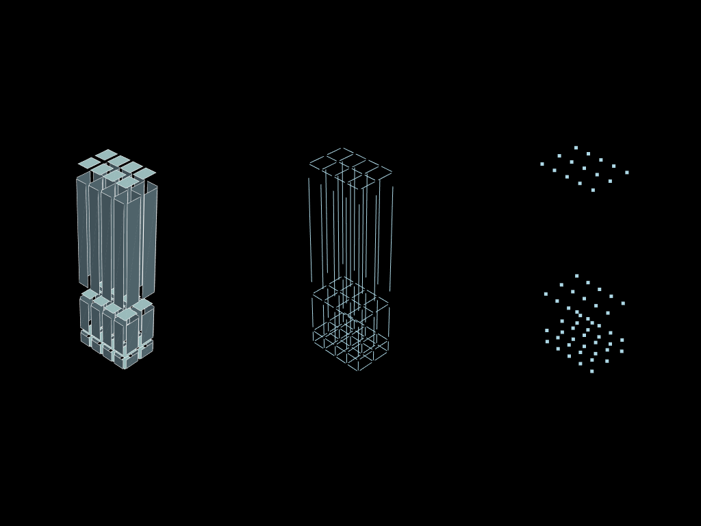
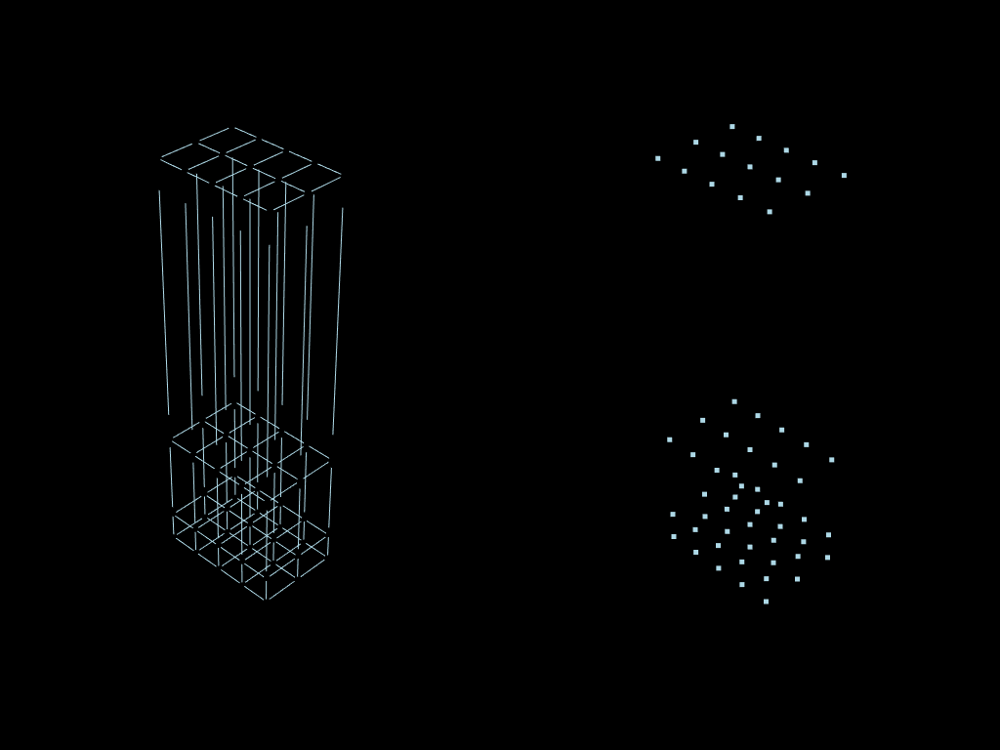
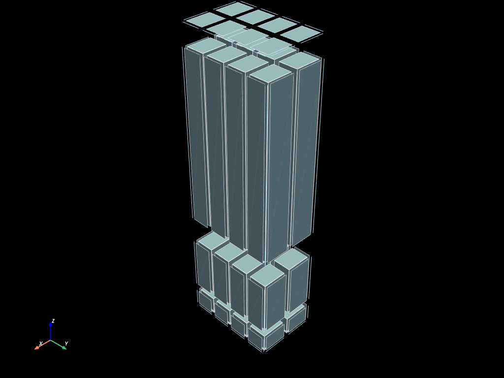
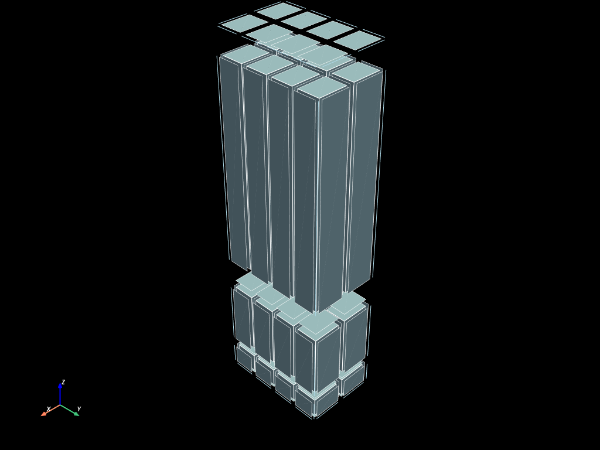
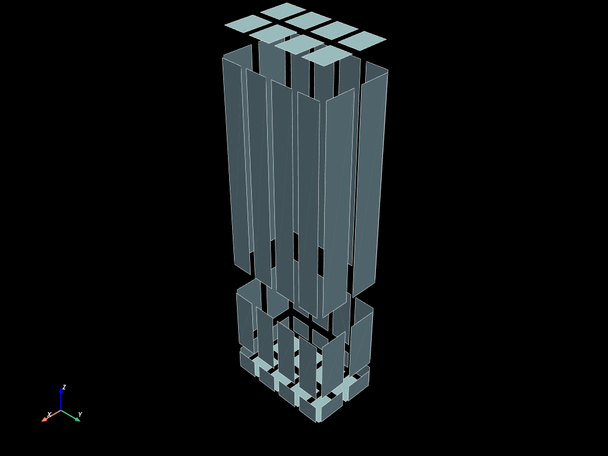
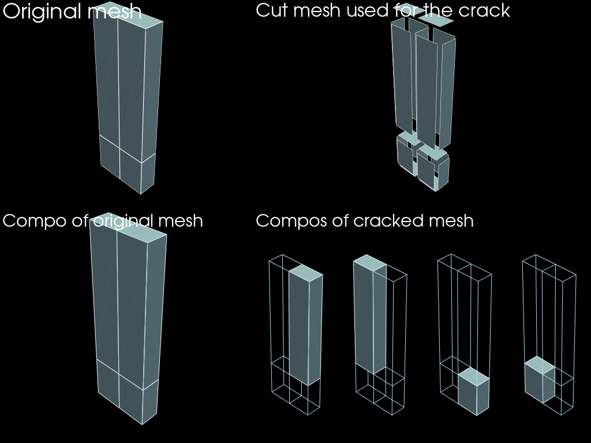
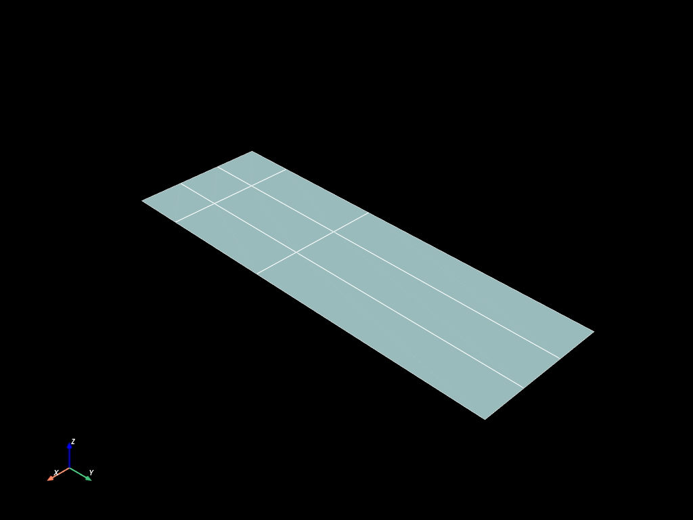
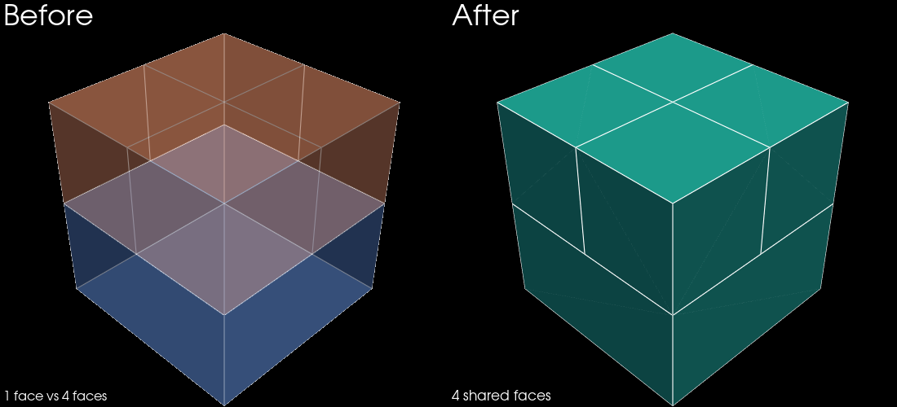
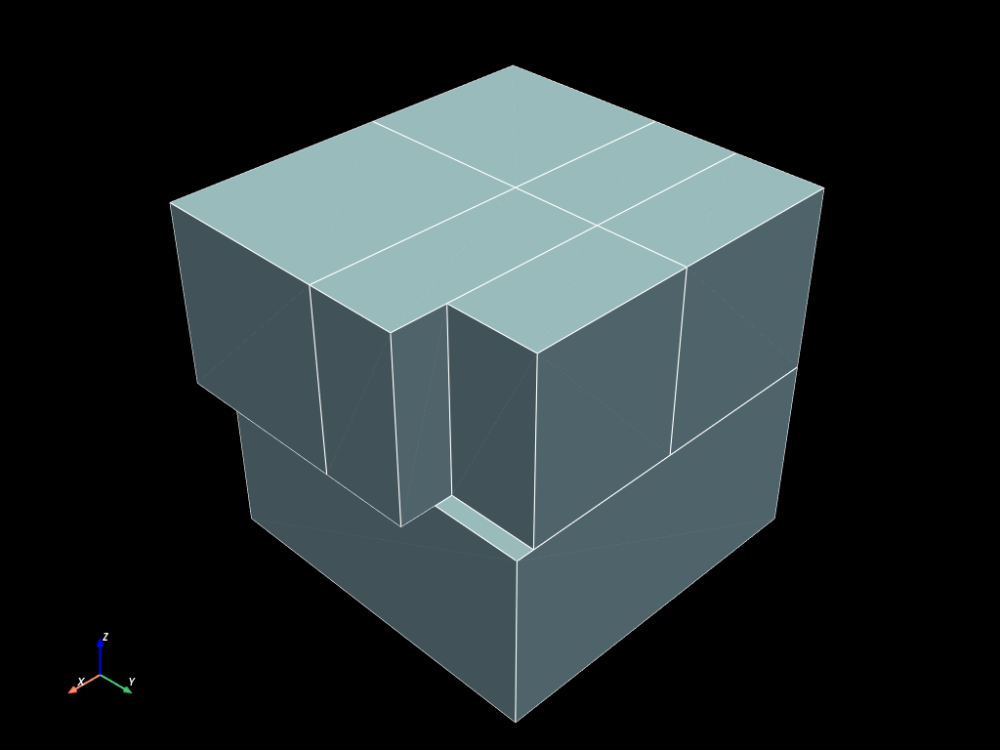

# Topological tools

*Figures use PyVista; verbose plotting boilerplate is omitted.*


```python
import numpy as np

import mefikit as mf
```

## Descending connectivity

Every topological tool here builds and returns a **new** mesh; the `*_update`
variants turn them into in-place operations (below). `descend` computes the
*descending connectivity* of a mesh: it decomposes each element into its
boundary (cells into faces, faces into edges, edges into vertices) and returns
a new mesh of the requested dimension.

Start from the structured volumes built below:


```python
x = range(3)
y = np.linspace(0.0, 3.0, 5, endpoint=True)
z = np.logspace(-0.5, 1, 4, endpoint=True)
volumes = mf.build_cmesh(x, y, z)
```

### Simple descending

Chaining `.descend()` walks down one dimension at a time — volumes, faces,
edges, vertices:


```python
faces = volumes.descend()
edges = faces.descend()
vertex = edges.descend()
```





### Submesh in one go

`target_dim` jumps straight to the wanted dimension, without chaining:

- `descend(target_dim=1)` returns the edges directly,
- `descend(target_dim=0)` returns the vertices directly.


```python
edges = volumes.descend(target_dim=1)
vertex = volumes.descend(target_dim=0)
```





## Boundaries computation

`boundaries` is the *closure* of a mesh: it keeps only the elements on the
outside, not shared with any neighbour — exactly the ones you need for boundary
conditions. It differs from `descend`, which returns *every* face of the mesh:


```python
face_bounds = volumes.boundaries()
edge_bounds = volumes.boundaries(target_dim=1)
vertex_bounds = volumes.boundaries(target_dim=0)
```


## Descend / boundaries update

Both operations come in an in-place flavour: `descend_update` / `boundaries_update`
modify the mesh instead of returning a new one.


```python
volumes.boundaries_update()
volumes.boundaries_update(target_dim=1)
volumes.to_pyvista(dim="all").shrink(0.8).plot(show_edges=True)
```





When using the `_update` version, the elements of the same dimension of the generated mesh are returned as a new mesh.


```python
old_face_mesh = volumes.descend_update()
volumes.to_pyvista(dim="all").shrink(0.8).plot(show_edges=True)
```





```python
old_face_mesh.to_pyvista().shrink(0.8).plot(show_edges=True)
```





## Connected components

`connected_components()` splits a mesh into its connected parts. The `link_dim`
argument decides what glues two elements together: sharing an edge (`link_dim=1`)
or sharing a node (`link_dim=0`). Below, a small ribbon of QUAD4 cells is a
single component when glued by edge, but falls apart as soon as only two cells
touch at a corner:


```python
x, y = np.meshgrid(np.linspace(0.0, 1.0, 5), np.linspace(0.0, 1.0, 5))
coords = np.c_[x.flatten(), y.flatten()]
conn = np.array(
    [
        [0, 1, 6, 5],
        [6, 7, 12, 11],
        # [2, 3, 8, 7],
        [11, 12, 17, 16],
    ],
    dtype=np.uint,
)
mesh = mf.UMesh(coords)
mesh.add_regular_block("QUAD4", conn)
mesh.add_regular_block("VERTEX", np.arange(len(coords), dtype=np.uint)[..., np.newaxis])
```


```python
compos_link_edge = mesh.connected_components(link_dim=1)
compos_link_node = mesh.connected_components(link_dim=0)

print(f"{len(compos_link_edge)=}")
print(f"{len(compos_link_node)=}")
```

    len(compos_link_edge)=2
    len(compos_link_node)=1


## Crack

`crack` is the exact opposite of `merge_nodes`: it duplicates the nodes that
sit on a given (descending) mesh, so that the result is *dis-connected* there —
each element along the crack line gets its own copy of those nodes. Here the
hexahedral stack is cracked along all its faces, growing from 1 to several
connected components:


```python
x = range(2)
y = np.linspace(0.0, 3.0, 3, endpoint=True)
z = np.logspace(0.0, 1.0, 3, endpoint=True)
volumes = mf.build_cmesh(x, y, z)
faces = volumes.descend()
```


```python
cracked = volumes.crack(faces)
```


```python
edges = faces.descend()
compos_original = volumes.connected_components()
compos_cracked = cracked.connected_components()

assert len(compos_original) == 1

n_compos = len(compos_cracked)
```





## Split

`split` cuts every cell into `2^n` smaller cells of the *same element type*
(`n` = topological dimension), keeping the domain and its topology unchanged.
Each HEX8 of the mesh below becomes 8 sub-cells:


```python
x = np.linspace(0.0, 3.0, 2, endpoint=True)
y = np.logspace(0.0, 1.0, 2, endpoint=True)
z = range(2)
mesh = mf.build_cmesh(x, y, z)
```


```python
mesh_splitted = mesh.split()
```





## Polyze

`polyze` re-emits a regular mesh as a *polyhedral* one: 2D cells become `PGON`
and 3D cells `PHED`. `unpolyze` converts them back. Mesh-generation codes often
output polyhedra, hence this round-trip:


```python
x = np.linspace(0.0, 3.0, 4, endpoint=True)
y = np.logspace(0.0, 1.0, 4, endpoint=True)
mesh = mf.build_cmesh(x, y)
print(mesh.blocks())
```

    {'QUAD4': array([[ 0,  1,  5,  4],
           [ 1,  2,  6,  5],
           [ 2,  3,  7,  6],
           [ 4,  5,  9,  8],
           [ 5,  6, 10,  9],
           [ 6,  7, 11, 10],
           [ 8,  9, 13, 12],
           [ 9, 10, 14, 13],
           [10, 11, 15, 14]], dtype=uint64)}


```python
mesh_polyzed = mesh.polyze()
```


```python
print(mesh_polyzed.blocks())
```

    {'PGON': (array([ 0,  1,  5,  4,  1,  2,  6,  5,  2,  3,  7,  6,  4,  5,  9,  8,  5,
            6, 10,  9,  6,  7, 11, 10,  8,  9, 13, 12,  9, 10, 14, 13, 10, 11,
           15, 14], dtype=uint64), array([ 4,  8, 12, 16, 20, 24, 28, 32, 36], dtype=uint64))}


```python
mesh_polyzed.to_pyvista().plot(show_edges=True)
```


```python
unpolyzed = mesh_polyzed.unpolyze()
print(unpolyzed.blocks())
unpolyzed.to_pyvista().plot(show_edges=True)
```

    {'QUAD4': array([[ 0,  1,  5,  4],
           [ 1,  2,  6,  5],
           [ 2,  3,  7,  6],
           [ 4,  5,  9,  8],
           [ 5,  6, 10,  9],
           [ 6,  7, 11, 10],
           [ 8,  9, 13, 12],
           [ 9, 10, 14, 13],
           [10, 11, 15, 14]], dtype=uint64)}


## Stitch

Meshes are often modeled as separate blocks that were meshed independently, so their nodes do not
match on the boundaries they share and they cannot be used as a single mesh. `mf.stitch` makes them
conformal: the faces of each block are split to match the faces of its neighbours.

Here a plate made of a single hexahedron sits below a block of four hexahedra. The plate's top
face is one square while the block's bottom is four squares, so they do not match.


```python
plate = mf.build_cmesh([0.0, 2.0], [0.0, 2.0], [0.0, 1.0])
block = mf.build_cmesh([0.0, 1.0, 2.0], [0.0, 1.0, 2.0], [1.0, 2.0])

stitched = mf.stitch([plate, block])

print(list(stitched.blocks()))
print(f"{stitched.num_elements()=}")
```

    ['PHED']
    stitched.num_elements()=5





```python
plate = mf.build_cmesh([0.0, 2.0], [0.0, 2.0], [0.0, 1.0])
block = mf.build_cmesh([0.0, 1.0, 2.2], [0.0, 1.0, 1.5], [1.0, 2.0])
other = mf.build_cmesh([0.0, 1.0, 1.9], [1.5, 2.0], [1.0, 2.0])

stitched = mf.stitch([plate, block, other])

print(list(stitched.blocks()))
print(f"{stitched.num_elements()=}")
```

    ['PHED']
    stitched.num_elements()=7


```python
stitched.to_pyvista().plot(show_edges=True)
```



