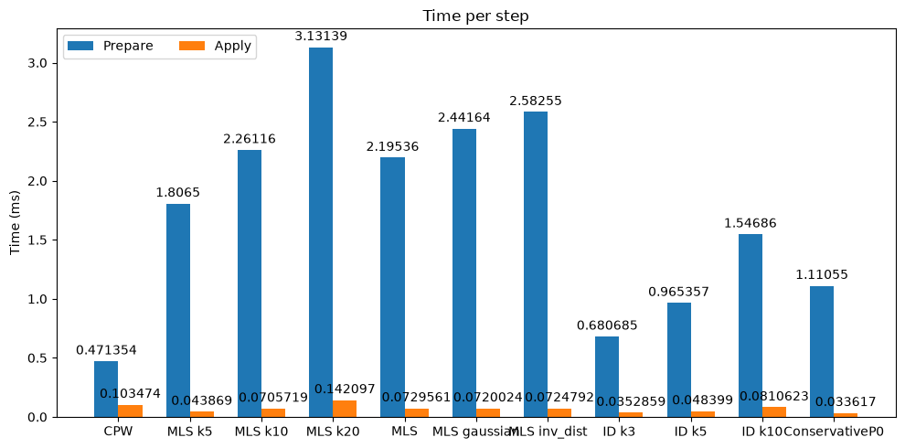

# Field transfers

This notebook shows how to remap fields between meshes with the
`mf.transfer` operators: interpolation, extrapolation and conservative
remapping, all sharing the same prepare / apply split.


```python
import numpy as np
import pyvista as pv

import mefikit as mf

pv.set_plot_theme("dark")
pv.set_jupyter_backend("static")

# Same mesh and selection context as the Fields notebook.
x = np.logspace(-5, 0.0, 1000)
mesh2 = mf.build_cmesh(x, x)

mesh2.fields["Measure"] = mf.M

m = mf.Field("Measure")
m2 = mf.Field("4 * M2")
mesh2.fields["4 * M2"] = m * m * 4.0

r = mf.sel.rect([0.25, 0.25], [0.7, 0.7])
c = mf.sel.circle([0.875, 0.875], 0.05)
```

## Transferring fields

The transfer function can be
- interpolation
- extrapolation
- conservative
- non-conservative
- using cells
- using cell centers and point clouds methods
- etc

They are many.

### ConstantPiecewise Transfer

The transfer is very simple. It is based on the cells of src_mesh and the cells center of the target mesh. It assigns to a cell from the target the value of the cell in which the center is located in. This is a point location based value assignment. By default the centroid (mean of cell nodes) is used because it is fast to comupute and is accurate with regular cells.


```python
m_src = mesh2.select((m2 > 4e-9) - r - c).to_mesh()
m_tgt = mf.build_cmesh(np.linspace(0.0, 1.5, 20), np.linspace(0.0, 1.5, 20))

# The transfer is computed between source and target geometry.
# This step is computationnaly heavy, but done once.
cpt = mf.transfer.ConstantPiecewise(m_src, m_tgt)
```


```python
# The transfer is applied. This step is much faster.
cpt.apply_update(m_src, "Measure", m_tgt, tgt_field_name="Projection", def_val=np.nan)
```


```python
m_tgt.to_pyvista().plot(show_edges=True)
```


As you can see the `"Measure"` field from m_src was used to compute the `"Projection"` field on m_tgt. Both mesh are not completly overlapping but that is not an issue. Cells from m_tgt whose center is not in a cell from m_src take a default value `def_val`. Default is 0.0 but any floating point value, such as `np.nan` is accepted.

This interpolation is good when coarseing a mesh and you do not need conservation. It might be useful in other circumstances I do not know of. It is quite fast but not that much because of the `is_in_cell` exact geometrical query.

### MovingMean Transfer

This Transfer is based on m_src cell center positions and m_tgt cell centers positions. It is a "meshless" operation as it does not care about connectivity. There are several options :

- normal mean
- weighted mean

Pros :

- it is extremly fast to compute
- it does not overshoot / undershoot

Cons :

- It lacks precision

### MovingLeastSquare Transfer

This Transfer is based on m_src cell center positions and m_tgt cell centers positions. It is a "meshless" operation as it does not care about connectivity. There are several options :

- linear least square : the projection is the least square linear approx of the solution (can be an extrapolation)
- weighted least square : the projection is the weighted least square linear approx of the solution, there are several possibilities for the weighting function but it depends on the relative distance to the target interpolation point.


```python
m_src = mesh2.select((m2 > 4e-9) - r - c).to_mesh()
m_tgt = mf.build_cmesh(np.linspace(0.0, 1.5, 20), np.linspace(0.0, 1.5, 20))

# The transfer is computed between source and target geometry.
# This step is computationnaly heavy, but done once.
mlsqt = mf.transfer.MovingLeastSquares(m_src, m_tgt, k=10)
```


```python
# The transfer is applied. This step is much faster.
mlsqt.apply_update(m_src, "Measure", m_tgt, tgt_field_name="Projection", def_val=np.nan)
```


```python
m_tgt.to_pyvista().plot(show_edges=True)
```


As you can see the projection gets a value everywhere, even outside the initial domain. This can lead to bad extrapolations, so it is to your responsability. Here as an example the extrapolated Measure can have negative values.

Inside the domain the interpolation works like a charm.

### Transfer methods comparison


```python
def compare_src_tgt(m_src, m_tgt):
    pt = pv.Plotter(shape=(1, 2))
    pt.subplot(0, 0)
    pt.add_text("Source")
    pt.add_mesh(m_src.to_pyvista(), show_edges=True, clim=[0.0, 0.06])
    pt.camera_position = "xy"
    pt.subplot(0, 1)
    pt.add_text("Target")
    pt.add_mesh(
        m_tgt.to_pyvista(), clim=[0.0, 0.06], below_color="pink", above_color="red"
    )
    pt.add_mesh(m_src.descend().to_pyvista(), show_edges=True, line_width=1)
    pt.camera_position = "xy"
    pt.show()
```


```python
import time

transfers = (
    mf.transfer.ConstantPiecewise,
    lambda src, tgt: mf.transfer.MovingLeastSquares(src, tgt, k=5),
    mf.transfer.MovingLeastSquares,
    lambda src, tgt: mf.transfer.MovingLeastSquares(src, tgt, k=20),
    mf.transfer.MovingLeastSquares,
    lambda src, tgt: mf.transfer.MovingLeastSquares(
        src, tgt, weighting=mf.transfer.DistanceWeighting.Gaussian()
    ),
    lambda src, tgt: mf.transfer.MovingLeastSquares(
        src, tgt, weighting=mf.transfer.DistanceWeighting.InverseDistance(1.0)
    ),
    lambda src, tgt: mf.transfer.InverseDistance(src, tgt, k=3),
    lambda src, tgt: mf.transfer.InverseDistance(src, tgt, k=5),
    lambda src, tgt: mf.transfer.InverseDistance(src, tgt, k=10),
    mf.transfer.ConservativeP0,
)
trasfers_labels = (
    "CPW",
    "MLS k5",
    "MLS k10",
    "MLS k20",
    "MLS",
    "MLS gaussian",
    "MLS inv_dist",
    "ID k3",
    "ID k5",
    "ID k10",
    "ConservativeP0",
)
prepare_times = []
apply_times = []

for T, label in zip(transfers, trasfers_labels):
    m_src = mf.build_cmesh(np.logspace(-2.0, 0.0, 20), np.logspace(-2.0, 0.0, 20))
    m_tgt = mf.build_cmesh(np.linspace(-0.05, 1.1, 40), np.linspace(-0.05, 1.1, 40))
    m_src.fields["Measure"] = mf.M
    t0 = time.time()
    tr = T(m_src, m_tgt)
    t1 = time.time()
    tr.apply_update(m_src, "Measure", m_tgt, label + " Transfered Measure")
    t2 = time.time()

    prepare_times.append((t1 - t0) * 1000.0)
    apply_times.append((t2 - t1) * 1000.0)

    compare_src_tgt(m_src, m_tgt)
```


```python
import matplotlib.pyplot as plt

chart_data = {
    "Prepare": prepare_times,
    "Apply": apply_times,
}

fig, ax = plt.subplots(figsize=(10, 5))

res = ax.grouped_bar(chart_data, tick_labels=trasfers_labels, group_spacing=1)
for container in res.bar_containers:
    ax.bar_label(container, padding=3)

# Add some text for labels, title, etc.
ax.set_ylabel("Time (ms)")
ax.set_title("Time per step")
ax.legend(loc="upper left", ncols=3)
fig.tight_layout()
plt.show()
```



