# Field transfers

*Figures use PyVista; verbose plotting boilerplate is omitted.*

This notebook shows how to remap fields between meshes with the
`mf.transfer` operators: interpolation, extrapolation and conservative
remapping, all sharing the same prepare / apply split.

The setup below is self-contained: a log-spaced box mesh carrying a `"Measure"`
field (cell volumes) and an analytic expression `"4 * M2"`, plus a couple of
spatial selections used to crop the source. If anything looks unfamiliar, the
[Fields](./fields.md) and
[Selection](./selection.md) notebooks cover their meaning.


```python
import numpy as np

import mefikit as mf

x = np.logspace(-5, 0.0, 1000)
mesh2 = mf.build_cmesh(x, x)

mesh2.fields["Measure"] = mf.M

m = mf.Field("Measure")
m2 = mf.Field("4 * M2")
mesh2.fields["4 * M2"] = m * m * 4.0

r = mf.sel.rect([0.25, 0.25], [0.7, 0.7])
c = mf.sel.circle([0.875, 0.875], 0.05)
```

## Transferring fields

A transfer maps a field from a **source** mesh onto a **target** mesh. Every
`mf.transfer` operator reduces to the same operation — each target cell is a
weighted sum of source cells:

    t_j = sum_i w_ji s_i

The weights are computed **once**, at construction time (the *prepare* step);
applying the operator to any field is then a single, fast matrix-vector
product. Reuse one operator for many fields, as long as the two meshes do not
change.

What differs between the four operators is only *how the weights are
obtained*:

| Operator | Kind | Sampling / support | Conserves the integral | Typical use |
|---|---|---|---|---|
| `ConstantPiecewise` | cell-based | target cell center located in a source cell (centroid) | no | faithful piecewise-constant copy, coarsening |
| `InverseDistance` | meshless | `k` nearest source cell centers, weights `1 / r**exponent` | no | cheap local fallback, unrelated point clouds |
| `MovingLeastSquares` | meshless | `k` nearest source cell centers, local fit with a distance kernel | no | smooth fields, trend reconstruction |
| `ConservativeP0` | overlap | volumetric intersection with source cells | **yes** | keep mass / energy exact (ALE, coupling) |

Some shared rules:

- **Interpolation methods** (`ConstantPiecewise`, `InverseDistance`,
  `MovingLeastSquares`) combine a few source cells per target cell and never
  conserve the integral.
- **`ConservativeP0`** weights each contribution by the intersection measure.
  For **intensive** fields (temperature, density) it normalizes by the target
  cell measure afterwards — enough to behave like an interpolation — while
  **extensive** fields (mass, energy) keep the raw weighted sum. Pass
  `extensive=True` to treat a field as extensive.
- Target cells covered by **no** source cell keep the **default value**
  `def_val` (defaults to `0.0`; `np.nan` makes the uncovered cells explicit).
- All operators share one calling convention: build them with
  `tr = mf.transfer.Op(src, tgt, ...)`, then call `tr(expr)` (returns a field
  on `tgt`), `tr.eval(expr)` (returns per-type arrays), or
  `tr.apply_update(src, name, tgt, ...)` to write into a target field in
  place.

### ConstantPiecewise Transfer

The transfer is very simple. It is based on the cells of src_mesh and the cells center of the target mesh. It assigns to a cell from the target the value of the cell in which the center is located in. This is a point location based value assignment. By default the centroid (mean of cell nodes) is used because it is fast to compute and is accurate with regular cells.


```python
m_src = mesh2.select((m2 > 4e-9) - r - c).to_mesh()
m_tgt = mf.build_cmesh(np.linspace(0.0, 1.5, 20), np.linspace(0.0, 1.5, 20))

# The transfer is computed between source and target geometry.
# This step is computationnaly heavy, but done once.
cpt = mf.transfer.ConstantPiecewise(m_src, m_tgt)
```


```python
# The transfer is applied. This step is much faster.
cpt.apply_update(m_src, "Measure", m_tgt, tgt_field_name="Projection", def_val=np.nan)
```


```python
m_tgt.to_pyvista().plot(show_edges=True)
```


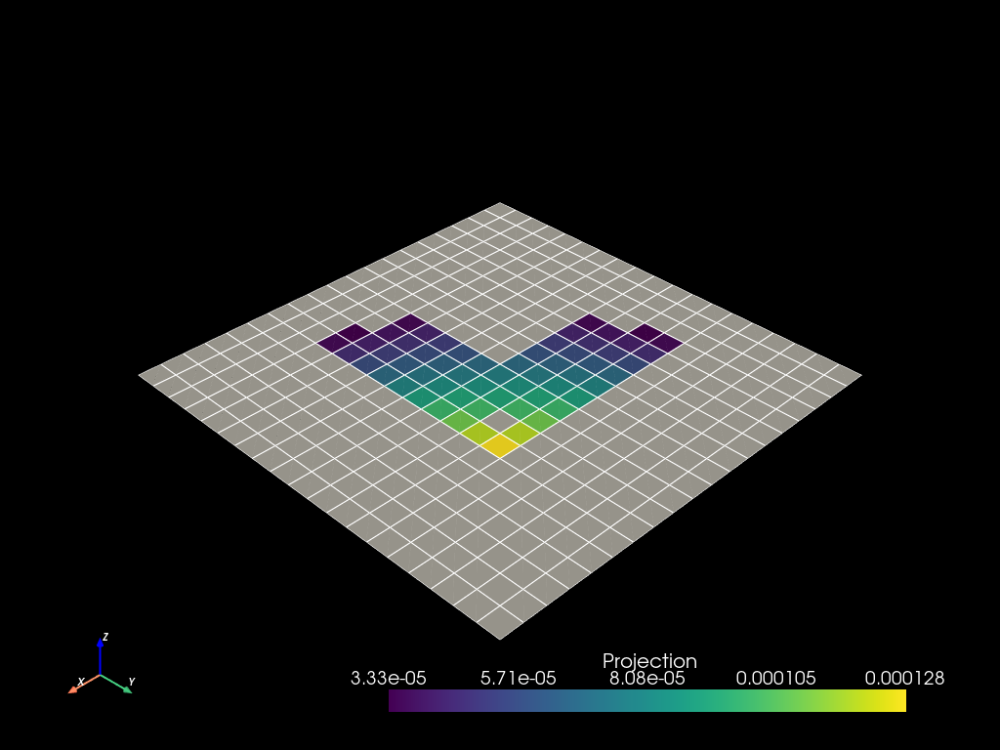


As you can see the `"Measure"` field from m_src was used to compute the
`"Projection"` field on m_tgt. Both meshes are not completely overlapping but
that is not an issue: cells from m_tgt whose center is not in a cell from m_src
take a default value `def_val`. Default is `0.0`, but any floating point value,
such as `np.nan`, is accepted.

This interpolation is a good fit when coarsening a mesh and you do not need
conservation. It is fast, though not as fast as the meshless methods, because
of the `is_in_cell` exact geometrical query.

### InverseDistance Transfer

The meshless counterpart of the piecewise-constant copy: each target cell
center samples its `k` nearest source cell centers and receives their weighted
mean, with weights `w_i ~ 1 / r**exponent` (defaults: `k = 4`,
`exponent = 2.0`). The weights are non-negative and normalized, so the value is
a convex combination of the neighbours — it stays inside the source range,
never overshoots, and is cheap to evaluate.

Use it when `ConstantPiecewise` leaves holes (uncovered cells) or when the
source and target meshes are unrelated point clouds. A higher `exponent`
concentrates the weight on the closest neighbour; `k = 1` degenerates to exact
nearest-neighbour sampling.

### MovingLeastSquares Transfer

The most flexible of the meshless methods: for each target cell center it
fits a local least-squares polynomial through the `k` nearest source centers
(default `k = 10`) and evaluates it at the target point. The neighbour weights
are shaped by a distance kernel, one of the `mf.transfer.DistanceWeighting`
choices:

- `Constant()` — a plain (linear) least-squares fit over the `k` neighbours;
- `InverseDistance(exponent)` — neighbours weighted by `(h / r)**exponent`
  where `h` is the distance to the farthest selected neighbour;
- `Gaussian()` — a gaussian kernel.

It smooths the field and reconstructs trends, but it is the only method that
can **overshoot** the source values and **extrapolate** outside the source
domain. Watch the boundaries — using `def_val=np.nan` as target for the
uncovered cells makes the extrapolated region visible.


```python
m_src = mesh2.select((m2 > 4e-9) - r - c).to_mesh()
m_tgt = mf.build_cmesh(np.linspace(0.0, 1.5, 20), np.linspace(0.0, 1.5, 20))

# The transfer is computed between source and target geometry.
# This step is computationnaly heavy, but done once.
mlsqt = mf.transfer.MovingLeastSquares(m_src, m_tgt, k=10)
```


```python
# The transfer is applied. This step is much faster.
mlsqt.apply_update(m_src, "Measure", m_tgt, tgt_field_name="Projection", def_val=np.nan)
```


```python
m_tgt.to_pyvista().plot(show_edges=True)
```


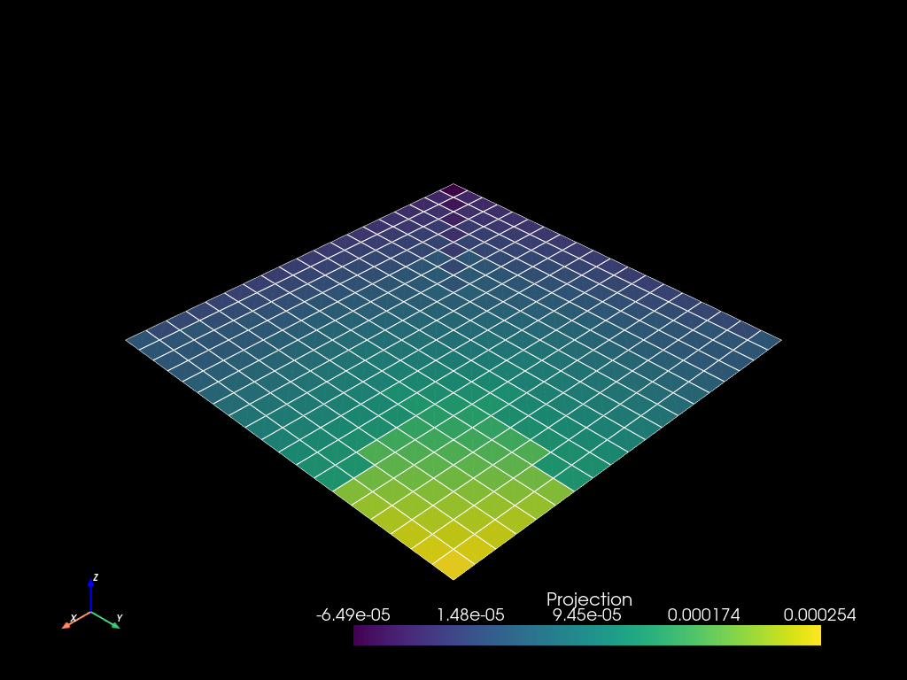


As you can see the projection gets a value everywhere, even outside the initial domain. This can lead to bad extrapolations, so it is to your responsability. Here as an example the extrapolated Measure can have negative values.

Inside the domain the interpolation works like a charm.

### Transfer methods comparison

Which method to use? `ConstantPiecewise` (CPW) is local and cheap, `MovingLeastSquares` (MLS) smooths the field but can extrapolate outside the source, `InverseDistance` (ID) is a tunable local fallback, and `ConservativeP0` conserves the integral.

Every method is timed on the same grid pair, split between the one-shot
**prepare** (slow) and the repeated **apply** (fast). The timing loop is hidden
for readability — it only fills the chart below.


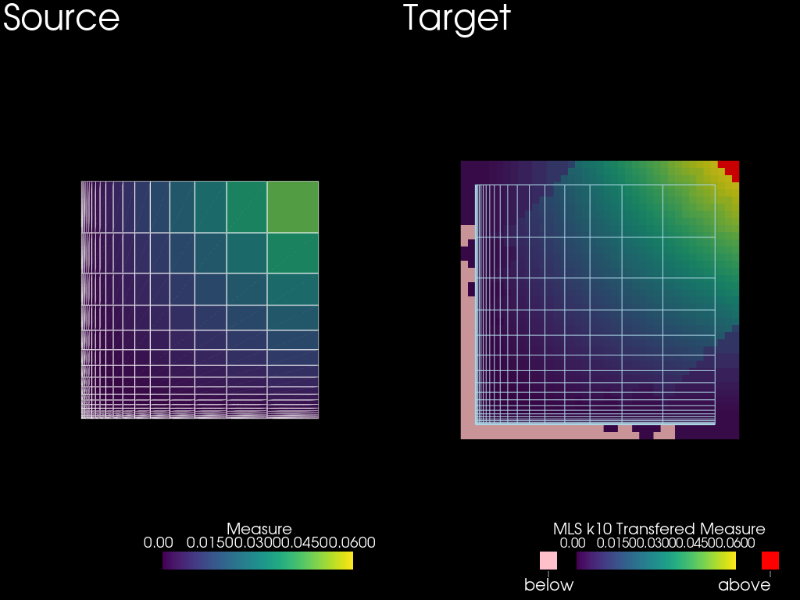


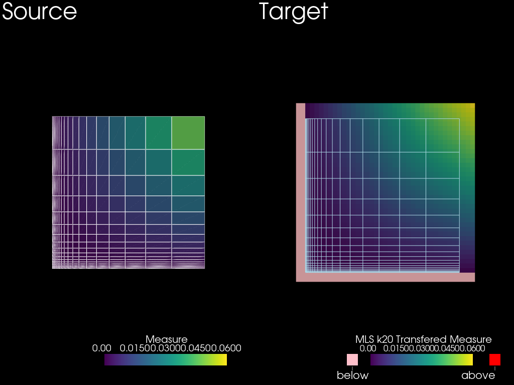


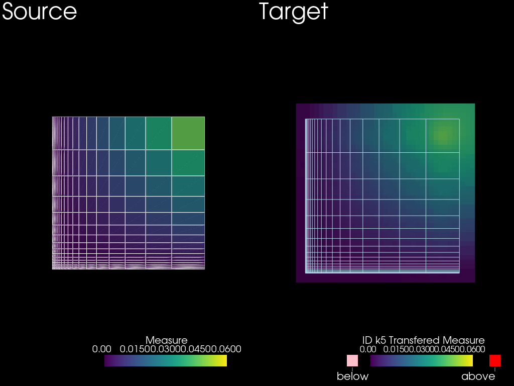


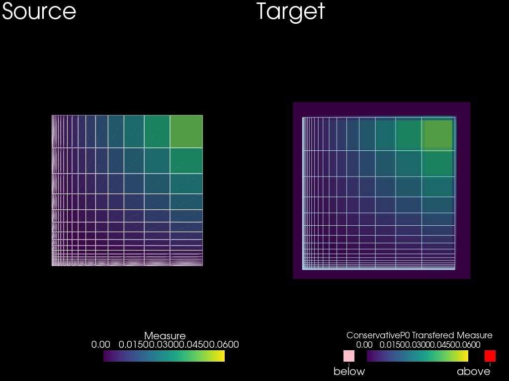


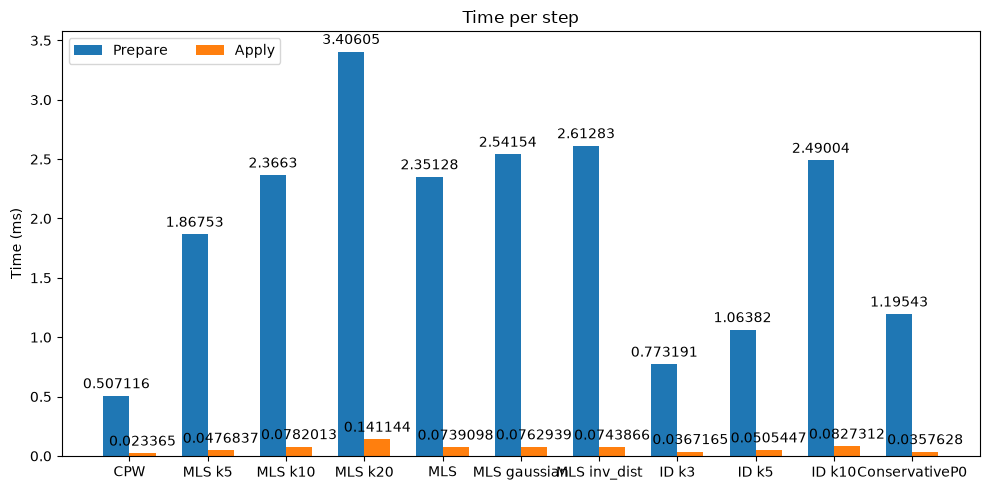


## Transfer of 3D fields

The same benchmark on a hexahedral grid pair — here `ConstantPiecewise`,
`InverseDistance` and `ConservativeP0` are timed. The prepare / apply split is
unchanged:


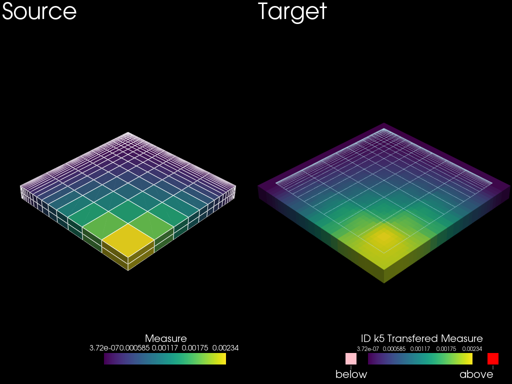


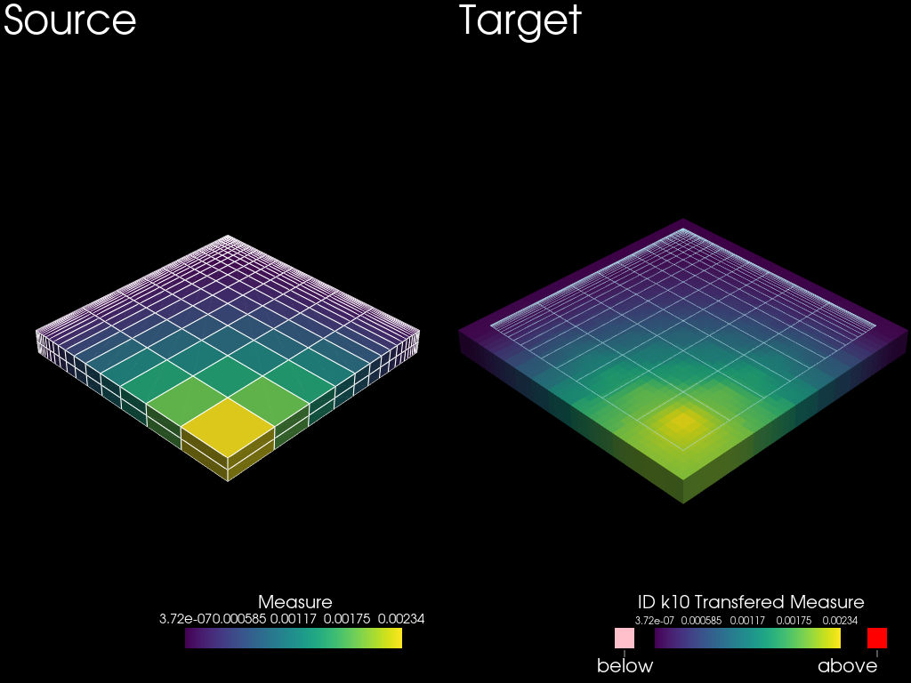


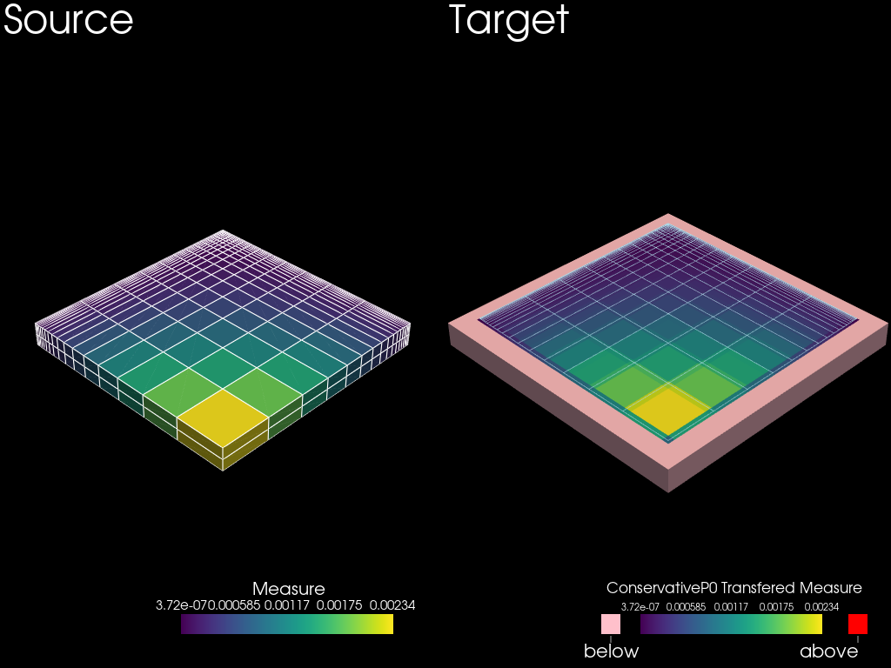


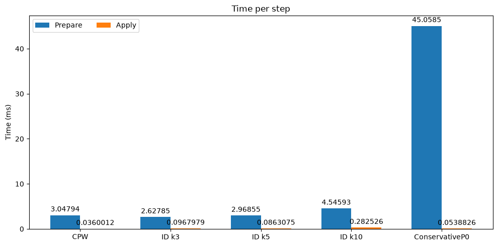


## Transfer between surfaces

Transfers do not apply to volumetric meshes only: they also work between surface
meshes, i.e. 2D domains embedded in 3D space. Here `sin_mesh` builds such a surface
by extruding a sine line along an increasing height. The cell `Measure` is remapped
from a coarse surface to a finer one with the `InverseDistance` interpolation.


```python
def sin_mesh(n=20):
    x = np.linspace(0.0, 1.0, n)
    coords = np.c_[x, 0.1 * np.sin(x * 2.0 * np.pi)]
    conn = np.c_[np.arange(0, n - 1, dtype=np.uint), np.arange(1, n, dtype=np.uint)]
    res = mf.UMesh(coords)
    res.add_regular_block("SEG2", conn)
    return res.extrude(np.linspace(0.0, 1.0, n) ** 2)
```


```python
coarse = sin_mesh(9)
coarse.measure_update()
coarse.to_pyvista().plot(show_edges=True)
```


```python
fine = sin_mesh(20)
fine.to_pyvista().plot(show_edges=True)
```


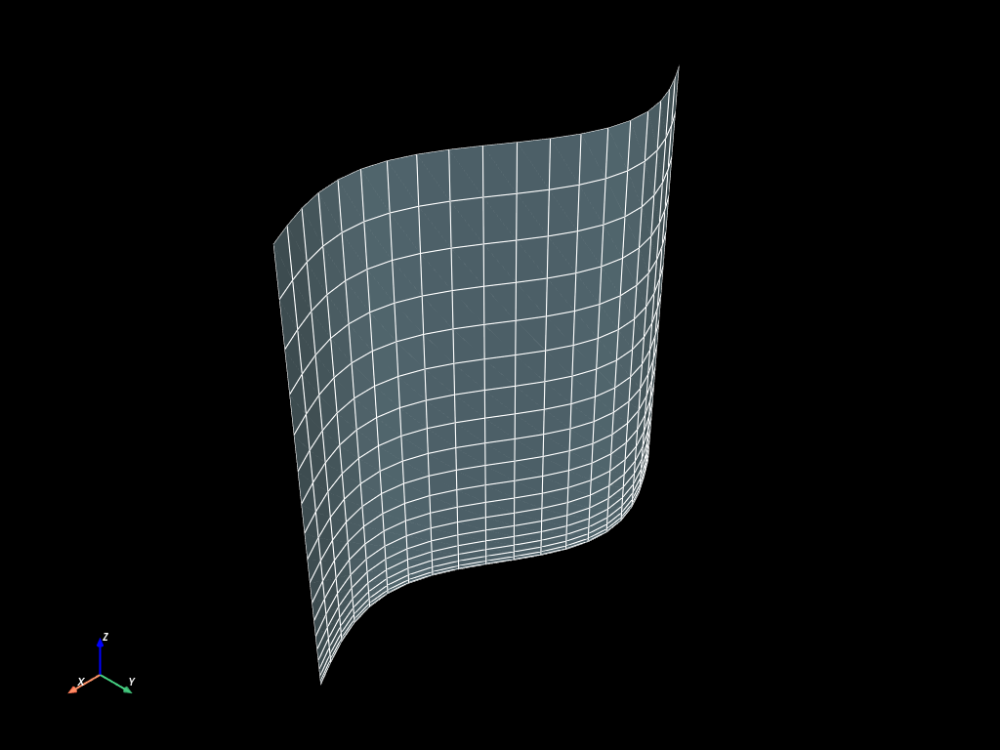


```python
tr = mf.transfer.InverseDistance(coarse, fine)
tr.apply_update(coarse, "Measure", fine)
```


```python
fine.to_pyvista().plot()
```


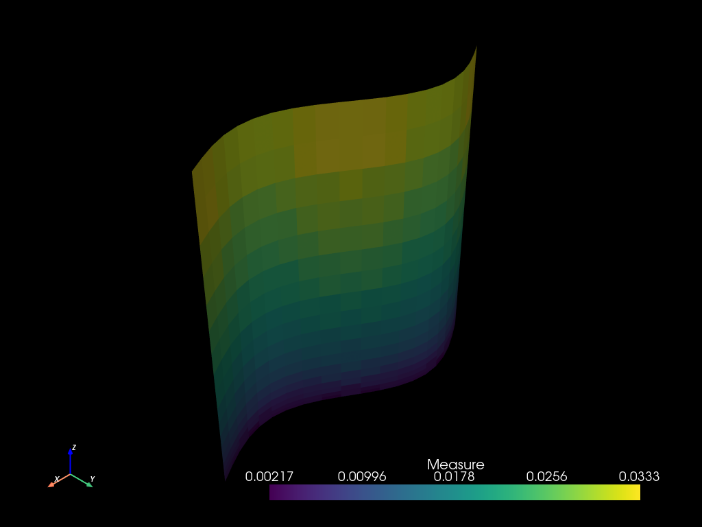


## Comparison to medcoupling


```python
import medcoupling as mc
from medcoupling import MEDCouplingRemapper
```


```python
m_src = mf.build_cmesh(
    np.logspace(-2.0, 0.0, 20), np.logspace(-2.0, 0.0, 20), np.linspace(0.0, 0.1, 5)
)
m_tgt = mf.build_cmesh(
    np.linspace(-0.05, 1.1, 40), np.linspace(-0.05, 1.1, 40), np.linspace(0.0, 0.1, 3)
)
m_src.fields["Measure"] = mf.M

t0 = time.time()
tr = mf.transfer.ConservativeP0(m_src, m_tgt)
t1 = time.time()
tr.apply_update(m_src, "Measure", m_tgt)
t2 = time.time()

mf_prepare = t1 - t0
mf_apply = t2 - t1
```


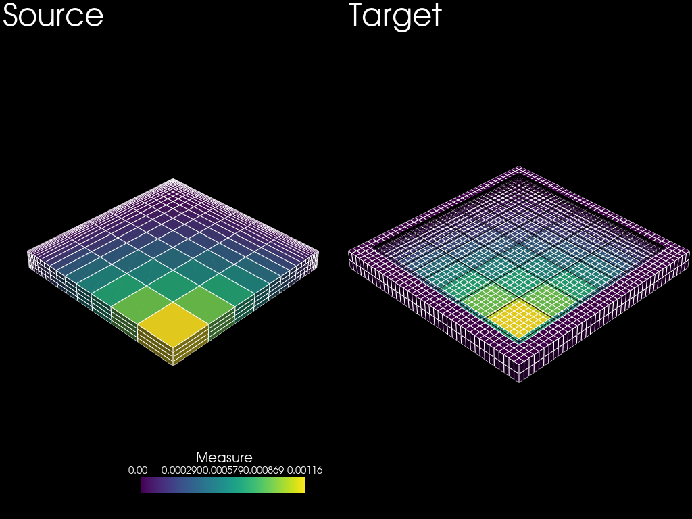


```python
mc_src = m_src.to_mc()
mc_tgt = m_tgt.to_mc()

f_src = mc_src.getMeasureField(True)
f_src.setNature(mc.IntensiveConservation)

remap = MEDCouplingRemapper()
t0 = time.time()
remap.prepare(mc_src, mc_tgt, "P0P0")
t1 = time.time()
f_tgt = remap.transferField(f_src, 0.0)
t2 = time.time()

mc_prepare = t1 - t0
mc_apply = t2 - t1
```


```python
# Identical fields, whichever library computed them
mf_f = m_tgt.fields["Measure"].numpy()
mc_f = f_tgt.getArray().toNumPyArray()
assert np.allclose(mc_f, mf_f)
```


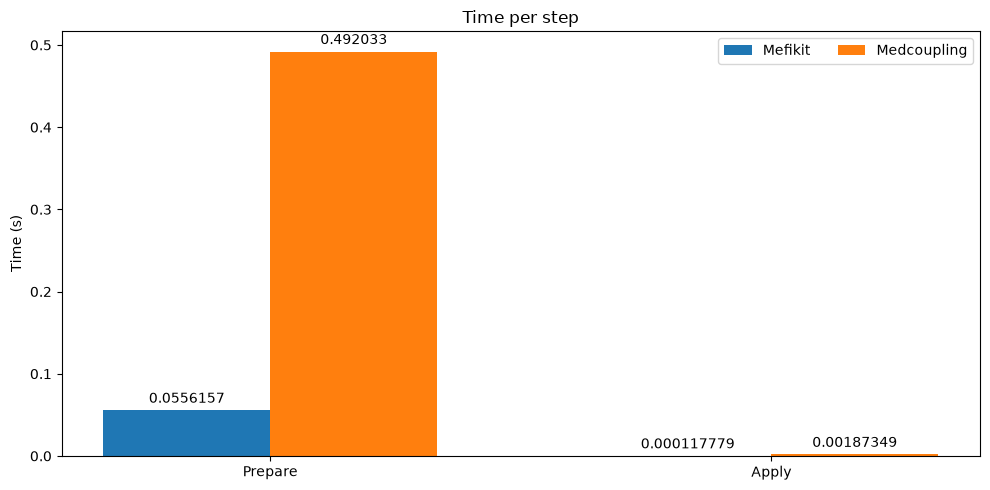


## Using transfer as a FieldExpressions


```python
trsf = mf.transfer.ConservativeP0(m_src, m_tgt)
rho = 3.0 * mf.X + mf.Y.square()
cp = 10.0 * mf.M
m_src.fields["rhoCp"] = rho * cp
m_tgt.fields["temp"] = trsf(rho * cp)
```

> **About the default value and the zeros**
>
> Target cells that are **not covered** by any source cell keep the transfer `def_val`, which defaults to `0.0`. With the log-pressure source `m_src` confined to ~[0.001, 0.1] above, most of the large `m_tgt` (up to 1.5) is outside the source, so most target cells are legitimately zero. The earlier cells set `def_val=np.nan` on purpose so that uncovered cells show up as `NaN` instead of `0.0`; use `def_val=np.nan` (or any other sentinel) the same way with `eval`/`__call__`:
>
> ```python
> trsf = mf.transfer.ConservativeP0(m_src, m_tgt, def_val=np.nan)
> m_tgt.fields["temp"] = trsf(rho)   # uncovered cells -> NaN, covered cells -> rho
> ```
>
> Cells covered by the source are transferred correctly and match `apply_update` exactly.


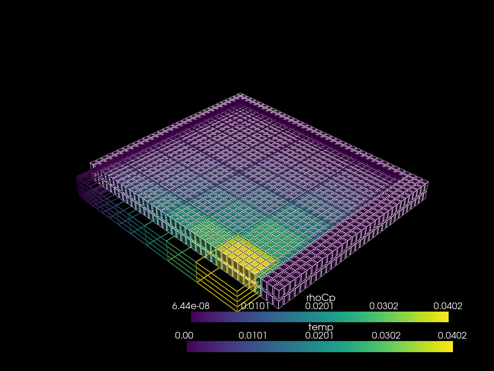
