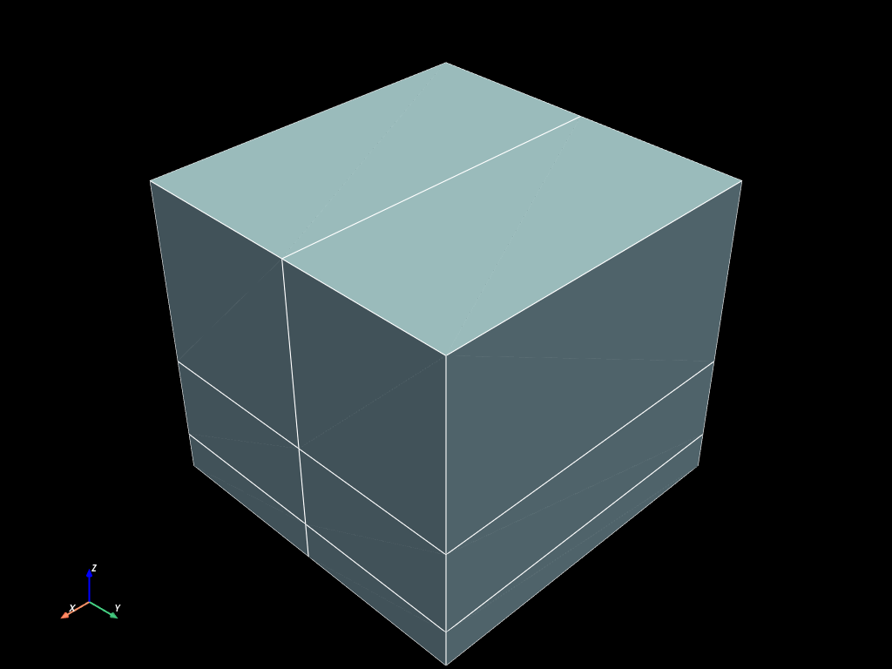
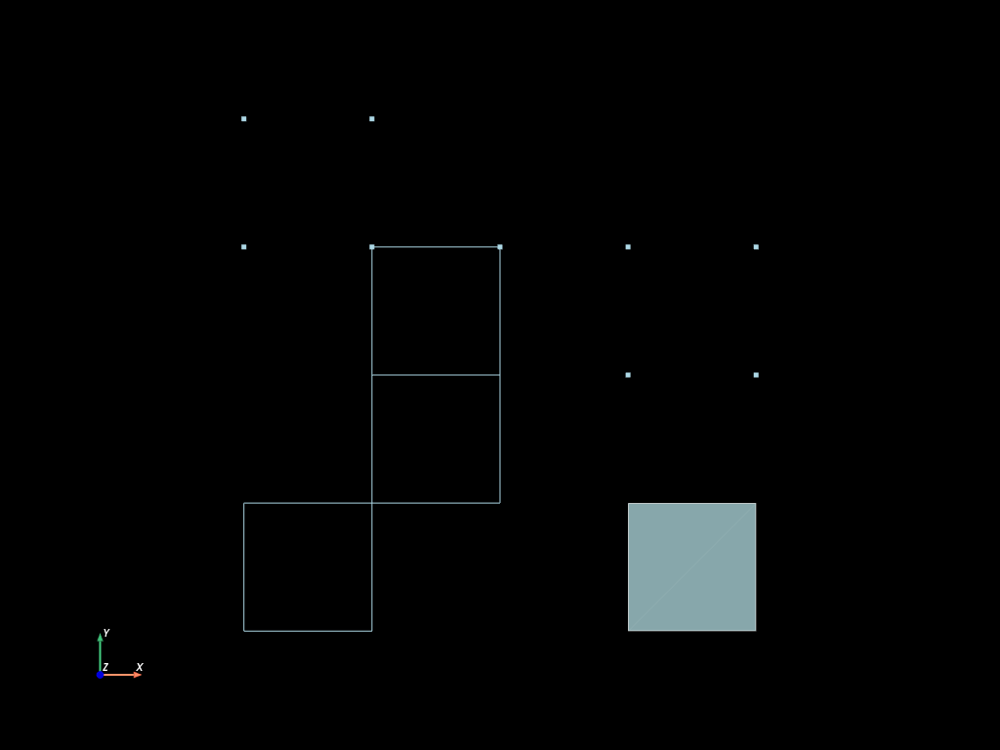

# UMesh basics

*Figures use PyVista; verbose plotting boilerplate is omitted.*

`UMesh` is the unstructured-mesh type at the heart of mefikit: a flat
**coordinates** array plus a set of **element blocks**, each storing the
connectivity of one element type (`HEX8`, `QUAD4`, `SEG2`, `VERTEX`,
polyhedra...). This notebook builds two meshes — the trivial way with
`build_cmesh`, then from raw coordinates and explicit connectivity — to show
what a `UMesh` actually contains.


```python
import numpy as np

import mefikit as mf
```

## Building cartesian meshes

`mf.build_cmesh(*axes)` builds a structured (cartesian) mesh in **one call**:
it takes the node coordinates along each axis and generates the regular grid
of cells. Here x has 2 nodes, y 3 and z 4, so the mesh holds
`(2-1) x (3-1) x (4-1) = 6` HEX8 cells over `2 x 3 x 4 = 24` nodes.


```python
volumes = mf.build_cmesh(
    range(2), np.linspace(0.0, 1.0, 3), np.logspace(0.0, 1.0, 4) / 10.0
)
```


```python
print(volumes)
```

    UMeshBase {
        coords: [[0.0, 0.0, 0.1],
         [1.0, 0.0, 0.1],
         [0.0, 0.5, 0.1],
         [1.0, 0.5, 0.1],
         [0.0, 1.0, 0.1],
         [1.0, 1.0, 0.1],
         [0.0, 0.0, 0.2154434690031884],
         [1.0, 0.0, 0.2154434690031884],
         [0.0, 0.5, 0.2154434690031884],
         [1.0, 0.5, 0.2154434690031884],
         [0.0, 1.0, 0.2154434690031884],
         [1.0, 1.0, 0.2154434690031884],
         [0.0, 0.0, 0.46415888336127786],
         [1.0, 0.0, 0.46415888336127786],
         [0.0, 0.5, 0.46415888336127786],
         [1.0, 0.5, 0.46415888336127786],
         [0.0, 1.0, 0.46415888336127786],
         [1.0, 1.0, 0.46415888336127786],
         [0.0, 0.0, 1.0],
         [1.0, 0.0, 1.0],
         [0.0, 0.5, 1.0],
         [1.0, 0.5, 1.0],
         [0.0, 1.0, 1.0],
         [1.0, 1.0, 1.0]], shape=[24, 3], strides=[3, 1], layout=Cc (0x5), const ndim=2,
        element_blocks: {
            HEX8: ElementBlockBase {
                cell_type: HEX8,
                connectivity: Regular(
                    [[0, 1, 3, 2, 6, 7, 9, 8],
                     [2, 3, 5, 4, 8, 9, 11, 10],
                     [6, 7, 9, 8, 12, 13, 15, 14],
                     [8, 9, 11, 10, 14, 15, 17, 16],
                     [12, 13, 15, 14, 18, 19, 21, 20],
                     [14, 15, 17, 16, 20, 21, 23, 22]], shape=[6, 8], strides=[8, 1], layout=Cc (0x5), const ndim=2,
                ),
                fields: {},
                families: [0, 0, 0, 0, 0, 0], shape=[6], strides=[1], layout=CFcf (0xf), const ndim=1,
                groups: ArcGroups(
                    {},
                ),
            },
        },
    }


`print(volumes)` shows the two ingredients. The **coords**
array lists every node with its coordinates (here 24 nodes, 3 values each).
The **element_blocks** entry groups the connectivity of one element type; a
`Regular` block stores it as a dense table where each row is one cell (6 HEX8
cells x 8 node ids each). Fields, families and groups are empty in a freshly
built mesh.


```python
volumes.to_pyvista().plot(show_edges=True)
```





## Building mesh with custom connectivity

Sometimes blocks must be built by hand. `mf.UMesh(coords)` starts from a plain
coordinates array, and `add_regular_block("TYPE", conn)` appends a block of a
given element type from an explicit connectivity table. Here one mesh mixes
three topologies: 9 isolated `VERTEX` nodes, a set of `SEG2` edges and one
`QUAD4` face. `to_pyvista(dim="all")` renders every dimension at once.


```python
x, y = np.meshgrid(np.linspace(0.0, 1.0, 5), np.linspace(0.0, 1.0, 5))
coords = np.c_[x.flatten(), y.flatten()]
conn = np.array(
    [
        [0, 1],
        [1, 6],
        [6, 5],
        [5, 0],
        [6, 7],
        [7, 12],
        [12, 11],
        [11, 6],
        [12, 17],
        [17, 16],
        [16, 11],
    ],
    dtype=np.uint,
)
```


```python
mesh = mf.UMesh(coords)
mesh.add_regular_block("VERTEX", np.arange(13, 22, dtype=np.uint)[..., np.newaxis])
mesh.add_regular_block("SEG2", conn)
mesh.add_regular_block("QUAD4", np.array([[3, 4, 9, 8]], dtype=np.uint))
```


```python
mesh.to_pyvista(dim="all").plot(cpos="xy", show_edges=True)
```





---

> **Read next:** [Getting started](./getting_started.md) is the 30-second tour;
> [Fields](./fields.md) attaches data to a mesh like this one.
