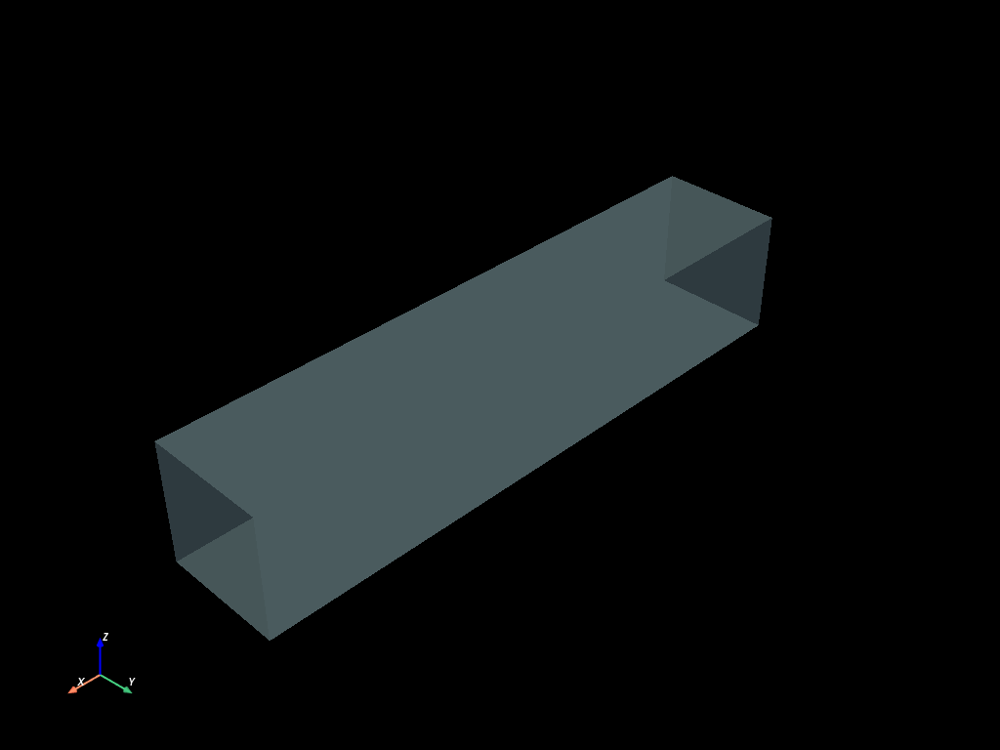

# Bubbles example


```python
import mefikit as mf
import numpy as np
import pyvista as pv

rng = np.random.default_rng(seed=123)
pv.set_plot_theme("dark")
pv.set_jupyter_backend("static")
```


```python
xmax = 5.0
ymax = 1.0
r = 0.17
nb = 15
nr = 12.5
```


```python
nx = int(xmax / r * nr)
ny = int(ymax / r * nr)
print(f"Number of elements : {nx * ny * ny:,}")
```

    Number of elements : 1,955,743


```python
xc = rng.uniform(r, xmax - r, nb)
yc = rng.uniform(r, ymax - r, nb)
zc = rng.uniform(r, ymax - r, nb)
spheres = [mf.sel.sphere([x, y, z], r) for x, y, z in zip(xc, yc, zc)]
sphere_union = spheres[0]
for s in spheres[1:]:
    sphere_union = sphere_union | s
```


```python
x = np.linspace(0.0, xmax, nx)
y = np.linspace(0.0, ymax, ny)
volumes = mf.build_cmesh(x, y, y)
```


```python
volumes.boundaries().to_pyvista().plot(opacity=0.4)
```





```python
inner_bubbles = volumes.select(sphere_union)
interface = inner_bubbles.boundaries()
cracked = volumes.crack(interface)
```


```python
cracked.boundaries().to_pyvista().plot(opacity=0.4)
```


```python
bubble_groups = inner_bubbles.connected_components()
```


```python
pv.global_theme.color_cycler = "default"
pl = pv.Plotter()
for c in bubble_groups:
    compo = c.to_pyvista()
    pl.add_mesh(compo)
pl.add_mesh(volumes.boundaries(target_dim=1).to_pyvista())
pl.show()
pv.global_theme.color_cycler = None
```


```python
clip1 = mf.sel.bbox([-np.inf] * 3, [np.inf, ymax / 3.0, np.inf])
pl = pv.Plotter()
pl.add_mesh(volumes.select(clip1 & ~sphere_union).to_pyvista())
pl.add_mesh(interface.to_pyvista(), opacity=0.4)
pl.show()
```


