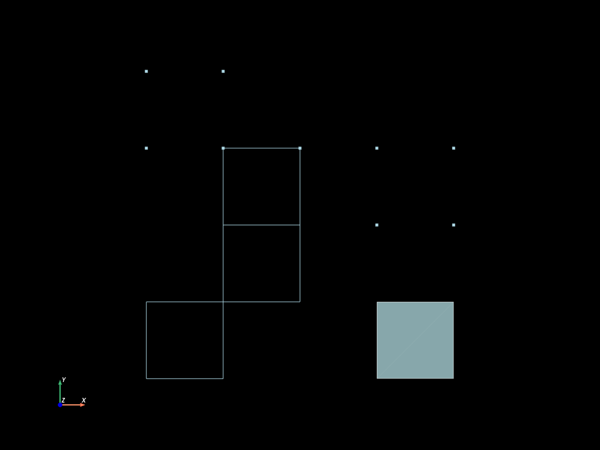
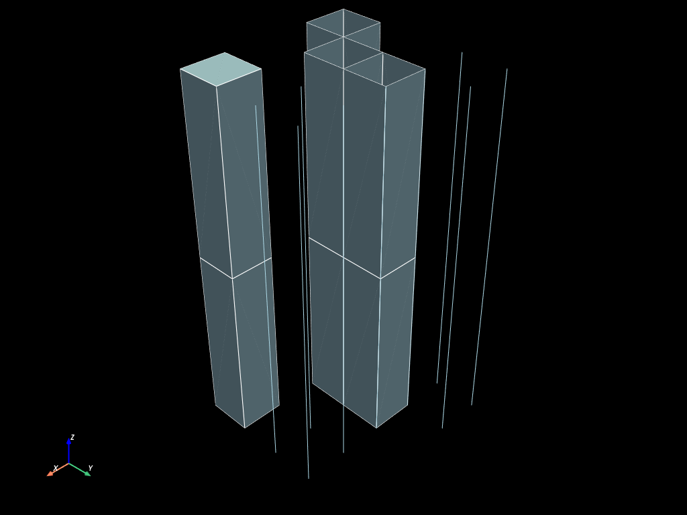
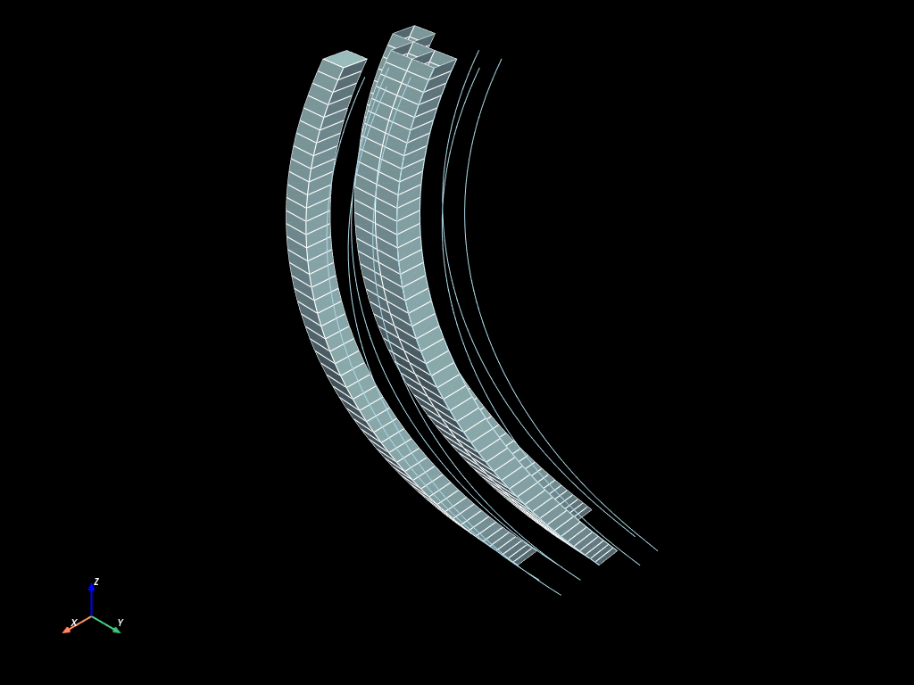

# Mesh extrusions


```python
import mefikit as mf
import numpy as np
import pyvista as pv

pv.set_plot_theme("dark")
pv.set_jupyter_backend("static")
```

### Building mesh with custom connectivity

First let's build a 2D mesh wich will by used to demonstrate extrusions.


```python
x, y = np.meshgrid(np.linspace(0.0, 1.0, 5), np.linspace(0.0, 1.0, 5))
coords = np.c_[x.flatten(), y.flatten()]
conn = np.array(
    [
        [0, 1],
        [1, 6],
        [6, 5],
        [5, 0],
        [6, 7],
        [7, 12],
        [12, 11],
        [11, 6],
        [12, 17],
        [17, 16],
        [16, 11],
    ],
    dtype=np.uint,
)
```


```python
mesh = mf.UMesh(coords)
mesh.add_regular_block("VERTEX", np.arange(13, 22, dtype=np.uint)[..., np.newaxis])
mesh.add_regular_block("SEG2", conn)
mesh.add_regular_block("QUAD4", np.array([[3, 4, 9, 8]], dtype=np.uint))
```


```python
mesh.to_pyvista(dim="all").plot(cpos="xy", show_edges=True)
```





## Extrusion along an existing axis

### Build simple extruded mesh


```python
extruded = mesh.extrude(range(3))
```


```python
extruded.to_pyvista(dim="all").plot(show_edges=True)
```





### Build extruded mesh along a 3d line with parallel z faces


```python
n = 50
x = np.sin(np.linspace(0., np.pi, n))
y = np.cos(np.linspace(0., np.pi, n))
z = np.linspace(0., 4., n)
line = np.c_[x, y, z]

extruded_par = mesh.extrude_parallel(line)
```


```python
extruded_par.to_pyvista(dim="all").plot(show_edges=True)
```



