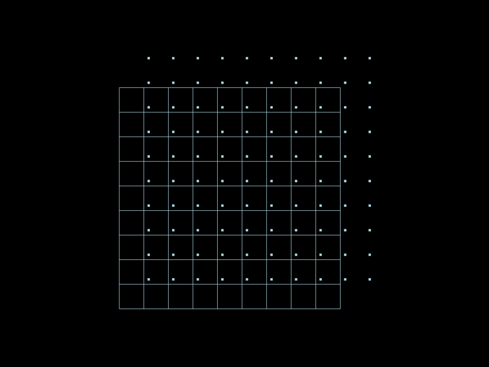

# Geometrical tools


```python
import mefikit as mf
import numpy as np
import pyvista as pv

pv.set_plot_theme("dark")
pv.set_jupyter_backend("static")
```

## Snap points


```python
x = np.linspace(0.0, 3.0, 10, endpoint=True)
mesh = mf.build_cmesh(x, x)

eps = 0.1
dec = x[-1] / len(x) + eps
x2 = np.linspace(dec, x[-1] + dec, len(x), endpoint=True)
mesh2 = mf.build_cmesh(x2, x2)
```

**Note:** epsilon value used in the following operation is big enough so that there are multiple candidates for some points, but low enough so that there is no degenerated cell created.


```python
snaped = mesh.snap(mesh2, eps=x[-1] / len(x))
```


```python
pt = pv.Plotter()
pt.add_mesh(mesh.submesh().to_pyvista())
pt.add_mesh(mesh2.submesh(target_dim=0).to_pyvista())
pt.show(cpos="xy")
```





```python
pt = pv.Plotter()
pt.add_mesh(snaped.to_pyvista(), show_edges=True)
pt.add_mesh(mesh2.submesh(target_dim=0).to_pyvista())
pt.show(cpos="xy")
```


