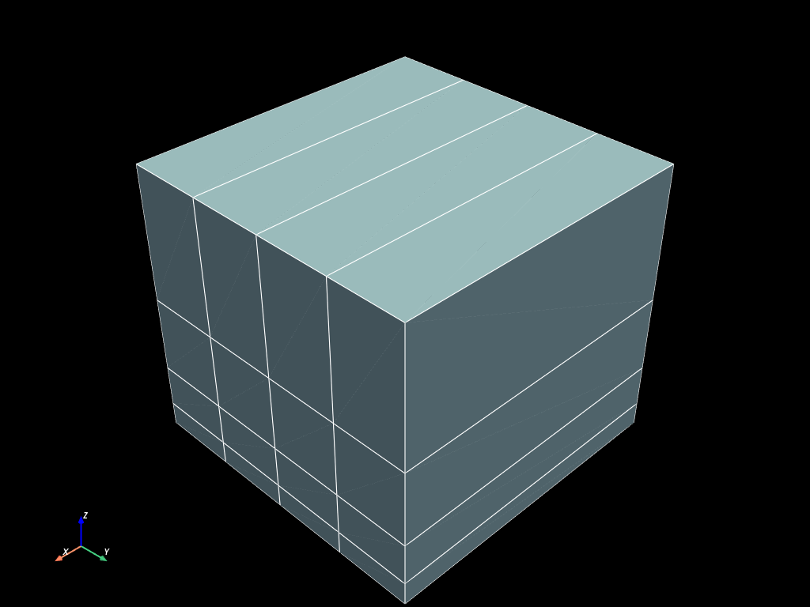
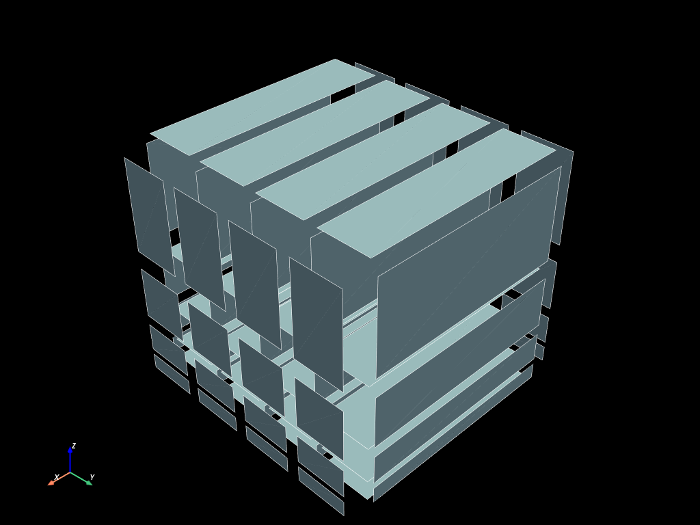
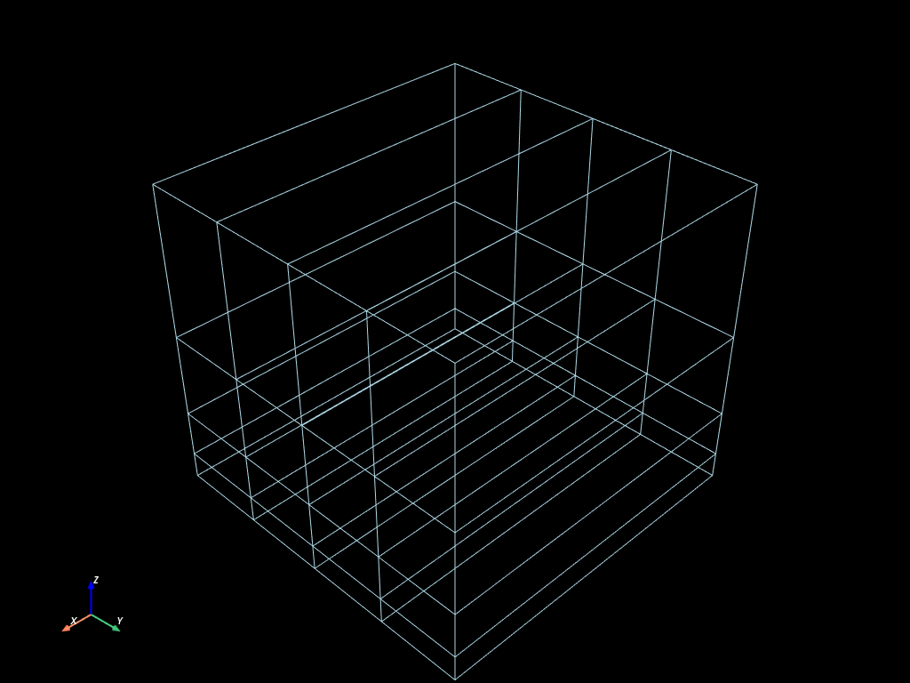
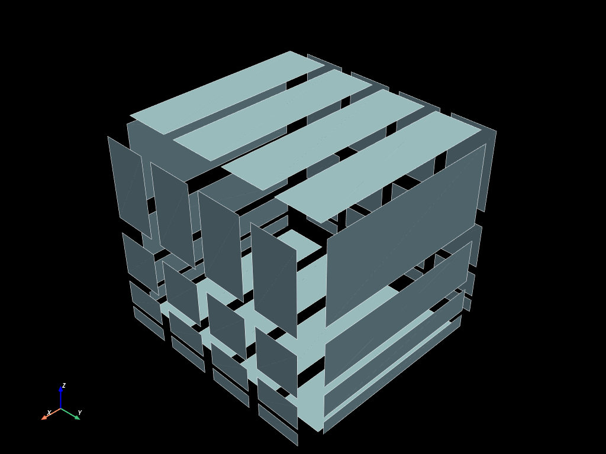

# `mefikit.UMesh`


```python
import mefikit as mf
import numpy as np
import pyvista as pv

pv.set_plot_theme('dark')
pv.set_jupyter_backend("static")
```

## `mf.UMesh` basics


```python
volumes = mf.build_cmesh(
    range(2), np.linspace(0.0, 1.0, 5), np.logspace(0.0, 1.0, 5) / 10.0
)
volumes
```


    <mefikit.UMesh at 0x71ae92777630>


```python
print(volumes)
```

    UMeshBase {
        coords: [[0.0, 0.0, 0.1],
         [1.0, 0.0, 0.1],
         [0.0, 0.25, 0.1],
         [1.0, 0.25, 0.1],
         [0.0, 0.5, 0.1],
         [1.0, 0.5, 0.1],
         [0.0, 0.75, 0.1],
         [1.0, 0.75, 0.1],
         [0.0, 1.0, 0.1],
         [1.0, 1.0, 0.1],
         [0.0, 0.0, 0.17782794100389226],
         [1.0, 0.0, 0.17782794100389226],
         [0.0, 0.25, 0.17782794100389226],
         [1.0, 0.25, 0.17782794100389226],
         [0.0, 0.5, 0.17782794100389226],
         [1.0, 0.5, 0.17782794100389226],
         [0.0, 0.75, 0.17782794100389226],
         [1.0, 0.75, 0.17782794100389226],
         [0.0, 1.0, 0.17782794100389226],
         [1.0, 1.0, 0.17782794100389226],
         [0.0, 0.0, 0.31622776601683794],
         [1.0, 0.0, 0.31622776601683794],
         [0.0, 0.25, 0.31622776601683794],
         [1.0, 0.25, 0.31622776601683794],
         [0.0, 0.5, 0.31622776601683794],
         [1.0, 0.5, 0.31622776601683794],
         [0.0, 0.75, 0.31622776601683794],
         [1.0, 0.75, 0.31622776601683794],
         [0.0, 1.0, 0.31622776601683794],
         [1.0, 1.0, 0.31622776601683794],
         [0.0, 0.0, 0.5623413251903491],
         [1.0, 0.0, 0.5623413251903491],
         [0.0, 0.25, 0.5623413251903491],
         [1.0, 0.25, 0.5623413251903491],
         [0.0, 0.5, 0.5623413251903491],
         [1.0, 0.5, 0.5623413251903491],
         [0.0, 0.75, 0.5623413251903491],
         [1.0, 0.75, 0.5623413251903491],
         [0.0, 1.0, 0.5623413251903491],
         [1.0, 1.0, 0.5623413251903491],
         [0.0, 0.0, 1.0],
         [1.0, 0.0, 1.0],
         [0.0, 0.25, 1.0],
         [1.0, 0.25, 1.0],
         [0.0, 0.5, 1.0],
         [1.0, 0.5, 1.0],
         [0.0, 0.75, 1.0],
         [1.0, 0.75, 1.0],
         [0.0, 1.0, 1.0],
         [1.0, 1.0, 1.0]], shape=[50, 3], strides=[3, 1], layout=Cc (0x5), const ndim=2,
        element_blocks: {
            HEX8: ElementBlockBase {
                cell_type: HEX8,
                connectivity: Regular(
                    [[0, 1, 3, 2, 10, 11, 13, 12],
                     [2, 3, 5, 4, 12, 13, 15, 14],
                     [4, 5, 7, 6, 14, 15, 17, 16],
                     [6, 7, 9, 8, 16, 17, 19, 18],
                     [10, 11, 13, 12, 20, 21, 23, 22],
                     [12, 13, 15, 14, 22, 23, 25, 24],
                     [14, 15, 17, 16, 24, 25, 27, 26],
                     [16, 17, 19, 18, 26, 27, 29, 28],
                     [20, 21, 23, 22, 30, 31, 33, 32],
                     [22, 23, 25, 24, 32, 33, 35, 34],
                     [24, 25, 27, 26, 34, 35, 37, 36],
                     [26, 27, 29, 28, 36, 37, 39, 38],
                     [30, 31, 33, 32, 40, 41, 43, 42],
                     [32, 33, 35, 34, 42, 43, 45, 44],
                     [34, 35, 37, 36, 44, 45, 47, 46],
                     [36, 37, 39, 38, 46, 47, 49, 48]], shape=[16, 8], strides=[8, 1], layout=Cc (0x5), const ndim=2,
                ),
                fields: {},
                families: [0, 0, 0, 0, 0, 0, 0, 0, 0, 0, 0, 0, 0, 0, 0, 0, 0, 0, 0, 0, 0, 0, 0, 0, 0, 0, 0, 0, 0, 0, 0, 0, 0, 0, 0, 0, 0, 0, 0, 0, 0, 0, 0, 0, 0, 0, 0, 0, 0, 0, 0, 0, 0, 0, 0, 0, 0, 0, 0, 0, 0, 0, 0, 0, 0, 0, 0, 0, 0, 0, 0, 0, 0, 0, 0, 0, 0, 0, 0, 0, 0, 0, 0, 0, 0, 0, 0, 0, 0, 0, 0, 0, 0, 0, 0, 0, 0, 0, 0, 0, 0, 0, 0, 0, 0, 0, 0, 0, 0, 0, 0, 0, 0, 0, 0, 0, 0, 0, 0, 0, 0, 0, 0, 0, 0, 0, 0, 0], shape=[128], strides=[1], layout=CFcf (0xf), const ndim=1,
                groups: {},
            },
        },
    }


```python
volumes.to_pyvista().plot(show_edges=True)
```





## Submesh computation


```python
faces = volumes.submesh()
faces.to_pyvista().shrink(0.8).plot(show_edges=True)
```





```python
edges = faces.submesh()
edges.to_pyvista().plot()
```





```python
nodes = edges.submesh()
nodes.to_pyvista().plot()
```


## Boundaries computation

As it is very common to compute boundaries on a mesh (for boundary counditions for ex), there is a custom `boundaries` computation method.


```python
bounds = volumes.boundaries()
bounds.to_pyvista().shrink(0.8).plot(show_edges=True)
```





## I/O

- On rust side, file I/O with the `read`/`write` methods:
    - vtk
    - yaml
    - json
- On python side (in memory through numpy arrays manipulations):
    - medcoupling
    - meshio
    - pyvista


```python
bounds.to_mc()
```


    MEDCouplingUMesh C++ instance at 0x3fce6630. Name : "mf_UMesh". Not set !


```python
bounds.to_pyvista()
```


<table style='width: 100%;'>
<tr><th>UnstructuredGrid</th><th>Information</th></tr>
<tr><td>N Cells</td><td>48</td></tr>
<tr><td>N Points</td><td>50</td></tr>
<tr><td>X Bounds</td><td>0.000e+00, 1.000e+00</td></tr>
<tr><td>Y Bounds</td><td>0.000e+00, 1.000e+00</td></tr>
<tr><td>Z Bounds</td><td>1.000e-01, 1.000e+00</td></tr>
<tr><td>N Arrays</td><td>0</td></tr>
</table>


```python
bounds.to_meshio()
```


    <meshio mesh object>
      Number of points: 50
      Number of cells:
        quad: 48


# Mesh *and* Fields


```python
x = np.logspace(-5, 0.0)
mesh2 = mf.build_cmesh(x, x)
```


```python
mes = mesh2.measure()
mes
```


    {'QUAD4': array([7.01482859e-12, 8.87274254e-12, 1.12227347e-11, ...,
            2.74065140e-02, 3.46652722e-02, 4.38465503e-02], shape=(2401,))}


```python
pvm2 = mesh2.to_pyvista()
```


```python
pvm2.cell_data["QUAD_surf"] = mes["QUAD4"]
```


```python
pvm2.plot(cpos='xy', show_edges=True)
```


