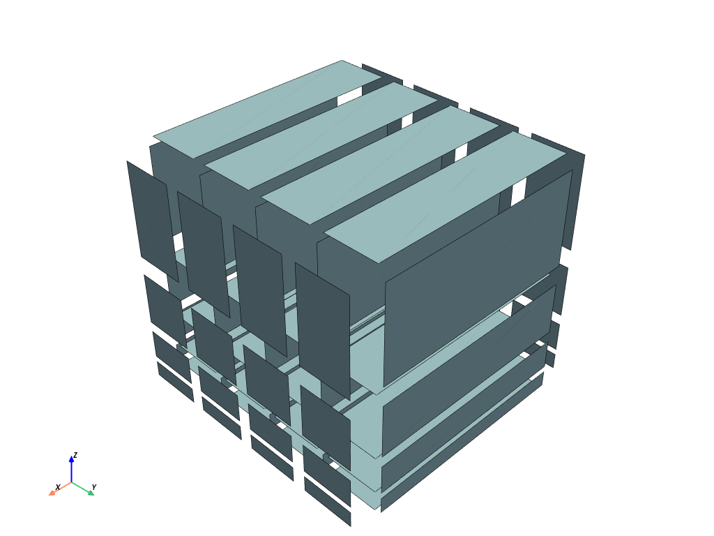
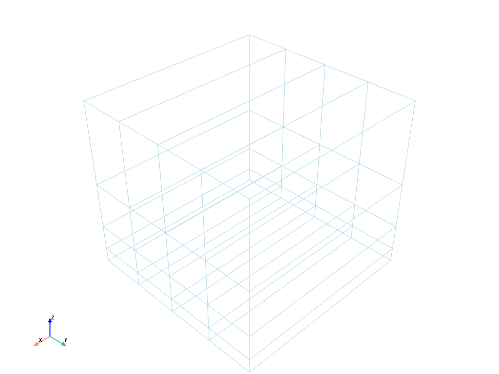

# Example using `PyVista` to visualize a mesh created with `mefikit`


```python
import mefikit as mf
import numpy as np
import pyvista as pv
pv.set_jupyter_backend('static')
```


```python
volumes = mf.build_cmesh(range(2), np.linspace(0., 1.0, 5), np.logspace(0., 1.0, 5) / 10.0)
volumes.to_pyvista().plot(show_edges=True)
```


```python
faces = volumes.submesh()
faces.to_pyvista().shrink(0.8).plot(show_edges=True)
```





```python
edges = faces.submesh()
edges.to_pyvista().plot()
```





```python
nodes = edges.submesh()
nodes.to_pyvista().plot()
```


