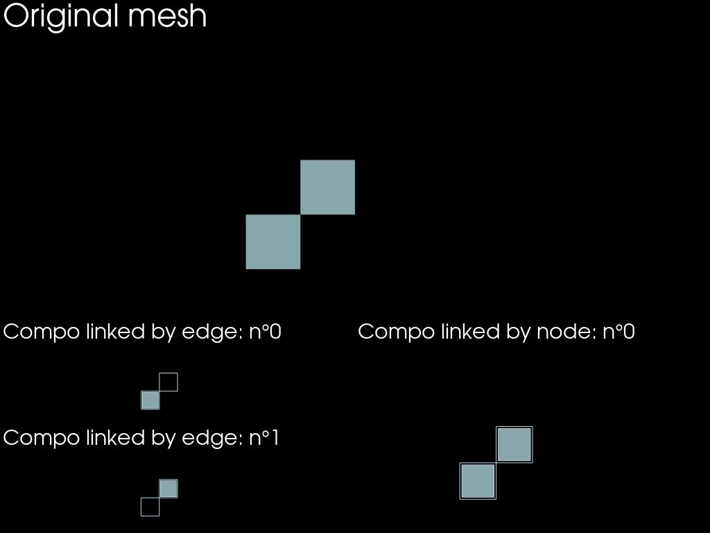

# Neighbours related topological operations

Here are some examples about the:
- `submesh` method
- `boundaries` method


```python
import mefikit as mf
import numpy as np
import pyvista as pv

pv.set_plot_theme("dark")
pv.set_jupyter_backend("static")
```


```python
x = range(3)
y = np.linspace(0.0, 3.0, 5, endpoint=True)
z = np.logspace(-0.5, 1, 4, endpoint=True)
volumes = mf.build_cmesh(x, y, z)
```

## Submesh functionaly

This functionality is able to compute the descending connectivity of the porvided mesh.
It can act on elements of dimension 1, 2 or 3.


```python
faces = volumes.submesh()
edges = faces.submesh()
vertex = edges.submesh()

plotter = pv.Plotter(shape=(1, 3))
plotter.subplot(0, 0)
plotter.add_mesh(faces.to_pyvista().shrink(0.8), show_edges=True)
plotter.subplot(0, 1)
plotter.add_mesh(edges.to_pyvista().shrink(0.8))
plotter.subplot(0, 2)
plotter.add_mesh(vertex.to_pyvista())
plotter.show()
```


## Submesh in one go

You might want to directly access either the node mesh or the edges mesh. You can ! And going into one step is ever faster than chaining mutliple `.submesh()` calls.


```python
edges = volumes.submesh(target_dim=1)
nodes = volumes.submesh(target_dim=0)

plotter = pv.Plotter(shape=(1, 2))
plotter.subplot(0, 0)
plotter.add_mesh(edges.to_pyvista().shrink(0.8))
plotter.subplot(0, 1)
plotter.add_mesh(vertex.to_pyvista())
plotter.show()
```


## Boundaries computation

As it is very common to compute boundaries on a mesh (for boundary counditions for ex), there is a custom `boundaries` computation method.


```python
face_bounds = volumes.boundaries()
edge_bounds = volumes.boundaries(target_dim=1)
vertex_bounds = volumes.boundaries(target_dim=0)

plotter = pv.Plotter(shape=(1, 3))
plotter.subplot(0, 0)
plotter.add_mesh(face_bounds.to_pyvista().shrink(0.8), show_edges=True)
plotter.subplot(0, 1)
plotter.add_mesh(edge_bounds.to_pyvista().shrink(0.8))
plotter.subplot(0, 2)
plotter.add_mesh(vertex_bounds.to_pyvista())
plotter.show()
```


# Connected components


```python
x, y = np.meshgrid(np.linspace(0, 1, 5), np.linspace(0., 1., 5))
coords = np.c_[x.flatten(), y.flatten()]
conn = np.array([
    [0, 1, 6, 5],
    [6, 7, 12, 11],
], dtype=np.uint)
mesh = mf.UMesh(coords)
mesh.add_regular_block("QUAD4", conn)
```


```python
compos_link_edge = mesh.connected_components(src_dim=2, link_dim=1)
compos_link_node = mesh.connected_components(src_dim=2, link_dim=0)

print(f"{len(compos_link_edge)=}")
print(f"{len(compos_link_node)=}")
```

    len(compos_link_edge)=2
    len(compos_link_node)=1


```python
edges = mesh.submesh()

shape = (3, 2)
row_weights = [1.5, 0.5, 0.5]
groups = [
    (0, np.s_[:]),
    (1, 0),
    (2, 0),
    (np.s_[1:], 1),
]

plotter = pv.Plotter(shape=shape, groups=groups, row_weights=row_weights)
plotter.subplot(0, 0)
plotter.add_text("Original mesh")
plotter.add_mesh(mesh.to_pyvista())
plotter.camera_position = "xy"

for i, compo in enumerate(compos_link_edge):
    plotter.subplot(i+1, 0)
    plotter.add_text(f"Compo linked by edge: n°{i}")
    plotter.add_mesh(edges.to_pyvista())
    plotter.add_mesh(compo.to_pyvista().shrink(0.9), show_edges=True)
    plotter.camera_position = "xy"

for i, compo in enumerate(compos_link_node):
    plotter.subplot(i+1, 1)
    plotter.add_text(f"Compo linked by node: n°{i}")
    plotter.add_mesh(edges.to_pyvista())
    plotter.add_mesh(compo.to_pyvista().shrink(0.9), show_edges=True)
    plotter.camera_position = "xy"
plotter.show()
```





```python

```
