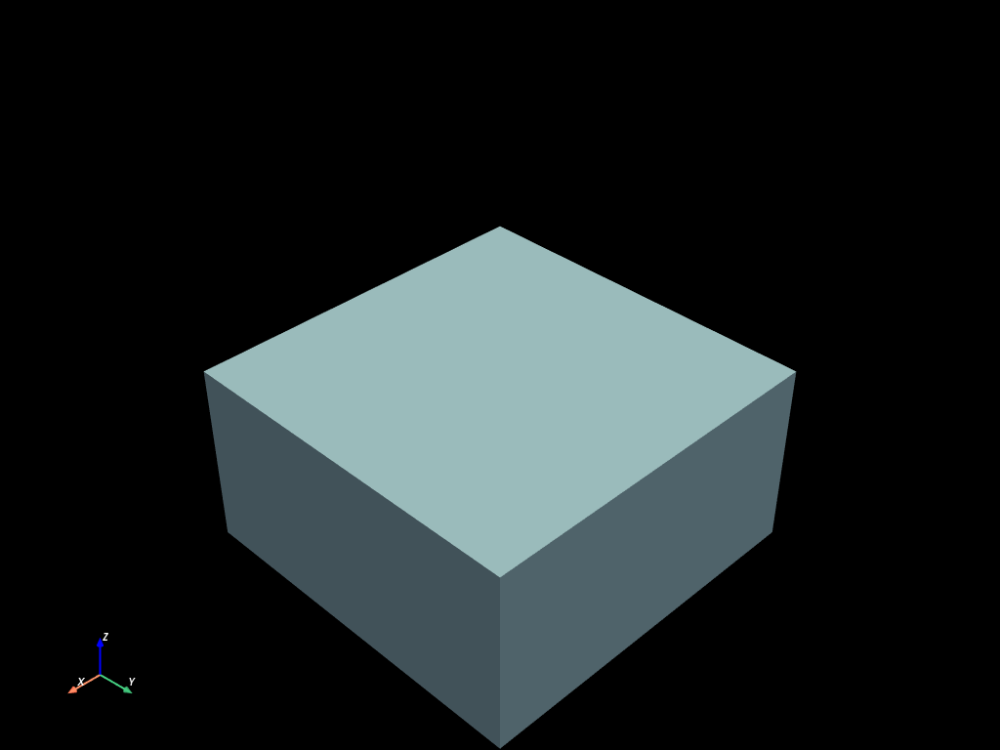

# Selection tool


```python
import mefikit as mf
import numpy as np
import pyvista as pv

pv.set_plot_theme("dark")
pv.set_jupyter_backend("static")
```


```python
x = np.linspace(0.0, 1.0, 50, endpoint=True)
volumes = mf.build_cmesh(x, x, x)
```

## Geometrical element selection

Elements can be selected based on there centroid position. The selection methods using centroids are :
- bbox
- sphere
- rectangle
- circle

As you can guess, bbox and sphere should be used for 3d meshes and rectangle and circle for 2d meshes.


```python
clip = mf.sel.bbox([-np.inf, -np.inf, -np.inf], [np.inf, np.inf, 0.5])
volumes.select(clip).to_pyvista().plot()
```





```python
sphere1 = mf.sel.sphere([0.5, 0.5, 0.5], 0.5)
volumes.select(sphere1).to_pyvista().plot()
```


## Selection composition

One of the great strength of the select method is its composability !
Whatch by yourself.

The operators `&`, `|`, `^` and `!` are available.


```python
volumes.select(sphere1 | clip).to_pyvista().plot()
```


```python
volumes.select(sphere1 & clip).to_pyvista().plot()
```


```python
clip2 = mf.sel.bbox([-np.inf, -np.inf, -np.inf], [0.5, np.inf, np.inf])
volumes.select((clip & sphere1) | clip2).to_pyvista().plot()
```


```python
volumes.select((clip | sphere1) & clip2).to_pyvista().plot()
```


## Other selections kinds

There are a few type of selection implemented, based on :
- centroids positions (bbox, sphere, circle, rectangle)
- nodes positions (idem, there is an extra boolean parameter to keep elements that have all of there nodes in the shape on any)
- types
- dimension
- ids
- nodes ids (with the boolean all nodes or any)
- fields values
- groups names
