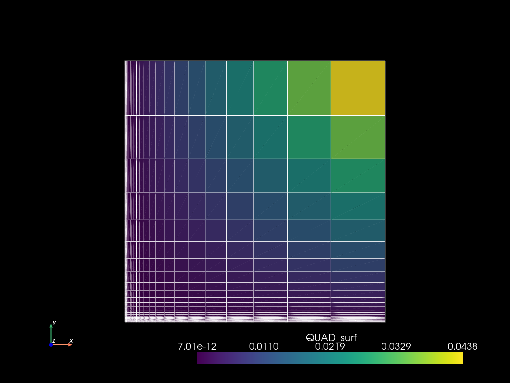

# `mefikit.UMesh`


```python
import mefikit as mf
import numpy as np
import pyvista as pv

pv.set_plot_theme("dark")
pv.set_jupyter_backend("static")
```

## Building cartesian meshes


```python
volumes = mf.build_cmesh(
    range(2), np.linspace(0.0, 1.0, 3), np.logspace(0.0, 1.0, 4) / 10.0
)
volumes
```


    <UMesh at 0x736e340af750>


```python
print(volumes)
```

    UMeshBase {
        coords: [[0.0, 0.0, 0.1],
         [1.0, 0.0, 0.1],
         [0.0, 0.5, 0.1],
         [1.0, 0.5, 0.1],
         [0.0, 1.0, 0.1],
         [1.0, 1.0, 0.1],
         [0.0, 0.0, 0.2154434690031884],
         [1.0, 0.0, 0.2154434690031884],
         [0.0, 0.5, 0.2154434690031884],
         [1.0, 0.5, 0.2154434690031884],
         [0.0, 1.0, 0.2154434690031884],
         [1.0, 1.0, 0.2154434690031884],
         [0.0, 0.0, 0.46415888336127786],
         [1.0, 0.0, 0.46415888336127786],
         [0.0, 0.5, 0.46415888336127786],
         [1.0, 0.5, 0.46415888336127786],
         [0.0, 1.0, 0.46415888336127786],
         [1.0, 1.0, 0.46415888336127786],
         [0.0, 0.0, 1.0],
         [1.0, 0.0, 1.0],
         [0.0, 0.5, 1.0],
         [1.0, 0.5, 1.0],
         [0.0, 1.0, 1.0],
         [1.0, 1.0, 1.0]], shape=[24, 3], strides=[3, 1], layout=Cc (0x5), const ndim=2,
        element_blocks: {
            HEX8: ElementBlockBase {
                cell_type: HEX8,
                connectivity: Regular(
                    [[0, 1, 3, 2, 6, 7, 9, 8],
                     [2, 3, 5, 4, 8, 9, 11, 10],
                     [6, 7, 9, 8, 12, 13, 15, 14],
                     [8, 9, 11, 10, 14, 15, 17, 16],
                     [12, 13, 15, 14, 18, 19, 21, 20],
                     [14, 15, 17, 16, 20, 21, 23, 22]], shape=[6, 8], strides=[8, 1], layout=Cc (0x5), const ndim=2,
                ),
                fields: {},
                families: [0, 0, 0, 0, 0, 0], shape=[6], strides=[1], layout=CFcf (0xf), const ndim=1,
                groups: {},
            },
        },
    }


The mesh is composed of a coordinates array, and several blocks.


```python
volumes.to_pyvista().plot(show_edges=True)
```


## Building mesh with custom connectivity


```python
x, y = np.meshgrid(np.linspace(0.0, 1.0, 5), np.linspace(0.0, 1.0, 5))
coords = np.c_[x.flatten(), y.flatten()]
conn = np.array(
    [
        [0, 1],
        [1, 6],
        [6, 5],
        [5, 0],
        [6, 7],
        [7, 12],
        [12, 11],
        [11, 6],
        [12, 17],
        [17, 16],
        [16, 11],
    ],
    dtype=np.uint,
)
```


```python
mesh = mf.UMesh(coords)
mesh.add_regular_block("VERTEX", np.arange(13, 22, dtype=np.uint)[..., np.newaxis])
mesh.add_regular_block("SEG2", conn)
mesh.add_regular_block("QUAD4", np.array([[3, 4, 9, 8]], dtype=np.uint))
```


```python
mesh.to_pyvista().plot(cpos="xy", show_edges=True)
```





## Build extruded mesh


```python
extruded = mesh.extrude(range(3))
```


```python
extruded.to_pyvista().plot(show_edges=True)
```


## Mesh *and* Fields


```python
x = np.logspace(-5, 0.0)
mesh2 = mf.build_cmesh(x, x)
```


```python
mes = mesh2.measure()
mes
```


    {'QUAD4': array([7.01482859e-12, 8.87274254e-12, 1.12227347e-11, ...,
            2.74065140e-02, 3.46652722e-02, 4.38465503e-02], shape=(2401,))}


```python
pvm2 = mesh2.to_pyvista()
```


```python
pvm2.cell_data["QUAD_surf"] = mes["QUAD4"]
```


```python
pvm2.plot(cpos="xy", show_edges=True)
```


